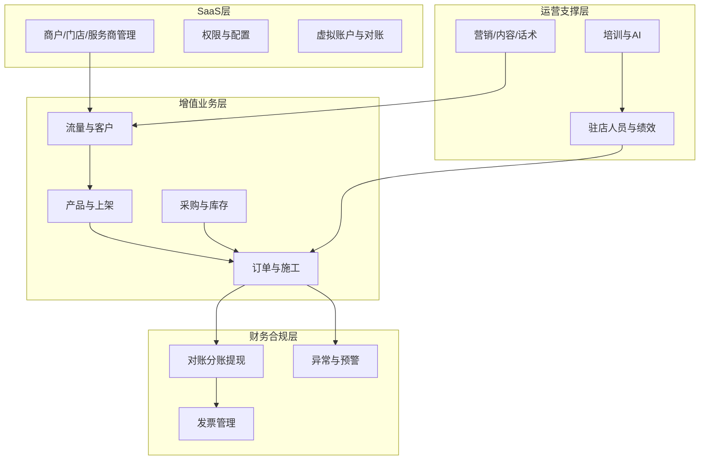

# SaaS+增值业务管理平台 — 平台定位与作用说明

> 产品品牌：**嘀加智享车生活**  
> 平台名称：**SaaS+增值业务管理平台**  
> 系统口号：让你的生意慧简单  
> 项目代号：`dj-car-life-system`

---

## 一、平台是什么

这是一套面向 **汽车经销/售后场景** 的企业级 **B 端管理后台**（Vue 2 + D2Admin + Element UI），用于支撑嘀加智享车生活业务的日常运营与管理。

**它不是：**

- 面向 C 端的小程序或 H5 活动页
- 整车 ERP 或 DMS 系统
- React / Next.js 项目

顶栏展示名称为「SaaS+增值业务管理平台」，系统品牌为「嘀加智享车生活」。

---

## 二、主要目的

### 2.1 用 SaaS 模式统一管理多级商户体系

平台按 **超管 → 省代/市代 → 园区店 → 服务商** 等多租户架构运营，核心是把分散的门店、服务商、商户收拢到同一套系统里：

- 商户 / 园区店 / 服务商 / 门店的开通、配置、上架、审核
- 虚拟对公账户、银企账号、场景类目、设备与店铺配置
- 按角色做权限与菜单控制（路由按 `authId` 动态下发）

**目的**：让总部、区域、门店在同一套 SaaS 上协同，而不是各自用 Excel 或独立系统。

### 2.2 支撑「4S 店 / 园区店」的增值业务全链路运营

「增值业务」指在 **交车、售后、驻店接待** 等环节销售的非整车类服务，例如：

| 业务类型 | 说明 |
| --- | --- |
| 精品升级 / 会员权益升级 | 贴膜、套餐、权益类商品 |
| 次新车转化、售后众筹 | 售后场景转化与众筹 |
| 车损报价 / 增值车损险 | 保险类增值服务 |
| 积分商城、发券宝、权益卡 | 营销与会员运营 |
| 施工单 | 服务落地与履约 |
| 二手车评估 / 合同 / 交付 | 二手车增值线 |

**目的**：从 **获客 → 产品介绍 → 下单 → 施工履约 → 退款/审核 → 对账分账** 跑通完整闭环。

### 2.3 提升驻店团队的销售与服务质量

「人员管理 / 驻店管理」是平台的重要模块，包括：

- **招聘管理**：招聘需求发布、处理、试岗入职等
- **质检体系**：质检管理、工牌管理、质检点管理
- **培训与合规**：AI 对练、话术违规管理、录音标签管理
- **绩效与薪酬**：绩效规则、提成方案、驻店工资绩效、积分与成长等级
- **日常运营**：日报管理、带教管理、督导管理、任务中心、门店工作汇报

**目的**：把 **驻店销售/服务人员** 的管理、培训、考核、质检数字化，提高转化率和合规性。

### 2.4 用数据驱动经营与风控

首页「总览」体现平台关注的核心经营指标：

- **转化客户概览**：客户数、转化率
- **订单概览**：已成交订单数、成交总额
- **财务概览**：流水额、毛利

此外还有：渗透率报表、店效盯防、预警管理、策略中心、门店看板等。

**目的**：让管理层看清 **转化、订单、流水、毛利、店效**，并做预警与策略调整。

---

## 三、主要作用（按业务域）

### 3.1 业务架构总览



### 3.2 功能模块一览

| 模块编号 | 模块名称 | 主要作用 |
| --- | --- | --- |
| 907 | **总览** | 工作台：转化、订单、财务一览；渗透率、交车数等报表 |
| 902 | **流量管理** | 客户列表、预录信息、客户画像、企微群关联 |
| 903 | **产品管理** | 商品库、产品主数据、上架管理、套餐、发券宝、服务项目 |
| 904 | **订单管理** | 多业态订单、施工单、退款审核、引荐数审核、订单补录 |
| 905 | **财务管理** | 对账、分账、提现、转账、应收应付、预付款、异常订单 |
| 906 | **系统设置** | 商户/服务商/园区店管理、虚拟账户、场景类目、开店审核、设备管理 |
| 908 | **库存管理** | 入库/出库、盘点、调拨、权益卡、退货审批、库存预警 |
| 909 | **采购管理** | 采购订单、采购商城、多级审核、采购发货 |
| 910 | **权益配置** | 权益规则配置 |
| 911 | **车损报价单** | 车损/增值车损险报价管理 |
| 912 | **人员管理** | 驻店管理、招聘、质检、绩效、日报、督导、带教、AI 对练 |
| 913 | **内容管理** | 内容编辑、企微群发、素材配置、客户标签/档案、活动管理 |
| 914 | **积分管理** | 积分审批、积分明细、抵扣配置 |
| 915 | **预警管理** | 员工预警、店效盯防、接待缺失报备、BI 事项、策略中心 |
| 916 | **AI 大模型** | 大模型账号管理 |
| 917 | **发票管理** | 开票二维码、发票查询、电子发票下载/打印 |
| 918 | **话术库** | 销售话术管理与明细 |
| 919 | **学习中心** | 长/短课程配置、考试管理、培训计划 |
| 920 | **二手车管理** | 数据看板、评估、合同、车辆台账、交付单、车况报告 |
| 921 | **销售管理** | 客户管理、组织架构、门店上架、销售合同、关店管理 |
| 922 | **营销管理** | 营销活动、营销推送策略 |
| 923 | **标签管理** | 标签维护与枚举值管理 |

---

## 四、典型业务闭环

### 4.1 增值销售闭环

```
客户流量（预录/到店）
    ↓
产品介绍（内容/话术/素材）
    ↓
下单成交（订单管理）
    ↓
施工履约（施工单）
    ↓
财务结算（对账/分账/提现）
    ↓
发票开具（发票管理）
```

### 4.2 驻店人员闭环

```
招聘需求（招聘管理）
    ↓
试岗入职（试岗/ onboard）
    ↓
培训考核（学习中心 / AI 对练）
    ↓
日常接待（质检 / 工牌）
    ↓
绩效核算（绩效/提成/工资）
    ↓
督导复盘（日报 / 督导 / 带教）
```

### 4.3 供应链闭环

```
产品主数据（商品库）
    ↓
采购下单（采购管理）
    ↓
入库/调拨（库存管理）
    ↓
门店销售（上架/订单）
    ↓
出库/发货（库存/施工）
```

---

## 五、平台角色与使用场景

| 角色 | 典型使用场景 |
| --- | --- |
| **总部/超管** | 商户体系配置、全局报表、财务对账、规则审核、策略制定 |
| **省代/市代** | 区域门店管理、业绩监控、采购与库存协调 |
| **园区店** | 日常订单处理、驻店人员管理、客户跟进、本地财务对账 |
| **服务商** | 服务履约、施工单处理、部分库存与订单操作 |
| **驻店员工** | 接待转化、日报提交、培训学习（部分能力在移动端/小程序） |

---

## 六、与外围系统的协同

平台并非孤立运行，常与以下系统联动：

| 系统/能力 | 用途 |
| --- | --- |
| **企业微信** | 消息推送、群发、商务付款审批流程 |
| **支付通道**（银盛、通联等） | 虚拟账户、线上对账、提现转账 |
| **SCRM** | 客户画像、群关联、车生活助手小程序 |
| **ROP 网关** | 统一 API 接入（`rop-dj-smartcarlife` 等） |

---

## 七、一句话总结

**SaaS+增值业务管理平台** 的核心目标是：

> 为汽车经销生态（尤其 4S / 园区店）提供 **多租户 SaaS 底座**，并在此基础上统一管理 **驻店增值业务** 的全流程——从客户流量、产品上架、订单履约，到人员绩效、财务对账、营销培训与风险预警。

它既是 **总部/区域的管理中枢**，也是 **门店日常经营的操作系统**，把「嘀加智享车生活」这类贴膜、权益、保险、二手车等增值业务 **标准化、可量化、可规模化复制**。

---

## 八、与常见系统的区别

| 对比维度 | 本平台 | 常见替代系统 |
| --- | --- | --- |
| 业务焦点 | 交车/售后环节增值销售 | 整车销售 ERP、纯 CRM |
| 架构模式 | SaaS 多商户 + 分账财务 | 单店工具或纯财务系统 |
| 人员管理 | 深度驻店绩效/质检/招聘 | 通用 HR 或简单排班 |
| 生态集成 | 企微 + 支付 + SCRM 深度耦合 | 独立闭环 |

---

## 附录：技术栈速览

| 类别 | 技术 |
| --- | --- |
| 前端框架 | Vue 2.6、Vue Router 3、Vuex 3 |
| UI 框架 | Element UI 2、D2Admin |
| 构建工具 | Vue CLI 5、Webpack 5 |
| 网络请求 | axios（项目封装） |
| 语言 | JavaScript |

---

*文档生成依据：项目路由模块、首页总览、系统配置及业务代码梳理。*
