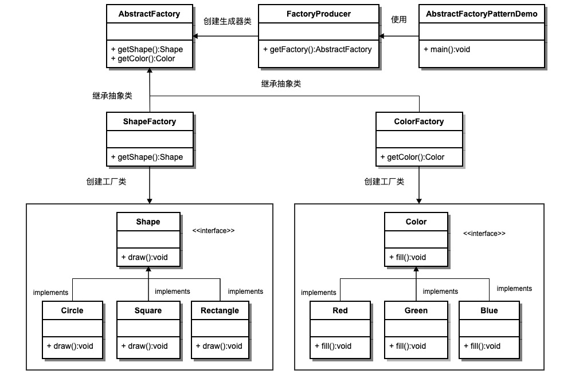
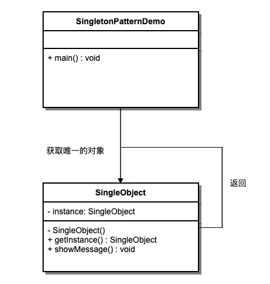

# UML 之创建型设计模式

创建型模式关注**对象的创建过程**，将对象的实例化与使用分离，使系统独立于对象的创建、组合和表示方式。

## 模式速览

| 模式 | 核心思想 | 典型场景 |
| :--- | :--- | :--- |
| [工厂方法模式](#一工厂方法模式) | 子类决定实例化哪个类 | 产品类型不确定、需集中管理创建 |
| [抽象工厂模式](#二抽象工厂模式) | 创建一系列相关对象 | 多产品族、需保持一致性 |
| [单例模式](#三单例模式) | 全局唯一实例 | 配置管理、日志、连接池 |
| [原型模式](#四原型模式) | 通过克隆创建对象 | 初始化成本高、需动态创建相似对象 |
| [建造者模式](#五建造者模式) | 分步构建复杂对象 | 属性众多、链式构建 |

---

## 一、工厂方法模式(Factory Method)

::: info 作用
** 把 `new` 对象这件事交给「工厂」去做，调用方只说要什么，不用管怎么造。**

- **解耦创建与使用**：业务代码只关心「用这个对象做什么」，不用到处写 `new PDFPreviewer()`、`new ImagePreviewer()`。
- **类型由外部决定**：具体实例化哪个类，交给工厂方法（或子类）根据参数、配置来决定。
- **方便扩展**：以后要支持新类型（比如 Markdown 预览），主要改工厂里的创建逻辑，原有调用代码可以不动。

> 类比：你去奶茶店点「一杯珍珠奶茶」，不用自己选杯子、加料、封口——店员（工厂）按你的订单做好递给你就行。
:::

#### 实用场景

- **类型运行时才确定**：比如文件预览器，用户打开的是 PDF、图片还是视频，程序事先不知道，只能根据 `file.type` 让工厂创建对应预览器。
- **创建逻辑想集中管理**：支付、日志、数据库连接等，如果每种实现都散落在业务里 `new`，改一处就要搜全项目；统一走工厂，维护更省事。
- **以后要加新品种**：新增「Markdown 预览」时，只需新增对应的预览器类与工厂子类，无需修改已有工厂代码，符合开闭原则——对扩展开放，对修改关闭。
- **常见落地例子**：UI 组件按主题创建、消息推送（短信 / 邮件 / App）、不同平台的导出器（Excel / CSV / PDF）。
- **补充**：每种产品由对应的工厂子类负责创建；客户端通过工厂实例获取产品，而不直接 `new` 具体类。
#### UML 图

<div style="text-align: center">


</div>

#### 示例代码

```js runnable
// 预览器工厂方法模式示例

// 抽象产品
class Previewer {
  render(content) {
    throw new Error('子类必须实现 render');
  }
}

class PDFPreviewer extends Previewer {
  render(content) { console.log('渲染 PDF:', content); }
}
class ImagePreviewer extends Previewer {
  render(content) { console.log('渲染图片:', content); }
}
class VideoPreviewer extends Previewer {
  render(content) { console.log('渲染视频:', content); }
}
class MarkdownPreviewer extends Previewer {
  render(content) { console.log('渲染 Markdown:', content); }
}

// 抽象工厂（Creator）
class PreviewerFactory {
  createPreviewer() {
    throw new Error('子类必须实现 createPreviewer');
  }
}

// 具体工厂：每种预览器对应一个工厂子类
class PDFPreviewerFactory extends PreviewerFactory {
  createPreviewer() { return new PDFPreviewer(); }
}
class ImagePreviewerFactory extends PreviewerFactory {
  createPreviewer() { return new ImagePreviewer(); }
}
class VideoPreviewerFactory extends PreviewerFactory {
  createPreviewer() { return new VideoPreviewer(); }
}
class MarkdownPreviewerFactory extends PreviewerFactory {
  createPreviewer() { return new MarkdownPreviewer(); }
}

// 类型常量，避免魔法字符串
const PreviewType = {
  PDF: 'pdf',
  IMAGE: 'image',
  VIDEO: 'video',
  MARKDOWN: 'markdown',
};

// 工厂注册表：新增类型时注册即可，无需改已有工厂
const factoryRegistry = new Map([
  [PreviewType.PDF, PDFPreviewerFactory],
  [PreviewType.IMAGE, ImagePreviewerFactory],
  [PreviewType.VIDEO, VideoPreviewerFactory],
  [PreviewType.MARKDOWN, MarkdownPreviewerFactory],
]);

function createPreviewerFactory(type) {
  const FactoryClass = factoryRegistry.get(type);
  if (!FactoryClass) {
    throw new Error(`未知类型: ${type}，支持: ${[...factoryRegistry.keys()].join(', ')}`);
  }
  return new FactoryClass();
}

// 使用方式
const file = { type: PreviewType.PDF, content: 'report.pdf' };
const factory = createPreviewerFactory(file.type);
const previewer = factory.createPreviewer();
previewer.render(file.content);
```

::: tip 优点
- 符合开闭原则
- 便于扩展新产品
- 简化客户端代码
:::

::: warning 缺点
- 增加类的数量（产品类 + 工厂类）
- 系统更加复杂
:::

---

## 二、抽象工厂模式(Abstract Factory)

::: info 作用
** 一次「成套」创建多个相关对象，保证它们风格、平台或配置始终匹配，换整套只换一家工厂。**

- **和工厂方法的区别**：工厂方法通常只负责创建**一种**产品（比如「PDF 预览器」）；抽象工厂负责创建**一整族**相关产品（比如「深色主题下的按钮 + 复选框 + 对话框」），这些产品必须搭配使用。
- **保证成套一致**：客户端不会误把「深色按钮」和「浅色输入框」拼在一起——所有组件都来自同一个工厂，天然属于同一产品族。
- **换族不改业务**：从浅色主题切到深色主题，只需把 `LightUIFactory` 换成 `DarkUIFactory`，`renderUI` 等业务代码一行不用动。

> 类比：装修选「北欧风套餐」，沙发、茶几、灯具都是同一风格成套交付；你不会北欧沙发配工业风吊灯——抽象工厂就是帮你一次拿齐「同一套」组件，而不是逐个去挑可能不搭的单件。
:::

#### 实用场景

- **UI 主题切换**：浅色 / 深色 / 高对比度主题下，按钮、输入框、弹窗、滚动条等都要成套替换，且不能混搭两种主题的控件。
- **跨平台界面**：Windows、macOS、移动端各有一套原生控件族（窗口、菜单、按钮），应用根据运行平台选用对应工厂，界面风格与交互保持一致。
- **数据库访问层**：MySQL 族（连接 + 查询构建器 + 事务管理）与 PostgreSQL 族各自成套；切换数据库时换一整族实现，业务层 SQL 调用逻辑不变。
- **游戏或业务中的「阵营 / 品牌」**：比如「人类阵营」的士兵、武器、建筑 vs「兽人阵营」的对应单位，必须同族搭配，不能人类士兵拿兽人武器。
- **配置驱动的环境切换**：开发 / 测试 / 生产环境可能需要不同的日志、缓存、消息队列客户端，但同一环境内这些组件要版本、协议彼此兼容——用抽象工厂按环境一次性创建整套依赖。
- **补充**：新增一种产品族（如「高对比度主题」）时，只需新增一个具体工厂类；但若要在现有族里增加全新种类的产品（如「新增滑块组件」），则需改抽象工厂接口，扩展成本较高。

#### UML 图

<div style="text-align: center">



</div>

#### 示例代码

```js runnable
// 抽象产品
class LightButton { paint() { console.log('浅色按钮'); } }
class LightCheckbox { paint() { console.log('浅色复选框'); } }
class DarkButton { paint() { console.log('深色按钮'); } }
class DarkCheckbox { paint() { console.log('深色复选框'); } }

// 抽象工厂接口
class UIFactory {
  createButton() {}
  createCheckbox() {}
}

// 具体工厂：浅色主题
class LightUIFactory extends UIFactory {
  createButton() { return new LightButton(); }
  createCheckbox() { return new LightCheckbox(); }
}

// 具体工厂：深色主题
class DarkUIFactory extends UIFactory {
  createButton() { return new DarkButton(); }
  createCheckbox() { return new DarkCheckbox(); }
}

// 客户端
function renderUI(factory) {
  const btn = factory.createButton();
  const cb = factory.createCheckbox();
  btn.paint();
  cb.paint();
}

const factory = new DarkUIFactory();
renderUI(factory);
```

::: tip 优点
- 易于交换产品族
- 保持不同产品间的一致性
- 符合开闭原则
:::

::: warning 缺点
- 难以支持新种类的产品
- 扩展困难，需修改抽象层
:::

---

## 三、单例模式(Singletion)

::: info 作用
** 整个程序里，这个类只创建一次，大家用的都是同一个对象。**

- **全局唯一**：无论在哪 `new`，得到的都是同一实例，配置、日志等状态共享，不会出现各模块各用一份的混乱。
- **节省资源**：避免重复创建连接、读配置等有开销的对象，也便于通过统一入口（如 `getInstance()`）访问。

:::

#### 实用场景

- **全局配置**：主题、语言、API 地址等全站只维护一份，改一处处处生效。
- **日志系统**：全项目共用一个 Logger，日志顺序和格式统一，便于写入同一文件或监控平台。
- **数据库连接池**：连接数有限，用单例统一管理借还，避免每个请求都新建连接。
- **补充**：适合「确实只需要一个」的场景；普通业务对象（如订单、用户）不要滥用，否则难以测试和维护。

#### UML 图

<div style="text-align: center">



</div>

#### 示例代码

```js runnable
class Logger {
  constructor() {
    if (Logger.instance) {
      return Logger.instance;
    }
    Logger.instance = this;
  }
  log(msg) { console.log('[Log]:', msg); }
}

const logger1 = new Logger();
const logger2 = new Logger();
console.log(logger1 === logger2); // true
logger1.log('单例模式：全局唯一实例');
```

::: tip 优点
- 节省资源，避免重复创建
- 提供全局访问点
:::

::: warning 缺点
- 隐藏依赖关系
- 不易拓展和测试
:::

---

## 四、原型模式(Prototype)

::: info 作用
** 复制现成对象当模板，改改就能用，不用每次从零 `new`。**

- **省掉重复初始化**：查库、算参数等耗时步骤只做一次，克隆比反复 `new` 快。
- **运行时按需复制**：从现有实例拷贝、微调即可，不必绑定具体构造函数。

> 类比：PPT「复制幻灯片」再改内容——程序里的复制粘贴。
:::

#### 实用场景

- **创建成本高**：游戏角色、地图块等批量生成时，克隆模板比逐个初始化省事。
- **大量相似对象**：复制格式、邮件模板群发——结构相同，只改少数字段。
- **状态快照**：撤销/重做、多分支预览；嵌套数据注意深拷贝，避免改克隆体连带改原对象。

#### UML 图

<div style="text-align: center">


</div>

#### 示例代码

```js runnable
class Prototype {
  constructor(name) { this.name = name; }
  clone() { return new Prototype(this.name); }
}

const original = new Prototype('原型对象');
const cloned = original.clone();
console.log(cloned.name); // 原型对象
console.log(original === cloned); // false，克隆是新实例
```

::: tip 优点
- 性能优越，可快速克隆
- 运行时动态获得对象
:::

::: warning 缺点
- 需处理深浅拷贝问题
- 依赖原型实例
:::

---

## 五、建造者模式(Builder)

::: info 作用
** 分步组装复杂对象，把「怎么造」和「造出来什么样」分开。**

- **避免巨型构造函数**：属性多时，链式 `.setX()` 比 `new User(a, b, c…)` 可读。
- **步骤清晰、规格可换**：构建顺序固定可见；豪华版 / 标准版共用流程，换 Builder 即可。

> 类比：点定制汉堡，按步骤选配料，店员帮你组装。
:::

#### 实用场景

- **参数多且可选**：HTTP 请求、导出配置等，链式调用比超长构造函数友好。
- **步骤有先后**：PDF 分段生成、SQL 拼装——顺序封装在 Builder 里。
- **多种规格同一套路**：不同套餐 / 角色类型共用 build 流程；字段少的简单对象不必用。

#### UML 图

<div style="text-align: center">


</div>

#### 示例代码

```js runnable
class Product {
  constructor() { this.parts = []; }
  add(part) { this.parts.push(part); }
}

class Builder {
  constructor() { this.product = new Product(); }
  buildPartA() { this.product.add('部件A'); return this; }
  buildPartB() { this.product.add('部件B'); return this; }
  buildPartC() { this.product.add('部件C'); return this; }
  getResult() { return this.product; }
}

const builder = new Builder();
const product = builder.buildPartA().buildPartB().buildPartC().getResult();
console.log(product.parts); // ['部件A', '部件B', '部件C']
```

::: tip 优点
- 构建过程清晰
- 易于扩展不同产品
:::

::: warning 缺点
- 需要额外的 Builder 类
:::
