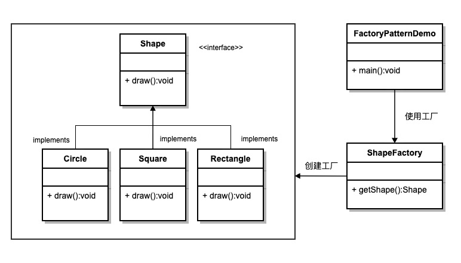

# UML 之结构型设计模式

结构型模式关注**类与对象的组合方式**，通过继承、组合、包装等手段，在不破坏封装的前提下，让现有结构更易扩展、复用与协作。

## 模式速览

| 模式 | 核心思想 | 典型场景 |
| :--- | :--- | :--- |
| [适配器模式](#一适配器模式) | 转换接口使不兼容类能协作 | 第三方 SDK、遗留系统对接 |
| [桥接模式](#二桥接模式) | 抽象与实现分离，独立变化 | 多平台 UI、消息通道 × 消息类型 |
| [组合模式](#三组合模式) | 树形结构统一对待叶子与容器 | 文件树、菜单、组织架构 |
| [装饰器模式](#四装饰器模式) | 动态叠加职责而不改原类 | 日志、缓存、权限包装 |
| [外观模式](#五外观模式) | 为子系统提供统一简化入口 | API 网关、启动封装、SDK 门面 |
| [享元模式](#六享元模式) | 共享细粒度对象以节省内存 | 图标池、字符缓存、连接复用 |
| [代理模式](#七代理模式) | 为对象提供替身以控制访问 | 懒加载、权限校验、RPC 代理 |

---

## 一、适配器模式(Adapter)

::: info 作用
** 在不改原有类的前提下，把「旧接口」包装成客户端期望的「新接口」，使原本无法协作的类可以一起工作。**

- **接口转换**：Adaptee 的方法与 Target 不一致时，Adapter 做参数、返回值或调用方式的映射。
- **复用遗留代码**：老模块、第三方库接口不符合新项目规范，用适配器接入而不重写。
- **两种形式**：类适配器（继承）与对象适配器（组合）；组合方式更灵活，也更常见。

> 类比：电源转接头——笔记本插头（Adaptee）与酒店插座（Target）规格不同，转接头（Adapter）让两者接通。
:::

#### 实用场景

- **对接第三方 SDK**：支付、地图、IM 等 API 与业务接口不一致，统一封装成内部 `PaymentGateway`。
- **遗留系统改造**：老系统返回 XML，新系统需要 JSON，适配器负责转换。
- **多数据源统一访问**：MySQL、Redis、ES 各自 API 不同，适配为统一的 `Repository` 接口。
- **补充**：适配器只解决接口兼容，不负责业务逻辑；若差异过大，考虑重构而非层层包装。

#### UML 图

<div style="text-align: center">


</div>

#### 示例代码

```js runnable
// 目标接口
class Target {
  request() { console.log('标准请求'); }
}

// 被适配者（接口不兼容）
class Adaptee {
  specificRequest() { console.log('特殊请求'); }
}

// 对象适配器
class Adapter extends Target {
  constructor(adaptee) {
    super();
    this.adaptee = adaptee;
  }
  request() {
    this.adaptee.specificRequest();
    console.log('已转换为标准接口');
  }
}

const adapter = new Adapter(new Adaptee());
adapter.request();
```

::: tip 优点
- 复用已有类，无需修改源代码
- 解耦客户端与被适配者
:::

::: warning 缺点
- 增加 Adapter 类，系统复杂度上升
- 过多适配层可能导致调用链难以追踪
:::

---

## 二、桥接模式(Bridge)

::: info 作用
** 将抽象部分与实现部分分离，使二者可以独立扩展，避免继承爆炸。**

- **两个维度独立变化**：如「形状 × 颜色」「消息类型 × 发送渠道」，用 Abstraction 持有 Implementor 引用。
- **组合优于继承**：不用为每种组合写一个子类（RedCircle、BlueCircle…），而是自由搭配。
- **运行时切换实现**：可在运行时替换 Implementor，灵活切换底层能力。

> 类比：电视遥控器（抽象）与不同品牌电视（实现）——换电视不用换遥控器的使用方式，遥控逻辑与电视品牌解耦。
:::

#### 实用场景

- **跨平台 UI**：Window 抽象与 Windows / macOS / Web 渲染实现分离。
- **消息通知**：短信、邮件、推送（实现）× 验证码、营销、告警（抽象）自由组合。
- **数据库驱动**：ORM 抽象层与 MySQL、PostgreSQL 驱动实现分离。
- **补充**：当两个维度都会频繁扩展时优先考虑；单一维度变化用策略模式往往更简单。

#### UML 图

<div style="text-align: center">



</div>

#### 示例代码

```js runnable
// 实现层
class Implementor {
  operationImpl() {}
}
class ConcreteImplementorA extends Implementor {
  operationImpl() { console.log('实现 A'); }
}
class ConcreteImplementorB extends Implementor {
  operationImpl() { console.log('实现 B'); }
}

// 抽象层
class Abstraction {
  constructor(implementor) { this.implementor = implementor; }
  operation() { this.implementor.operationImpl(); }
}
class RefinedAbstraction extends Abstraction {
  operation() {
    console.log('扩展操作');
    super.operation();
  }
}

new RefinedAbstraction(new ConcreteImplementorA()).operation();
new RefinedAbstraction(new ConcreteImplementorB()).operation();
```

::: tip 优点
- 抽象与实现分离，各自独立扩展
- 避免多维度组合导致的类爆炸
:::

::: warning 缺点
- 增加抽象层与实现层，理解成本提高
- 简单场景使用会显得过度设计
:::

---

## 三、组合模式(Composite)

::: info 作用
** 将对象组织成树形结构，使客户端对单个对象与组合对象的使用保持一致。**

- **统一接口**：Component 定义 `operation()`，Leaf 与 Composite 都实现同一接口。
- **递归结构**：Composite 持有子节点列表，可嵌套任意层级。
- **透明与安全两种风格**：透明式子类统一；安全式区分 Leaf 与 Composite 职责。

> 类比：公司组织架构——员工（叶子）与部门（组合）都可统计「人数」，对上层来说调用方式相同。
:::

#### 实用场景

- **文件系统**：文件与文件夹统一为 `FileSystemNode`，支持遍历、删除、大小统计。
- **UI 组件树**：Panel 包含 Button、Text 等子组件，统一 `render()`。
- **菜单 / 权限树**：多级菜单、RBAC 权限节点递归管理。
- **补充**：遍历、查找、删除等操作可配合迭代器或访问者模式；注意循环引用与深度限制。

#### UML 图

<div style="text-align: center">


</div>

#### 示例代码

```js runnable
class Component {
  constructor(name) { this.name = name; }
  add() { throw new Error('不支持'); }
  remove() { throw new Error('不支持'); }
  operation(depth = 0) { console.log('  '.repeat(depth) + this.name); }
}

class Leaf extends Component {}

class Composite extends Component {
  constructor(name) {
    super(name);
    this.children = [];
  }
  add(component) { this.children.push(component); }
  remove(component) {
    this.children = this.children.filter(c => c !== component);
  }
  operation(depth = 0) {
    super.operation(depth);
    this.children.forEach(c => c.operation(depth + 1));
  }
}

const root = new Composite('根目录');
const folder = new Composite('文档');
folder.add(new Leaf('readme.md'));
folder.add(new Leaf('notes.txt'));
root.add(folder);
root.add(new Leaf('index.html'));
root.operation();
```

::: tip 优点
- 客户端无需区分叶子与组合，调用统一
- 易于新增新类型的组件节点
:::

::: warning 缺点
- 设计较通用时，难以限制某节点应有的行为
- 树过深时遍历与调试成本增加
:::

---

## 四、装饰器模式(Decorator)

::: info 作用
** 在不修改原类的前提下，动态地为对象叠加额外职责，比继承更灵活。**

- **包装链**：Decorator 与 Component 同接口，内部持有 Component 引用，可层层嵌套。
- **开闭原则**：新增「带日志的请求」「带缓存的请求」只需加 Decorator，不改原类。
- **与代理区别**：装饰器侧重增强功能；代理侧重控制访问（权限、延迟加载等）。

> 类比：给咖啡加料——浓缩咖啡（Component）上依次加奶、糖、奶油（Decorator），每加一层仍是「可饮用的咖啡」。
:::

#### 实用场景

- **IO 流包装**：Java `BufferedInputStream`、Node.js `Transform` 流式叠加。
- **中间件链**：HTTP 请求依次经过日志、鉴权、限流装饰。
- **UI 组件增强**：为按钮叠加 Tooltip、Loading、权限禁用等能力。
- **补充**：JavaScript 中函数式「高阶函数」与 ES 装饰器语法是常见变体；注意装饰顺序影响最终结果。

#### UML 图

<div style="text-align: center">


</div>

#### 示例代码

```js runnable
class Component {
  operation() { console.log('基础操作'); }
}

class Decorator extends Component {
  constructor(component) {
    super();
    this.component = component;
  }
  operation() { this.component.operation(); }
}

class ConcreteDecoratorA extends Decorator {
  operation() {
    super.operation();
    console.log('装饰 A：添加日志');
  }
}

class ConcreteDecoratorB extends Decorator {
  operation() {
    super.operation();
    console.log('装饰 B：添加缓存');
  }
}

let component = new Component();
component = new ConcreteDecoratorA(component);
component = new ConcreteDecoratorB(component);
component.operation();
```

::: tip 优点
- 比继承更灵活，职责可运行时组合
- 符合开闭原则，易于扩展
:::

::: warning 缺点
- 多层装饰时调用链变长，排查问题较难
- 大量小装饰类会增加系统复杂度
:::

---

## 五、外观模式(Facade)

::: info 作用
** 为复杂子系统提供一个统一、简化的高层接口，隐藏内部模块细节。**

- **门面协调**：Facade 封装多个 Subsystem 的调用顺序与依赖关系。
- **降低耦合**：客户端只依赖 Facade，不必了解子系统内部类结构。
- **非功能限制**：不阻止客户端直接访问子系统，只是提供便捷入口。

> 类比：一键开机——用户按电源键（Facade），背后 CPU、内存、硬盘等子系统按序启动，用户无需逐步操作。
:::

#### 实用场景

- **SDK 统一入口**：`axios.create()`、`Vue.use()` 封装复杂初始化。
- **应用启动**：`bootstrap()` 依次加载配置、数据库、路由、插件。
- **遗留系统封装**：对外暴露简单 REST API，内部协调多个老模块。
- **补充**：外观类逻辑过重时会变成「上帝对象」，可按子域拆分为多个 Facade。

#### UML 图

<div style="text-align: center">


</div>

#### 示例代码

```js runnable
class SubsystemA {
  operationA() { console.log('子系统 A'); }
}
class SubsystemB {
  operationB() { console.log('子系统 B'); }
}
class SubsystemC {
  operationC() { console.log('子系统 C'); }
}

class Facade {
  constructor() {
    this.a = new SubsystemA();
    this.b = new SubsystemB();
    this.c = new SubsystemC();
  }
  operation() {
    console.log('外观统一调用：');
    this.a.operationA();
    this.b.operationB();
    this.c.operationC();
  }
}

new Facade().operation();
```

::: tip 优点
- 简化客户端调用，降低学习成本
- 隔离变化，子系统内部调整不影响客户端
:::

::: warning 缺点
- 外观类可能承担过多协调逻辑
- 过度封装会限制高级用户对子系统的灵活使用
:::

---

## 六、享元模式(Flyweight)

::: info 作用
** 通过共享细粒度对象，减少内存中重复实例，以空间换时间。**

- **内部状态 vs 外部状态**：Flyweight 存不可变内部状态；可变部分由客户端传入。
- **工厂管理池**：FlyweightFactory 维护对象池，`get(key)` 复用已有实例。
- **适用大量相似对象**：字符、图标、棋子、地图块等重复出现且内部状态相同。

> 类比：活字印刷——每个汉字（享元）只刻一块印版，排版时重复使用，不必为每个字单独造一块新印版。
:::

#### 实用场景

- **文本编辑器字符对象**：相同字符共享 Flyweight，位置、颜色作为外部状态。
- **游戏对象池**：子弹、粒子、敌人贴图复用，减少 GC 压力。
- **连接 / 线程池**：数据库连接、HTTP 连接复用（思想相近）。
- **补充**：需区分内部/外部状态；对象有独特状态时不适合共享，否则会产生 bug。

#### UML 图

<div style="text-align: center">


</div>

#### 示例代码

```js runnable
class FlyweightFactory {
  constructor() { this.pool = new Map(); }
  get(key, intrinsicState) {
    if (!this.pool.has(key)) {
      this.pool.set(key, new Flyweight(intrinsicState));
    }
    return this.pool.get(key);
  }
  count() { return this.pool.size; }
}

class Flyweight {
  constructor(intrinsicState) { this.intrinsicState = intrinsicState; }
  operation(extrinsicState) {
    console.log(`共享状态: ${this.intrinsicState}, 外部状态: ${extrinsicState}`);
  }
}

const factory = new FlyweightFactory();
const a1 = factory.get('A', '字母A');
const a2 = factory.get('A', '字母A');
console.log('是否同一实例:', a1 === a2);
a1.operation('位置(10, 20)');
a2.operation('位置(30, 40)');
console.log('池中对象数:', factory.count());
```

::: tip 优点
- 大幅减少内存中重复对象
- 提升大量相似对象的创建与访问效率
:::

::: warning 缺点
- 需分离内外部状态，设计成本较高
- 工厂与池管理增加系统复杂度
:::

---

## 七、代理模式(Proxy)

::: info 作用
** 为其他对象提供代理，以控制对原对象的访问，并在访问前后附加额外逻辑。**

- **同接口替身**：Proxy 与 RealSubject 实现相同接口，客户端无感知。
- **控制访问时机**：懒加载、权限校验、缓存、远程调用、引用计数等。
- **与装饰器区别**：代理管理对象生命周期与访问；装饰器侧重功能叠加。

> 类比：明星经纪人——粉丝（客户端）联系经纪人（代理），由经纪人决定是否安排见面、如何传话，明星（真实对象）不必直接应对所有请求。
:::

#### 实用场景

- **虚拟代理 / 懒加载**：大图片、重型组件用时再加载真实资源。
- **保护代理**：校验用户权限后再调用敏感操作。
- **远程代理**：RPC、REST 客户端代理远程服务对象。
- **补充**：JavaScript 原生 `Proxy` 可拦截对象操作，是语言级代理能力；与 GoF 代理模式思想一致但用法更底层。

#### UML 图

<div style="text-align: center">


</div>

#### 示例代码

```js runnable
class Subject {
  request() { console.log('真实对象处理请求'); }
}

class Proxy {
  constructor(realSubject) {
    this.realSubject = realSubject;
    this.loaded = false;
  }
  request() {
    if (!this.loaded) {
      console.log('代理：懒加载真实对象');
      this.loaded = true;
    }
    console.log('代理：访问前校验');
    this.realSubject.request();
    console.log('代理：访问后记录日志');
  }
}

const proxy = new Proxy(new Subject());
proxy.request();
proxy.request();
```

::: tip 优点
- 在不改真实对象的情况下控制访问
- 支持懒加载、缓存、权限等横切逻辑
:::

::: warning 缺点
- 增加代理层，可能带来性能开销
- 代理逻辑复杂时调试链路变长
:::
