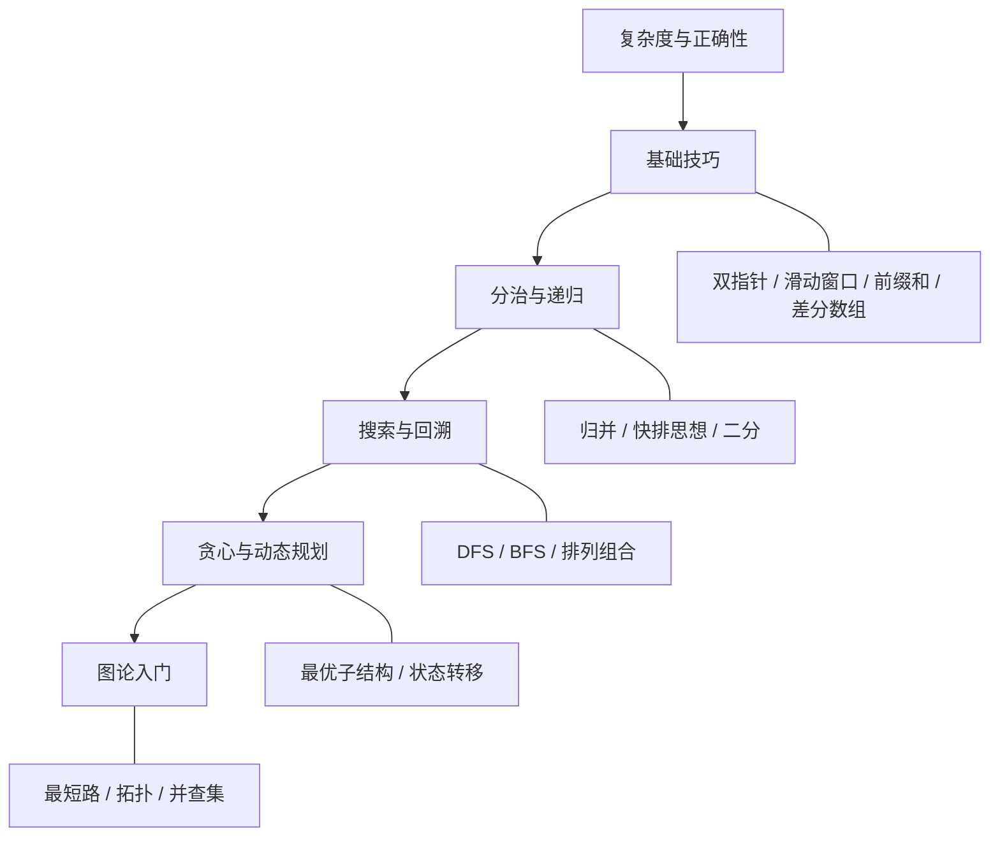
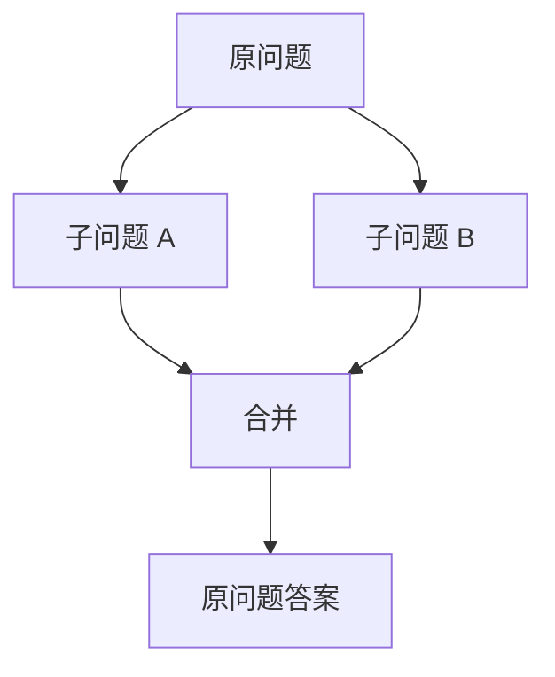

# 算法基础大全

算法是解决一类问题的**清晰步骤**：给定规范输入，在有限步骤内得到正确输出。它关心的是「怎么算」，通常建立在合适的数据结构之上。

一句话概括：**数据结构决定能怎么存，算法决定怎么高效地算**——本篇按「思维模板」组织，方便系统学习与刷题迁移。

配套阅读：[数据结构基础大全](/featuresFiles/dataStructure.md)、本站 [排序](/algorithm/sortAlg) / [查找](/algorithm/searchAlg) / [求和](/algorithm/addAlg) 专题。

---

## 学习路线图



建议：先把 **复杂度 + 双指针/滑动窗口/二分** 练熟，再学递归与回溯，然后攻克贪心与 DP，最后补图论。

---

## 0. 算法怎么评价？

好算法通常同时满足：

| 维度 | 含义 |
| --- | --- |
| **正确性** | 对所有合法输入都能得到正确结果（含边界） |
| **有穷性** | 步骤有限，不会死循环 |
| **确定性** | 每一步含义清楚，无歧义 |
| **效率** | 时间 / 空间复杂度可接受 |
| **可读性** | 人能维护，便于改与测 |

复杂度回顾（详见数据结构篇）：

| 量级 | 感觉 | 常见算法 |
| --- | --- | --- |
| O(1) | 常数 | 哈希查找、交换 |
| O(log n) | 砍半 | 二分查找 |
| O(n) | 扫一遍 | 双指针、滑动窗口 |
| O(n log n) | 高效排序级 | 快排、归并、堆排 |
| O(n²) | 双重循环 | 冒泡、简单 DP |
| O(2ⁿ) / O(n!) | 爆炸 | 暴力子集、全排列（需剪枝） |

刷题口诀：**先暴力想通 → 再找重复计算 / 可排除区间 → 换更优结构或模板**。

---

## 1. 排序算法

把无序序列变成有序。先分清 **稳定性**（相同关键字相对顺序是否保留）和 **适用规模**。

### 1.1 总览对照

| 算法 | 平均时间 | 最坏 | 空间 | 稳定 | 一句话 |
| --- | --- | --- | --- | --- | --- |
| 冒泡 | O(n²) | O(n²) | O(1) | 是 | 相邻交换，大泡上浮 |
| 选择 | O(n²) | O(n²) | O(1) | 否 | 每次选最小放到前面 |
| 插入 | O(n²) | O(n²) | O(1) | 是 | 像摸牌，插入已排好段 |
| 希尔 | O(n^1.3) 左右 | 视增量 | O(1) | 否 | 分组插入 |
| 归并 | O(n log n) | O(n log n) | O(n) | 是 | 分治，再合并 |
| 快排 | O(n log n) | O(n²) | O(log n) | 否 | 分治，基准分区 |
| 堆排 | O(n log n) | O(n log n) | O(1) | 否 | 建堆再取堆顶 |
| 计数/桶/基数 | O(n+k) 等 | 视数据 | 较大 | 多数可稳 | 不比较，靠映射 |

工程里：`n` 不大用库排序即可；手写重点掌握 **快排思想、归并、堆**。

### 1.2 冒泡（入门）

```js
function bubbleSort(arr) {
  const a = arr.slice()
  for (let i = 0; i < a.length - 1; i++) {
    let swapped = false
    for (let j = 0; j < a.length - 1 - i; j++) {
      if (a[j] > a[j + 1]) {
        ;[a[j], a[j + 1]] = [a[j + 1], a[j]]
        swapped = true
      }
    }
    if (!swapped) break // 已有序可提前结束
  }
  return a
}
```

### 1.3 快速排序（必会思想）

选基准，小于放左、大于放右，递归两边。

```js
function quickSort(arr) {
  if (arr.length <= 1) return arr
  const pivot = arr[arr.length >> 1]
  const left = arr.filter((x) => x < pivot)
  const mid = arr.filter((x) => x === pivot)
  const right = arr.filter((x) => x > pivot)
  return [...quickSort(left), ...mid, ...quickSort(right)]
}
```

> 上面写法便于理解；面试常写「原地分区」。最坏 O(n²) 可用随机基准缓解。

### 1.4 归并排序（稳定 + 分治典范）

```js
function mergeSort(arr) {
  if (arr.length <= 1) return arr
  const mid = arr.length >> 1
  const left = mergeSort(arr.slice(0, mid))
  const right = mergeSort(arr.slice(mid))
  return merge(left, right)
}

function merge(a, b) {
  const res = []
  let i = 0, j = 0
  while (i < a.length && j < b.length) {
    res.push(a[i] <= b[j] ? a[i++] : b[j++])
  }
  return res.concat(a.slice(i), b.slice(j))
}
```

更细的排序笔记见：[排序算法](/algorithm/sortAlg)。

---

## 2. 查找算法

### 2.1 线性查找

无序数组从左到右扫：O(n)。简单但慢。

### 2.2 二分查找（必会模板）

前提：**有序**（或满足单调性）。每次排除一半。

```js
function binarySearch(nums, target) {
  let lo = 0, hi = nums.length - 1
  while (lo <= hi) {
    const mid = (lo + hi) >> 1
    if (nums[mid] === target) return mid
    if (nums[mid] < target) lo = mid + 1
    else hi = mid - 1
  }
  return -1
}
```

变体（比「找到等于」更常见）：

| 变体 | 目标 |
| --- | --- |
| 找第一个 ≥ target | lower_bound |
| 找第一个 > target | upper_bound |
| 旋转数组中查找 | 先判断哪半有序 |
| 答案落在值域上 | **二分答案**（如最小速度、最小容量） |

二分口诀：**写清搜索区间开闭、每次必须缩小区间、想清楚 mid 落哪边**。

### 2.3 哈希查找

用 Map/Set 把查找从 O(n) 降到平均 O(1)。经典：两数之和（见 [求和算法](/algorithm/addAlg)）。

---

## 3. 基础技巧模板（刷题高频）

这些不是「某一种算法名」，而是**反复出现的解题骨架**。

### 3.1 双指针

两根指针按规则移动，把 O(n²) 压到 O(n)。

| 类型 | 场景 | 例子 |
| --- | --- | --- |
| **对撞指针** | 有序数组两端向中间 | 两数之和 II、盛水容器 |
| **快慢指针** | 链表 | 判环、中点、删倒数第 k |
| **同向双指针** | 右扩左缩维护区间 | 常与滑动窗口一起 |

```js
// 有序数组：两数之和等于 target
function twoSumSorted(nums, target) {
  let l = 0, r = nums.length - 1
  while (l < r) {
    const s = nums[l] + nums[r]
    if (s === target) return [l, r]
    if (s < target) l++
    else r--
  }
  return [-1, -1]
}
```

### 3.2 滑动窗口

维护一个「可变区间」，右指针扩张，左指针收缩，常用于子串/子数组最值。

```js
// 最长无重复字符子串
function lengthOfLongestSubstring(s) {
  const seen = new Map()
  let left = 0, best = 0
  for (let right = 0; right < s.length; right++) {
    const ch = s[right]
    if (seen.has(ch) && seen.get(ch) >= left) {
      left = seen.get(ch) + 1
    }
    seen.set(ch, right)
    best = Math.max(best, right - left + 1)
  }
  return best
}
```

适用信号：题目含「连续子数组 / 子串」「最长 / 最短满足条件」。

### 3.3 前缀和与差分数组

- **前缀和**：快速求区间和 → `sum(l..r) = pre[r+1] - pre[l]`
- **差分数组**：快速对区间做加减，最后还原数组

```js
// 前缀和
function rangeSum(nums, l, r) {
  const pre = [0]
  for (const x of nums) pre.push(pre.at(-1) + x)
  return pre[r + 1] - pre[l]
}
```

### 3.4 单调栈 / 单调队列

栈（或队列）内元素保持单调，用于「下一个更大/更小元素」、滑动窗口最值。

典型题：每日温度、柱状图最大矩形、滑动窗口最大值。

---

## 4. 递归与分治

### 4.1 递归三要素

1. **结束条件**（base case）
2. **缩小问题**（向答案靠近）
3. **返回 / 合并结果**

```js
function factorial(n) {
  if (n <= 1) return 1
  return n * factorial(n - 1)
}
```

注意：递归深度过大可能栈溢出 → 可改迭代或显式栈。

### 4.2 分治

**分**：拆成子问题 → **治**：递归解决 → **合**：合并结果。

代表：归并排序、快速选择、大整数乘法、多数分治树相关题。



---

## 5. 深度 / 广度搜索与回溯

### 5.1 DFS 与 BFS

| | DFS | BFS |
| --- | --- | --- |
| 结构 | 栈 / 递归 | 队列 |
| 特点 | 一路走到底 | 一层层扩 |
| 擅长 | 路径、连通、拓扑前置 | 无权最短路、层序 |

见数据结构篇「图」一节；做题时先画搜索树/层级再写代码。

### 5.2 回溯（Backtracking）

在 DFS 上增加「做选择 → 递归 → **撤销选择**」，用于排列、组合、子集、棋盘类。

通用模板：

```js
function backtrack(path, choices, res) {
  if (满足结束条件) {
    res.push(path.slice())
    return
  }
  for (const c of choices) {
    if (不合法) continue
    path.push(c)          // 做选择
    backtrack(path, 下一组选择, res)
    path.pop()            // 撤销选择
  }
}
```

经典题：全排列、组合总和、N 皇后、括号生成。

优化：**剪枝**——提前排除不可能的分支（如总和已超、重复元素跳过）。

---

## 6. 贪心

每一步选「当前看起来最优」，希望最终全局最优。

| 能用贪心的信号 | 说明 |
| --- | --- |
| 最优子结构 + 贪心选择性质 | 局部最优可推全局 |
| 可证明或经典模型 | 区间调度、找零（特定币制）、霍夫曼 |

```js
// 经典：用最少箭射爆气球（按终点排序贪心）
function findMinArrowShots(points) {
  if (!points.length) return 0
  points.sort((a, b) => a[1] - b[1])
  let arrows = 1, end = points[0][1]
  for (let i = 1; i < points.length; i++) {
    if (points[i][0] > end) {
      arrows++
      end = points[i][1]
    }
  }
  return arrows
}
```

注意：贪心**不是**万能；证不出就别硬贪，改 DP 或搜索。

---

## 7. 动态规划（DP）

把大问题拆成子问题，**记住子问题答案**，避免重复计算。

### 7.1 DP 四步

1. **定义状态** `dp[i]` / `dp[i][j]` 含义是什么  
2. **转移方程** 当前状态怎么由更小状态推出  
3. **初始条件** 边界填什么  
4. **计算顺序** 保证用到的状态已经算完  

### 7.2 入门：斐波那契 / 爬楼梯

```js
// 爬楼梯：一次 1 或 2 阶，到 n 阶有多少种走法
function climbStairs(n) {
  if (n <= 2) return n
  let a = 1, b = 2
  for (let i = 3; i <= n; i++) {
    ;[a, b] = [b, a + b]
  }
  return b
}
```

状态：`dp[i] = dp[i-1] + dp[i-2]`。

### 7.3 常见 DP 类型

| 类型 | 状态直觉 | 例题方向 |
| --- | --- | --- |
| **线性 DP** | 做到第 i 个 | 最大子数组和、打家劫舍 |
| **背包 DP** | 容量 / 选或不选 | 0-1 背包、完全背包 |
| **区间 DP** | 区间 [l,r] | 戳气球、矩阵链 |
| **状压 DP** | 用二进制压集合 | 旅行商小规模 |
| **树形 DP** | 子树答案合并 | 树的直径、打家劫舍 III |
| **序列 DP** | LCS / LIS | 最长公共子序列、最长递增子序列 |

### 7.4 0-1 背包直觉

每件物品只能选一次：对每个物品，倒序更新容量，避免重复选用。

```js
function knapsack(weights, values, W) {
  const dp = Array(W + 1).fill(0)
  for (let i = 0; i < weights.length; i++) {
    for (let w = W; w >= weights[i]; w--) {
      dp[w] = Math.max(dp[w], dp[w - weights[i]] + values[i])
    }
  }
  return dp[W]
}
```

DP vs 贪心 vs 回溯：

- 要**所有方案 / 精确计数** → 回溯或 DP  
- 有**重叠子问题 + 最优子结构** → DP  
- 每步局部最优可证全局 → 贪心  

---

## 8. 图论算法入门

| 问题 | 常用算法 | 复杂度量级（示意） |
| --- | --- | --- |
| 遍历 / 连通 | DFS、BFS | O(V+E) |
| 无权最短路 | BFS | O(V+E) |
| 正权最短路 | Dijkstra | O((V+E) log V) 堆优化 |
| 可有负权 | Bellman-Ford / SPFA | 更高 |
| 多源最短路 | Floyd | O(V³) |
| 最小生成树 | Kruskal / Prim | 近似 O(E log E) |
| 任务顺序 | 拓扑排序 | O(V+E) |
| 连通分量合并 | 并查集 | 近乎 O(1) 每次 |

学习顺序建议：BFS/DFS → 拓扑 → 并查集 → Dijkstra → Kruskal。

```js
// 拓扑排序（Kahn：入度为 0 入队）
function topoSort(n, edges) {
  const g = Array.from({ length: n }, () => [])
  const indeg = Array(n).fill(0)
  for (const [u, v] of edges) {
    g[u].push(v)
    indeg[v]++
  }
  const q = []
  for (let i = 0; i < n; i++) if (indeg[i] === 0) q.push(i)
  const order = []
  while (q.length) {
    const u = q.shift()
    order.push(u)
    for (const v of g[u]) {
      if (--indeg[v] === 0) q.push(v)
    }
  }
  return order.length === n ? order : [] // 有环则失败
}
```

---

## 9. 字符串算法速览

| 算法 / 思想 | 用途 |
| --- | --- |
| **KMP** | 单模式串匹配，避免回头重配 |
| **Rabin-Karp** | 滚动哈希匹配 |
| **Trie** | 多模式前缀（见数据结构） |
| **滑动窗口 + 哈希** | 异位词、最小覆盖子串 |

入门刷题够用：双指针、哈希、Trie；KMP 作为进阶了解。

---

## 10. 位运算技巧（加分项）

| 技巧 | 作用 |
| --- | --- |
| `x & 1` | 判奇偶 |
| `x & (x-1)` | 去掉最低位 1 |
| `x & -x` | 取最低位 1 |
| `a ^= b; b ^= a; a ^= b` | 交换（了解即可） |
| 异或性质 | 找只出现一次的数 |

---

## 11. 刷题方法论

### 11.1 题型 → 模板映射

| 题干关键词 | 优先想 |
| --- | --- |
| 有序、最大最小可行值 | 二分 |
| 连续子数组/子串 | 滑动窗口、前缀和 |
| 和下一个更大 | 单调栈 |
| 最短路径（网格/无权） | BFS |
| 所有方案、排列组合 | 回溯 |
| 最大/最小代价且可拆子问题 | DP |
| 局部最优策略明显 | 贪心 |
| 频繁查存在 | 哈希 |

### 11.2 练习节奏

1. **分类刷**：按模板集中练 10～20 题，形成肌肉记忆  
2. **限时复盘**：隔天默写模板，不看答案  
3. **错题本**：记「错在状态定义 / 边界 / 复杂度」而非题目编号  
4. **由易到难**：Hot 100 → 专题提高 → 周赛  

### 11.3 复杂度感觉训练

写完先问自己：

- 有几层循环？和 n 什么关系？  
- 有没有用堆 / 排序额外带 log？  
- 能不能哈希或双指针去掉一层？  

---

## 12. 小结速查

| 层次 | 掌握内容 |
| --- | --- |
| **必会** | 复杂度、二分、双指针、滑动窗口、前缀和、快排/归并思想、DFS/BFS、回溯模板、入门 DP（爬楼梯/背包直觉） |
| **应熟** | 单调栈、拓扑、并查集、Dijkstra 直觉、常见贪心模型、LIS/LCS |
| **了解** | KMP、状压 DP、网络流、高级字符串 |

算法学习的本质是 **模式识别**：

> 看到题 → 归到某类模板 → 填状态与边界 → 验证复杂度与样例。

把模板练熟，比盲目刷题数量更重要。

延伸阅读：

- 《算法导论》（系统理论）
- 《算法（第 4 版）》Sedgewick（实现友好）
- LeetCode Hot 100 / 题型分类清单
- VisuAlgo：https://visualgo.net
- 本站：[数据结构](/featuresFiles/dataStructure.md) · [排序](/algorithm/sortAlg) · [查找](/algorithm/searchAlg) · [求和](/algorithm/addAlg)
