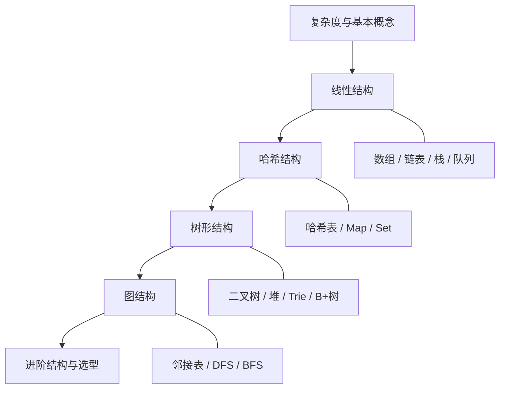

# 数据结构基础大全

数据结构是计算机里**组织和存放数据**的方式。同样一份数据，用不同结构存放，查询、插入、删除的快慢可以差出几个数量级。

一句话概括：算法是「怎么做」，数据结构是「怎么放」——**放对了，算法才有用武之地**。

---

## 学习路线图



建议顺序：先搞懂 **时间 / 空间复杂度**，再学线性结构（最常用），然后是哈希与树，最后是图与进阶结构。

---

## 0. 先搞懂：复杂度（Big O）

衡量操作快慢时，通常只关心「数据量变大时，耗时怎么变」，用 **大 O 记号** 表示。

| 复杂度 | 通俗理解 | 典型场景 |
| --- | --- | --- |
| **O(1)** | 不管多少数据，几乎恒定时间 | 数组按下标取值、哈希表理想情况 |
| **O(log n)** | 每步砍掉一半 | 二分查找、平衡树查询 |
| **O(n)** | 和数据量成正比 | 遍历数组、链表查找 |
| **O(n log n)** | 比线性稍慢 | 高效排序（快排 / 归并平均） |
| **O(n²)** | 双重循环级 | 简单两两比较、冒泡排序 |
| **O(2ⁿ)** | 指数爆炸 | 暴力枚举子集（要尽量避免） |

记忆口诀：

- **O(1)** ≈ 伸手就拿
- **O(log n)** ≈ 猜数字（每次对半分）
- **O(n)** ≈ 从头翻到尾
- **O(n²)** ≈ 每个人都和所有人比一遍

> 空间复杂度同理：额外开了多少内存。能原地完成往往更省，但有时用空间换时间（如哈希表）更划算。

---

## 1. 线性结构

元素之间是「前后排队」的关系：一个接一个。

### 1.1 数组（Array）

**核心：连续内存 + 下标随机访问。**

像一排固定编号的储物柜：知道编号就能直接打开。

| 操作 | 平均复杂度 | 说明 |
| --- | --- | --- |
| 按下标读 / 写 | O(1) | 最大优势 |
| 末尾追加 | 均摊 O(1) | 动态数组扩容时偶尔变慢 |
| 中间插入 / 删除 | O(n) | 后面元素要挪位 |
| 按值查找 | O(n) | 无序时只能扫一遍 |

```js
// 动态数组（JS 的 Array 就是这类）
const nums = [10, 20, 30]
nums[1]          // O(1) → 20
nums.push(40)    // 末尾追加，均摊 O(1)
nums.splice(1, 0, 15) // 中间插入，后面要移动 → O(n)
```

适用：需要按下标访问、顺序遍历、数据量已知或变化不大。

注意：

- 静态数组长度固定；动态数组（如 `ArrayList`、JS `Array`）底层会扩容（通常约 1.5～2 倍）
- 扩容要整块拷贝，所以「偶尔」会变慢，平均下来仍可接受

---

### 1.2 链表（Linked List）

**核心：节点散落存储，靠指针（引用）串起来。**

像一条「手拉手」的队伍：找到人要顺着牵手往下摸，但插队、出队只改握手关系即可。

```text
头 → [10|●] → [20|●] → [30|∅]
         next      next
```

| 操作 | 单向链表 | 说明 |
| --- | --- | --- |
| 头插 / 头删 | O(1) | 改头指针即可 |
| 尾插（无尾指针） | O(n) | 要走到尾 |
| 按值 / 按下标找 | O(n) | 不能随机访问 |
| 已知节点后插入 | O(1) | 改指针 |

```js
class ListNode {
  constructor(val, next = null) {
    this.val = val
    this.next = next
  }
}

// 头插
function prepend(head, val) {
  return new ListNode(val, head)
}
```

常见变体：

| 类型 | 特点 |
| --- | --- |
| **单向链表** | 只有 `next`，省空间 |
| **双向链表** | 有 `prev` + `next`，可双向遍历（如 LRU 缓存） |
| **循环链表** | 尾接回头，适合环形任务调度 |

**数组 vs 链表怎么选？**

| 场景 | 更合适 |
| --- | --- |
| 频繁按下标读 | 数组 |
| 频繁在中间插入 / 删除（且已定位到节点） | 链表 |
| 缓存友好、顺序扫描 | 数组（连续内存） |
| 实现栈 / 队列 / LRU | 链表或数组均可，看语言与细节 |

---

### 1.3 栈（Stack）

**核心：后进先出（LIFO）。**

像叠盘子：最后放上去的最先拿走。

```text
入栈 push →  [3]
              [2]
              [1]  ← 栈底
出栈 pop  → 先拿走 3
```

| 操作 | 复杂度 |
| --- | --- |
| push / pop / peek | O(1) |

典型应用：

- 括号匹配、表达式求值
- 函数调用栈、递归改迭代
- 浏览器前进后退（常配合两个栈）
- 单调栈（求「下一个更大元素」等）

```js
const stack = []
stack.push(1)
stack.push(2)
stack.pop()   // 2
stack.at(-1)  // 窥视栈顶 → 1
```

---

### 1.4 队列（Queue）

**核心：先进先出（FIFO）。**

像食堂排队：先来的先打饭。

```text
入队 enqueue → 队尾
出队 dequeue ← 队头
[1] [2] [3] → 先出 1
```

| 操作 | 复杂度 |
| --- | --- |
| enqueue / dequeue | O(1)（用合适实现） |

典型应用：

- BFS 广度优先搜索
- 消息队列、任务调度
- 滑动窗口、缓冲区

```js
// 简单演示（生产环境注意 shift 是 O(n)，可用双端队列或链表）
const queue = []
queue.push(1)   // 入队
queue.push(2)
queue.shift()   // 出队 → 1
```

常见变体：

| 类型 | 说明 |
| --- | --- |
| **普通队列** | 一头进一头出 |
| **双端队列 Deque** | 两端都可进可出 |
| **优先队列** | 按优先级出队（底层常用堆） |
| **循环队列** | 数组环形复用，避免假溢出 |

---

## 2. 哈希结构

### 2.1 哈希表（Hash Table / Map）

**核心：用哈希函数把「键」映射到「桶」，接近 O(1) 查找。**

像图书馆按姓氏分区：先算该去哪一区，再在区内找，而不是从头翻整馆。

```text
key ──哈希函数──→ index ──→ 桶（存 key-value）
"name" → 3 → [ "name" : "Codery" ]
```

| 操作 | 平均 | 最坏（冲突严重） |
| --- | --- | --- |
| 增 / 删 / 查 | O(1) | O(n) |

冲突解决常见两种：

1. **链地址法**：同一桶挂链表 / 红黑树（Java `HashMap`）
2. **开放寻址法**：冲突了往后探下一个空位（部分语言字典实现）

```js
const map = new Map()
map.set('userId', 42)
map.get('userId')     // 42
map.has('userId')     // true
map.delete('userId')
```

使用注意：

- 好的哈希函数 + 合理装载因子，才能接近 O(1)
- 键需要稳定的哈希与相等语义（对象引用当键时要小心）
- 无序（除非用 `LinkedHashMap` 等保序变体）

### 2.2 集合（Set）

**核心：只存「有没有」，不关心值；元素唯一。**

```js
const set = new Set([1, 2, 2, 3])
set.size           // 3
set.has(2)         // true
set.add(4)
```

典型用途：去重、判断存在、交集 / 并集运算。

---

## 3. 树形结构

树是「一对多」的层级关系：一个根，向下分叉，**没有环**。

```text
        根
       / \
      A   B
     / \   \
    C   D   E
```

### 3.1 二叉树基础

每个节点最多两个孩子：左、右。

重要术语：

| 术语 | 含义 |
| --- | --- |
| **深度 / 高度** | 从根到叶的层数相关概念 |
| **叶子** | 没有孩子的节点 |
| **满二叉树** | 每层都满 |
| **完全二叉树** | 除最后一层外都满，最后一层左对齐（堆常用） |

三种经典遍历：


- **前序**：复制树、前缀表达式
- **中序**：BST 中可得有序序列
- **后序**：删树、后缀表达式
- **层序**：用队列，一层一层扫（BFS）

```js
// 前序遍历（递归）
function preorder(node, out = []) {
  if (!node) return out
  out.push(node.val)
  preorder(node.left, out)
  preorder(node.right, out)
  return out
}
```

---

### 3.2 二叉搜索树 BST

**核心：左 < 根 < 右（对每个子树都成立）。**

查找像二分：每次排除一半方向。

| 操作 | 平均 | 最坏（退化成链） |
| --- | --- | --- |
| 查 / 插 / 删 | O(log n) | O(n) |

```text
      8
     / \
    3   10
   / \    \
  1   6    14
```

问题：若按有序顺序插入，会退化成链表。于是需要 **平衡树**。

---

### 3.3 平衡树：AVL 与红黑树

目标：通过旋转保持大致平衡，查询稳定在 O(log n)。

| 类型 | 平衡严格度 | 常见用途 |
| --- | --- | --- |
| **AVL** | 很严（左右高度差 ≤ 1） | 查询极多、插入较少 |
| **红黑树** | 较松 | 通用（Java `TreeMap`、多语言标准库） |

不必死记旋转细节，先建立直觉：**插入破坏平衡 → 旋转修复 → 高度始终对数级**。

---

### 3.4 堆（Heap）

**核心：用完全二叉树实现的优先队列；父节点总比子节点大（或总比子节点小）。**

| 类型 | 规则 | 典型用途 |
| --- | --- | --- |
| **大根堆** | 父 ≥ 子 | 取最大、堆排序 |
| **小根堆** | 父 ≤ 子 | 取最小、定时任务、TopK |

| 操作 | 复杂度 |
| --- | --- |
| 看堆顶 | O(1) |
| 插入 / 删除堆顶 | O(log n) |
| 建堆 | O(n) |

```js
// 概念示意：小根堆取最小
// 实际可用优先队列库；手写需维护上浮 / 下沉
```

经典题型：前 K 大、合并 K 个有序链表、中位数（对顶堆）。

---

### 3.5 字典树 Trie（前缀树）

**核心：按字符一层层分叉，共享前缀。**

适合：自动补全、敏感词过滤、词频统计。

```text
根
└─ c
   └─ a
      ├─ t（cat）
      └─ r
         └─ s（cars）
```

| 操作 | 复杂度 |
| --- | --- |
| 插入 / 查找单词 | O(L)，L 为单词长度 |

空间换时间：节点可能很多，但前缀共享很省。

---

### 3.6 B 树 / B+ 树（了解即可）

多路搜索树，一个节点可有多个孩子，专为 **磁盘 / 数据库索引** 设计：减少 IO 次数。

- **B 树**：数据可存在内部节点
- **B+ 树**：数据只在叶子，叶子串成链表 → 范围查询友好（MySQL InnoDB 索引）

前端日常少直接写，但理解「为什么数据库用 B+ 树」很有帮助。

---

## 4. 图结构

图是「多对多」：节点（顶点）+ 边，**可以有环**。

```text
A —— B
|    |
C —— D
```

| 概念 | 含义 |
| --- | --- |
| **有向 / 无向** | 边是否有方向 |
| **有权 / 无权** | 边是否带距离、费用 |
| **度** | 连了多少条边 |

### 4.1 存储方式

| 方式 | 空间 | 适合 |
| --- | --- | --- |
| **邻接矩阵** | O(V²) | 稠密图、快速判断两点是否相连 |
| **邻接表** | O(V+E) | 稀疏图（更常见） |

```js
// 邻接表：无向图
const graph = {
  A: ['B', 'C'],
  B: ['A', 'D'],
  C: ['A', 'D'],
  D: ['B', 'C'],
}
```

### 4.2 两种遍历

| 方式 | 数据结构 | 直观理解 | 用途 |
| --- | --- | --- | --- |
| **DFS 深度优先** | 栈 / 递归 | 一条路走到底再回头 | 路径、连通、拓扑 |
| **BFS 广度优先** | 队列 | 先访近再访远 | 最短路（无权）、层级 |

```js
// BFS 最短层数示意
function bfs(start, graph) {
  const q = [start]
  const seen = new Set([start])
  while (q.length) {
    const u = q.shift()
    for (const v of graph[u] || []) {
      if (!seen.has(v)) {
        seen.add(v)
        q.push(v)
      }
    }
  }
}
```

进阶方向（有基础后再学）：Dijkstra、最小生成树、拓扑排序、并查集判连通。

---

## 5. 进阶结构速览

面试与工程中常「知其然」即可，细节可按需深入。

| 结构 | 一句话 | 典型场景 |
| --- | --- | --- |
| **并查集 Union-Find** | 快速合并集合、查是否同组 | 连通分量、最小生成树 Kruskal |
| **跳表 Skip List** | 多层链表近似平衡树 | Redis 有序集合 ZSet |
| **布隆过滤器** | 用位图快速判断「一定不存在」 | 缓存穿透防护、爬虫去重 |
| **线段树 / 树状数组** | 区间查询与更新 | 竞赛、区间统计 |
| **LRU 缓存** | 哈希表 + 双向链表 | 最近最少使用淘汰 |

### LRU 为什么是「哈希 + 双向链表」？

- 哈希表：O(1) 找到节点
- 双向链表：O(1) 挪到头部 / 删尾部

这是工程里「组合数据结构」的经典例子。

---

## 6. 选型速查表

面对实际问题时，先问：**主要操作是什么？数据规模多大？要不要有序？**

| 你的需求 | 优先考虑 |
| --- | --- |
| 按下标访问、顺序扫 | 数组 |
| 头尾频繁插删 | 链表 / 双端队列 |
| 撤销、括号、递归转迭代 | 栈 |
| 排队、层序、BFS | 队列 |
| 快速判断存在 / 去重 / 计数 | 哈希表 / Set |
| 要有序 + 动态插删 | 平衡树 / 有序映射 |
| 反复取最大 / 最小 | 堆 |
| 字符串前缀 | Trie |
| 关系网络、路径 | 图 |
| 数据库范围索引 | B+ 树（引擎层） |

**复杂度对比（平均情况，便于记忆）：**

| 结构 | 访问 | 查找 | 插入 | 删除 |
| --- | --- | --- | --- | --- |
| 数组 | O(1) | O(n) | O(n) | O(n) |
| 链表 | O(n) | O(n) | O(1)* | O(1)* |
| 哈希表 | — | O(1) | O(1) | O(1) |
| BST（平衡） | — | O(log n) | O(log n) | O(log n) |
| 堆 | 堆顶 O(1) | O(n) | O(log n) | O(log n) |

\* 链表的 O(1) 插入 / 删除前提是：**已经拿到目标位置的节点引用**。

---

## 7. 怎么学更高效

1. **先建立画面**：柜子（数组）、手拉手（链表）、盘子摞（栈）、排队（队列）、图书馆分区（哈希）、家谱（树）、社交网（图）。
2. **每学一种，手写一遍**：用自己熟悉的语言实现核心 API（push/pop、insert、traverse）。
3. **对照刷题**：LeetCode 热题里的「数组 / 链表 / 栈队列 / 哈希 / 树 / 图 / 堆」专题。
4. **和算法一起看**：本站 [排序算法](/algorithm/sortAlg)、[查找算法](/algorithm/searchAlg) 往往直接建立在这些结构上。
5. **结合业务**：前端路由栈、事件队列、虚拟 DOM 树、Map 缓存、LRU——处处都是数据结构。

---

## 8. 小结

| 层次 | 你应掌握 |
| --- | --- |
| **必会** | 数组、链表、栈、队列、哈希表、二叉树遍历、堆的概念、图的 BFS/DFS |
| **应熟** | BST、平衡树直觉、Trie、优先队列刷题用法、邻接表 |
| **了解** | 红黑树细节、B+ 树、跳表、布隆过滤器、并查集 |

选择数据结构的本质是 **权衡**：

> 要速度还是要空间？要随机访问还是要灵活插删？要有序还是要 O(1) 查找？

把这几个问题想清楚，大部分选型就有答案了。

延伸阅读：

- 《算法（第 4 版）》—— Sedgewick（图解清晰）
- 《数据结构与算法分析》—— Weiss
- VisuAlgo（可视化）：https://visualgo.net
- 本站算法专题：`/algorithm/`
