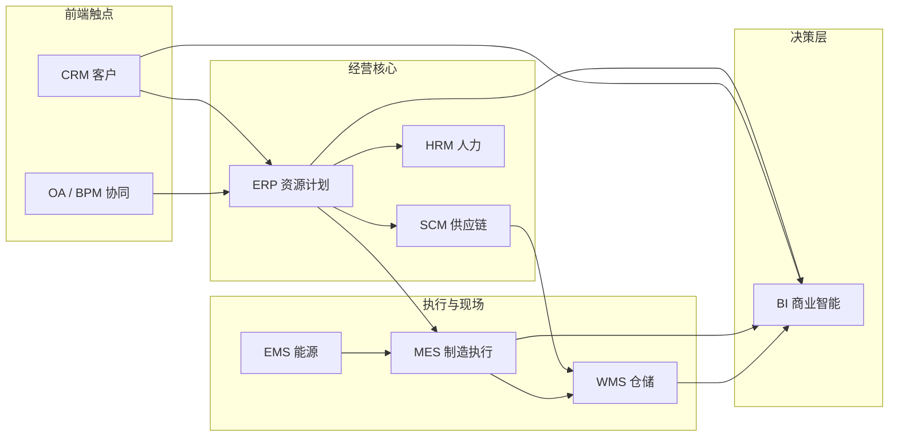
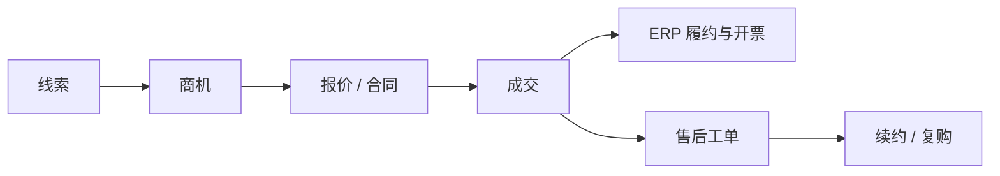
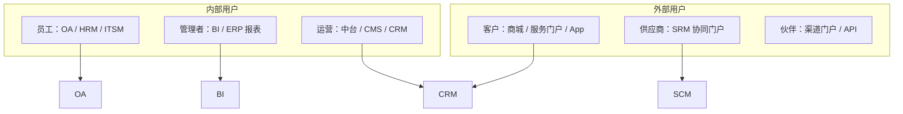
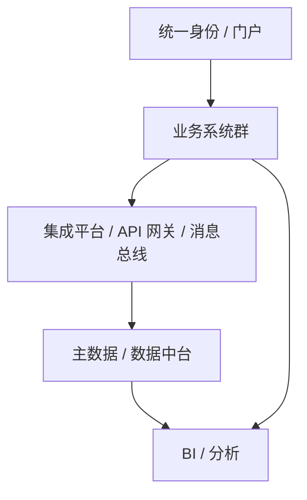
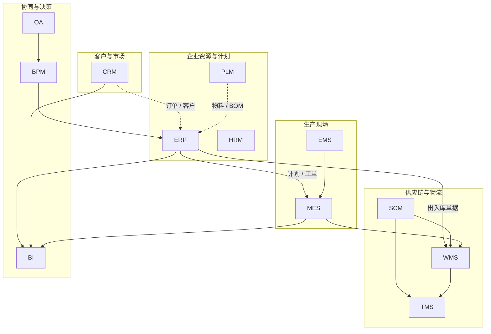

# 互联网常见管理平台

企业管理软件解决的是「人、财、物、客、产、供、销」的数字化协同问题。可按 **核心功能、行业场景、用户角色、技术架构** 等维度划分；同一企业通常会同时运行多套系统，并通过接口或中台打通数据。

一句话概括：管理平台是业务规则的软件化承载——**把流程固化、把数据沉淀、把决策可视化**。

---

## 分类总览

| 划分维度 | 关注点 | 典型问题 |
| --- | --- | --- |
| **按核心功能** | 系统解决哪一类业务 | 要管财务、客户，还是仓库？ |
| **按行业场景** | 垂直领域特有流程 | 制造、电商、政务、医疗？ |
| **按用户角色** | 谁在用、权限边界 | 员工、客户、供应商、运营？ |
| **按技术架构** | 怎么建、怎么部署 | 单体 / 微服务、SaaS / 私有化？ |

下图从「企业运营主链路」看常见系统如何协作：



数据大致流向：**业务系统产生交易与过程数据 → BI / 数据中台汇总分析 → 反哺经营决策**。

---

## 一、按核心功能划分

| 平台类型 | 英文全称 | 核心职责 | 典型行业 | 代表产品 |
| --- | --- | --- | --- | --- |
| **ERP** | Enterprise Resource Planning | 企业资源整合（财务、供应链、生产、库存） | 制造、零售 | SAP、用友、金蝶 |
| **CRM** | Customer Relationship Management | 客户生命周期（线索、商机、服务、营销） | 电商、金融、ToB 销售 | Salesforce、HubSpot、纷享销客 |
| **MES** | Manufacturing Execution System | 车间执行与过程管控（工单、质量、设备） | 工业制造、汽车 | Siemens MES、达索 DELMIA |
| **WMS** | Warehouse Management System | 仓储作业（入库、拣选、盘点、出库） | 物流、电商 | 京东物流 WMS、Infor |
| **SCM** | Supply Chain Management | 端到端供应链协同（采购、物流、供应网络） | 快消、跨境 | Oracle SCM、蓝卓 |
| **HRM / HCM** | Human Resource / Capital Management | 人力全周期（招聘、考勤、绩效、薪酬） | 全行业 | 北森、Workday、钉钉 |
| **OA** | Office Automation | 办公协同（审批、文档、沟通、门户） | 企业服务 | 飞书、企业微信、泛微 |
| **BPM** | Business Process Management | 流程建模、执行、监控与优化 | 金融、政务 | 阿里宜搭、K2 |
| **BI** | Business Intelligence | 报表、看板、分析与预测 | 全行业 | Tableau、Power BI、帆软 |
| **EMS** | Energy Management System | 能耗采集、监控与节能优化 | 电力、园区、工业 | 施耐德 EcoStruxure |
| **PLM** | Product Lifecycle Management | 产品从设计到退役的数据与流程 | 研发型制造 | Siemens Teamcenter、PTC Windchill |
| **TMS** | Transportation Management System | 运输计划、运力调度、运费结算 | 物流、电商 | 满帮、Oracle TMS |
| **CMS** | Content Management System | 内容创建、发布与站点管理 | 媒体、运营 | WordPress、Contentful |
| **ITSM** | IT Service Management | IT 服务台、变更、事件、资产管理 | 信息化密集企业 | ServiceNow、Jira Service Management |

下面按「学什么、管什么、和谁对接」展开说明。

### 1. ERP：企业资源计划

**定位：** 企业内部「资源账本」与经营中枢，把财务、采购、销售、库存、生产计划等主数据与业务单据打通。

**常见模块：**

| 模块 | 管什么 |
| --- | --- |
| 财务会计 / 管理会计 | 总账、应收应付、成本、预算 |
| 采购与库存 | 请购、订单、入库、库存账 |
| 销售与分销 | 订单、发货、开票 |
| 生产计划（MRP） | 主生产计划、物料需求计划 |
| 主数据 | 物料、客户、供应商、组织与科目 |

**学习要点：**

- ERP 强调 **账实一致** 与 **流程闭环**，不是单纯的「报表工具」
- 与 MES、WMS、CRM 常通过接口同步：订单、库存、成本、客户主数据
- 选型时关注：行业模板、实施周期、二次开发成本、与现有系统集成能力

```text
销售订单 → 库存 / 生产可用性检查 → 发货 / 完工入库 → 应收开票 → 总账
采购申请 → 采购订单 → 收货入库 → 应付结算 → 总账
```

### 2. CRM：客户关系管理

**定位：** 面向「客户侧」的经营系统，覆盖获客、转化、成交、服务与复购。

**常见能力：**

| 阶段 | 能力举例 |
| --- | --- |
| 获客 | 线索采集、渠道归因、营销自动化 |
| 转化 | 商机跟进、报价、合同 |
| 服务 | 工单、回访、知识库、NPS |
| 运营 | 客户分层、会员、复购策略 |

**与 ERP 的边界：** CRM 管「客户怎么成交与服务」；ERP 管「成交后如何履约与记账」。成交单往往从 CRM 推送到 ERP 生成销售订单。



### 3. MES：制造执行系统

**定位：** 连接计划层（ERP）与现场设备 / 人员，把「生产计划」落到「车间怎么干、干得怎样」。

**核心能力：** 工单下发与报工、工艺路线与工序管控、质量采集与追溯、设备状态与 OEE、物料上线与在制品（WIP）跟踪。

**和 ERP 的分工：**

| 层级 | 系统 | 时间粒度 | 关注点 |
| --- | --- | --- | --- |
| 计划层 | ERP | 天 / 周 | 要生产什么、用什么料、成本多少 |
| 执行层 | MES | 班次 / 分钟 | 正在产什么、质量如何、设备是否正常 |
| 控制层 | PLC / SCADA | 秒 / 毫秒 | 设备怎么动 |

### 4. WMS：仓储管理系统

**定位：** 仓库内作业的「操作系统」——库位、批次、拣选路径、盘点差异都在这里管理。

**典型流程：**

```text
预约到货 → 收货质检 → 上架 → 库存调拨 / 盘点
客户订单 / 出库单 → 波次拣选 → 复核打包 → 发运交接（可对接 TMS）
```

**学习要点：** 关注库位策略、批次 / 序列号追溯、与 ERP 库存账的差异对账（账面库存 vs 实物库存）。

### 5. SCM：供应链管理

**定位：** 跨组织协同——不只是企业内部采购，还包括供应商、物流商、分销网络的计划与协同。

相对 ERP 中的采购模块，SCM 更强调：需求预测与补货、供应网络可视化、供应商协同（SRM）、物流与库存联合优化。

### 6. HRM / HCM：人力资源管理

**定位：** 组织与人的全生命周期：组织编制、招聘入职、考勤排班、绩效薪酬、培训与离职。

与 OA 常重叠在「请假审批」等流程；与 ERP 财务对接薪酬核算与成本归集。

### 7. OA 与 BPM：协同与流程

| 对比项 | OA | BPM |
| --- | --- | --- |
| 侧重点 | 办公协同、门户、沟通、文档 | 流程建模、引擎执行、监控优化 |
| 典型场景 | 请假、用章、公告、知识库 | 信贷审批、工单流转、跨系统编排 |
| 关系 | BPM 可作为 OA / 业务系统的流程引擎 | 低代码平台常同时具备二者能力 |

可以把 OA 理解为「人协作的工作台」，BPM 理解为「把业务流程画出来并自动跑起来的引擎」。

### 8. BI：商业智能

**定位：** 把各业务系统数据汇总为可理解的指标、报表与看板，支撑经营分析。

**常见分层：**

```text
业务库 / 日志 → ETL / 数仓 → 数据集市 → 报表 / 看板 / 自助分析
```

**学习要点：** BI 质量取决于上游主数据与口径是否统一；没有治理的「报表堆」很难形成可信决策。

### 9. 其他常见类型（简表）

| 类型 | 一句话 | 常与谁集成 |
| --- | --- | --- |
| **PLM** | 管产品设计数据与变更 | ERP（物料）、MES（工艺） |
| **TMS** | 管运输与运力 | WMS、SCM、电商订单 |
| **EMS** | 管能耗与能源成本 | MES、楼宇 / 园区系统 |
| **ITSM** | 管 IT 服务与资产 | OA、监控、CMDB |
| **E-commerce 中台** | 管商品、订单、营销、会员 | CRM、WMS、ERP、支付 |

---

## 二、按行业场景划分

| 行业 | 常见系统组合 | 行业特有关注点 |
| --- | --- | --- |
| **离散制造** | ERP + MES + PLM + WMS | 工艺路线、质量追溯、设备稼动率 |
| **流程制造** | ERP + MES + EMS + LIMS | 配方、批次、能耗、合规 |
| **零售 / 电商** | 中台 + WMS + TMS + CRM + BI | 库存共享、履约时效、会员运营 |
| **金融** | 核心业务系统 + CRM + BPM + 风控 + BI | 合规、审批流、风控模型 |
| **政务** | OA + BPM + 一网通办门户 | 事项标准化、数据共享、安全等保 |
| **医疗** | HIS / EMR + LIS + 物资 / 设备系统 | 诊疗闭环、药品器械追溯 |
| **物流** | WMS + TMS + OMS | 运力、路由、末端时效 |

> 垂直行业往往在通用 ERP/CRM 之上叠加行业模块，或直接采用行业套件。

---

## 三、按用户角色划分



| 角色 | 典型系统入口 | 核心诉求 |
| --- | --- | --- |
| 员工 | OA、HRM、研发协作工具 | 少填表、流程清晰、移动端可用 |
| 管理者 | BI 看板、ERP 经营报表 | 口径统一、可下钻、异常预警 |
| 客户 | 官网 / App / 服务台 | 下单便捷、进度可查、问题可跟 |
| 供应商 | SRM / 门户 | 订单可视、对账清晰、协同高效 |

---

## 四、按技术与部署方式划分

| 维度 | 常见选项 | 说明 |
| --- | --- | --- |
| **交付形态** | 本地部署、私有云、公有云 SaaS、混合云 | SaaS 上线快；本地 / 私有云更利于强合规与深度定制 |
| **架构风格** | 单体、SOA、微服务、低代码平台 | 中大型企业常用「业务中台 + 数据中台」思路集成多系统 |
| **集成方式** | API、ESB / iPaaS、消息队列、RPA | 主数据与单据同步是集成重点 |
| **终端** | Web、桌面客户端、移动 App、小程序、大屏 | 现场类（MES/WMS）常需工业终端或 PDA |

企业集成的常见形态：



---

## 五、系统选型与学习建议

### 1. 选型时可问的五个问题

1. **主链路是什么？** 先厘清订单、库存、财务、生产中哪条链最痛。
2. **数据谁说了算？** 客户、物料、组织等主数据以哪套系统为准。
3. **集成还是替换？** 存量系统多时，优先考虑集成与分期替换。
4. **组织能否跟上？** 软件只是载体，流程与岗位不变则上线效果有限。
5. **总拥有成本？** 许可、实施、二次开发、运维、培训都要计入。

### 2. 建议的学习顺序

```text
1. 先建立「企业业务主链路」心智模型（订单 → 履约 → 结算 → 分析）
2. 再对照 ERP / CRM / WMS / MES 各自卡在主链路的哪一段
3. 用一张集成图理解系统边界，避免把所有能力都塞进同一套软件
4. 结合具体产品做模块级上手（如用友某一财务模块、飞书审批流）
```

### 3. 易混淆概念速查

| 容易混淆 | 区分要点 |
| --- | --- |
| ERP vs MES | ERP 管计划与账；MES 管车间执行与过程 |
| WMS vs 库存模块 | ERP 库存偏账面；WMS 偏库位与作业执行 |
| OA vs BPM | OA 偏协同办公；BPM 偏流程引擎与编排 |
| CRM vs 客服工单 | CRM 覆盖营销销售全周期；工单只是服务环节之一 |
| BI vs 业务报表 | 业务系统报表服务操作；BI 服务跨系统分析与指标治理 |
| SCM vs 采购模块 | 采购是节点能力；SCM 强调端到端网络协同 |

---

## 六、一张图记住边界



记住三点即可入门：

1. **CRM 对外经营客户，ERP 对内经营资源与账。**
2. **MES / WMS 把计划变成现场动作，并回传实绩。**
3. **OA / BPM 让人按规则协作，BI 让数据支撑决策。**

---

## 参考延伸

- 国际标准与参考模型：ISA-95（制造层级）、ITIL（IT 服务）、SCOR（供应链）
- 国内常见厂商文档：用友、金蝶、华为云 / 阿里云上的行业解决方案白皮书
- 若面向开发：优先理解 **主数据、单据状态机、集成接口、权限与组织模型** 四类通用抽象
