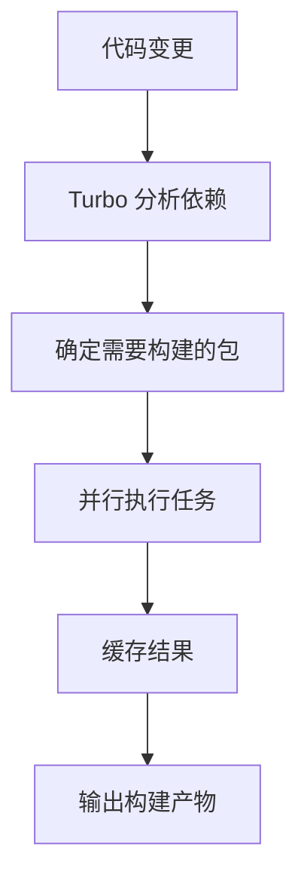

# Monorepo 架构详解

<div align="center">
  <h1>Monorepo 项目架构完整指南</h1>
  <p>基于 Vue Vben Admin 项目的 Monorepo 架构实践</p>
</div>

## 📖 目录

- [什么是 Monorepo](#什么是-monorepo)
- [Monorepo vs 传统架构](#monorepo-vs-传统架构)
- [核心工具介绍](#核心工具介绍)
- [项目结构对比](#项目结构对比)
- [实际应用示例](#实际应用示例)
- [优势与挑战](#优势与挑战)
- [最佳实践](#最佳实践)

## 什么是 Monorepo

### 定义

**Monorepo**（Monolithic Repository）是一种代码管理策略，将多个相关的项目或包存储在同一个 Git 仓库中。

### 核心特征

- **单一仓库** - 所有相关代码在一个 Git 仓库中
- **多包管理** - 包含多个独立的包或应用
- **共享依赖** - 包之间可以共享代码和依赖
- **统一管理** - 统一的版本控制、构建流程和开发工具

## Monorepo vs 传统架构

### 传统多仓库架构（Multi-repo）

```
传统多仓库方式：
├── vue-admin-antd/          # 独立仓库 1
│   ├── src/
│   ├── package.json
│   └── README.md
├── vue-admin-ele/           # 独立仓库 2
│   ├── src/
│   ├── package.json
│   └── README.md
├── vue-admin-naive/         # 独立仓库 3
│   ├── src/
│   ├── package.json
│   └── README.md
├── shared-components/       # 独立仓库 4
│   ├── src/
│   ├── package.json
│   └── README.md
└── shared-utils/            # 独立仓库 5
    ├── src/
    ├── package.json
    └── README.md
```

### Monorepo 架构

```
vue-vben-admin/              # 单一仓库
├── apps/                    # 应用程序目录
│   ├── web-antd/           # Ant Design 版本
│   │   ├── src/
│   │   ├── package.json
│   │   └── vite.config.mts
│   ├── web-ele/            # Element Plus 版本
│   │   ├── src/
│   │   ├── package.json
│   │   └── vite.config.mts
│   └── web-naive/          # Naive UI 版本
│       ├── src/
│       ├── package.json
│       └── vite.config.mts
├── packages/               # 共享包目录
│   ├── @vben/utils/        # 工具函数库
│   │   ├── src/
│   │   ├── package.json
│   │   └── tsconfig.json
│   ├── @vben/layouts/      # 布局组件库
│   │   ├── src/
│   │   ├── package.json
│   │   └── tsconfig.json
│   └── @vben/icons/        # 图标库
│       ├── src/
│       ├── package.json
│       └── tsconfig.json
├── internal/               # 内部工具包
│   ├── vite-config/        # Vite 配置
│   ├── tailwind-config/    # Tailwind 配置
│   └── tsconfig/           # TypeScript 配置
├── package.json            # 根包配置
├── pnpm-workspace.yaml     # 工作空间配置
├── turbo.json              # Turbo 配置
└── README.md
```

## 核心工具介绍

### 1. pnpm - 包管理器

#### 什么是 pnpm？

**pnpm** 是一个快速、节省磁盘空间的包管理器，特别适合 Monorepo 项目。

#### 核心特性

- **硬链接** - 节省磁盘空间
- **工作空间** - 原生支持 Monorepo
- **严格依赖** - 避免幽灵依赖
- **高性能** - 比 npm/yarn 更快

#### 工作空间配置

```yaml
# pnpm-workspace.yaml
packages:
  - internal/*           # 内部工具包：包含项目内部使用的工具和配置，如vite-config、ts-config、lint-config、tailwind-config
  - packages/*           # 共享包：管理可以被多个应用共享的库和组件，包括组件库、全局样式主题配置、全局ts类型定义、图标库、Pinia状态管理、国际化配置等
  - apps/*              # 应用程序：具体的应用程序
  - scripts/*           # 构建脚本：包含项目构建和开发所需的各种脚本、deploy部署脚本、turbo-run运行脚本、清理项目文件等等
  - docs                # 文档
  - playground          # 开发测试环境：开发和测试的沙盒环境
```

### 2. Turbo - 构建系统

#### 什么是 Turbo？

**Turbo** 是一个高性能的构建系统，专门为 JavaScript/TypeScript Monorepo 设计。

#### 核心功能

1. **任务编排** - 协调多个包的构建任务
2. **依赖分析** - 自动分析包之间的依赖关系
3. **增量构建** - 只构建发生变化的包
4. **并行执行** - 同时运行多个任务
5. **智能缓存** - 缓存构建结果，避免重复工作

#### 配置示例

```json
// turbo.json
{
  "tasks": {
    "build": {
      "dependsOn": ["^build"],  // 依赖其他包的构建
      "outputs": ["dist/**"]    // 输出目录
    },
    "dev": {
      "dependsOn": [],
      "cache": false,          // 开发模式不缓存
      "persistent": true       // 持久化任务
    },
    "test": {
      "dependsOn": ["build"]   // 依赖构建完成
    }
  }
}
```

#### 工作流程



## 项目结构对比

### 目录组织方式

#### 普通项目架构
```
每个项目独立：
├── vue-admin-antd/
│   ├── src/
│   ├── public/
│   ├── package.json
│   ├── vite.config.js
│   ├── tsconfig.json
│   └── README.md
└── vue-admin-ele/
    ├── src/
    ├── public/
    ├── package.json
    ├── vite.config.js
    ├── tsconfig.json
    └── README.md
```

#### Monorepo 架构
```
统一管理：
├── apps/                    # 应用层
│   ├── web-antd/           # 每个应用独立配置
│   ├── web-ele/
│   └── web-naive/
├── packages/               # 共享层
│   ├── @vben/utils/        # 工具包
│   ├── @vben/layouts/      # 布局包
│   └── @vben/icons/        # 图标包
├── internal/               # 内部工具层
│   ├── vite-config/        # 统一配置
│   ├── tailwind-config/
│   └── tsconfig/
└── 根配置文件
```

### 配置文件差异

#### 普通项目
```json
// 每个项目独立的 package.json
{
  "name": "vue-admin-antd",
  "dependencies": {
    "shared-components": "^1.0.0",
    "shared-utils": "^1.0.0"
  },
  "scripts": {
    "dev": "vite",
    "build": "vite build"
  }
}
```

#### Monorepo
```json
// 根目录 package.json
{
  "name": "vben-admin-monorepo",
  "scripts": {
    "dev": "turbo-run dev",
    "build": "turbo build"
  }
}

// 工作空间配置 pnpm-workspace.yaml
packages:
  - apps/*
  - packages/*
  - internal/*

// 各个包的 package.json
{
  "name": "@vben/web-antd",
  "dependencies": {
    "@vben/layouts": "workspace:*",
    "@vben/utils": "workspace:*"
  }
}
```

### 依赖管理差异

#### 普通项目
```bash
# 需要发布共享包到 npm
npm publish shared-components
npm publish shared-utils

# 在各个项目中安装
npm install shared-components@^1.0.0
npm install shared-utils@^1.0.0
```

#### Monorepo
```bash
# 直接使用工作空间引用
"@vben/layouts": "workspace:*"
"@vben/utils": "workspace:*"

# 统一安装依赖
pnpm install
```

### 构建流程差异

#### 普通项目
```bash
# 需要分别构建每个项目
cd vue-admin-antd && npm run build
cd vue-admin-ele && npm run build
cd vue-admin-naive && npm run build

# 需要手动管理构建顺序
npm run build:shared-components
npm run build:shared-utils
npm run build:apps
```

#### Monorepo
```bash
# 统一构建命令
pnpm build                    # 构建所有
pnpm build --filter=@vben/web-antd  # 构建特定应用

# 自动管理依赖顺序
turbo build  # 自动分析依赖关系
```

## 实际应用示例

### Vue Vben Admin 项目结构

```
vue-vben-admin/
├── apps/                    # 应用程序目录
│   ├── web-antd/           # Ant Design Vue 版本
│   ├── web-ele/            # Element Plus 版本
│   ├── web-naive/          # Naive UI 版本
│   ├── backend-mock/       # 模拟后端服务
│   └── docs/               # 文档站点
├── packages/               # 共享包目录
│   ├── @core/              # 核心包
│   │   ├── base/           # 基础功能
│   │   ├── ui-kit/         # UI 组件库
│   │   ├── composables/    # 组合式函数
│   │   └── preferences/    # 偏好设置
│   ├── effects/            # 功能效果包
│   │   ├── access/         # 权限控制
│   │   ├── common-ui/      # 通用 UI 组件
│   │   ├── hooks/          # 自定义 Hooks
│   │   ├── layouts/        # 布局组件
│   │   ├── plugins/        # 插件系统
│   │   └── request/        # 请求封装
│   ├── constants/          # 常量定义
│   ├── icons/              # 图标库
│   ├── locales/            # 国际化资源
│   ├── stores/             # 状态管理
│   ├── styles/             # 样式文件
│   ├── types/              # 类型定义
│   └── utils/              # 工具函数
├── internal/               # 内部工具包
│   ├── lint-configs/       # 代码规范配置
│   ├── node-utils/         # Node.js 工具
│   ├── tailwind-config/    # Tailwind 配置
│   ├── tsconfig/           # TypeScript 配置
│   └── vite-config/        # Vite 配置
├── scripts/                # 构建脚本
├── playground/             # 开发测试环境
└── docs/                   # 项目文档
```

### 依赖关系图

```mermaid
graph TD
    A[@vben/types] --> B[@vben/utils]
    A --> C[@vben/icons]
    B --> D[@vben/layouts]
    C --> D
    D --> E[@vben/web-antd]
    D --> F[@vben/web-ele]
    D --> G[@vben/web-naive]
    
    H[vite-config] --> E
    H --> F
    H --> G
    I[tailwind-config] --> E
    I --> F
    I --> G
```

### 构建流程示例

#### 场景1：完整构建

```bash
# 第一次构建，所有包都需要构建
pnpm build

# Turbo 执行流程：
1. 分析所有包的依赖关系
2. 创建构建任务队列
3. 按依赖顺序执行构建
4. 缓存构建结果
5. 输出最终产物
```

#### 场景2：增量构建

```bash
# 修改了 @vben/utils 包中的代码
# 再次运行构建

pnpm build

# Turbo 执行流程：
1. 检测到 @vben/utils 发生变化
2. 分析受影响的其他包：
   - @vben/layouts（依赖 @vben/utils）
   - @vben/web-antd（依赖 @vben/layouts）
   - @vben/web-ele（依赖 @vben/layouts）
   - @vben/web-naive（依赖 @vben/layouts）
3. 只重新构建受影响的包
4. 使用缓存加速构建
```

### 开发命令对比

| 操作 | 普通项目 | Monorepo |
|------|---------|----------|
| **安装依赖** | `npm install` | `pnpm install` |
| **启动开发** | `npm run dev` | `pnpm dev` |
| **构建项目** | `npm run build` | `pnpm build` |
| **运行测试** | `npm test` | `pnpm test:unit` |
| **代码检查** | `npm run lint` | `pnpm lint` |
| **构建特定包** | 需要切换目录 | `pnpm build --filter=@vben/web-antd` |

## 优势与挑战

### 优势

#### 1. 代码共享
- **避免重复** - 多个项目可以共享代码和组件
- **统一维护** - 共享代码的修改只需要在一个地方进行
- **版本一致** - 所有项目使用相同版本的共享代码

#### 2. 统一管理
- **依赖版本** - 统一的依赖版本管理
- **代码规范** - 统一的代码风格和规范
- **构建流程** - 统一的构建和部署流程

#### 3. 开发体验
- **原子性提交** - 跨项目的修改可以在一次提交中完成
- **简化依赖** - 避免循环依赖和版本冲突
- **更好的重构** - 可以安全地重构共享代码

#### 4. 性能优化
- **增量构建** - 只构建发生变化的包
- **并行执行** - 同时运行多个任务
- **智能缓存** - 缓存构建结果，避免重复工作

### 挑战

#### 1. 复杂性
- **学习成本** - 需要学习新的工具和概念
- **配置复杂** - 需要配置多个工具和文件
- **调试困难** - 问题可能涉及多个包

#### 2. 工具链
- **工具选择** - 需要选择合适的工具链
- **版本兼容** - 需要确保工具之间的兼容性
- **维护成本** - 需要维护复杂的构建配置

#### 3. 团队协作
- **权限管理** - 需要合理的权限管理策略
- **代码审查** - 需要更严格的代码审查流程
- **冲突解决** - 多人同时修改可能产生冲突

## 最佳实践

### 1. 项目结构设计

#### 目录命名规范
```
├── apps/           # 应用程序
├── packages/       # 共享包
├── internal/       # 内部工具
├── scripts/        # 构建脚本
├── docs/           # 文档
└── playground/     # 开发测试
```

#### 包命名规范
```
@vben/web-antd      # 应用包
@vben/utils         # 工具包
@vben/layouts       # 组件包
@vben/types         # 类型包
```

### 2. 依赖管理

#### 工作空间引用
```json
{
  "dependencies": {
    "@vben/layouts": "workspace:*",
    "@vben/utils": "workspace:*"
  }
}
```

#### 版本管理
```json
// 根目录 package.json
{
  "devDependencies": {
    "typescript": "5.6.3",
    "vite": "^6.0.3"
  }
}
```

### 3. 构建配置

#### Turbo 配置
```json
{
  "tasks": {
    "build": {
      "dependsOn": ["^build"],
      "outputs": ["dist/**"]
    },
    "dev": {
      "dependsOn": [],
      "cache": false,
      "persistent": true
    }
  }
}
```

#### 脚本配置
```json
{
  "scripts": {
    "dev": "turbo-run dev",
    "build": "turbo build",
    "build:antd": "pnpm run build --filter=@vben/web-antd"
  }
}
```

### 4. 开发流程

#### Git 工作流
```bash
# 创建功能分支
git checkout -b feature/new-feature

# 提交修改
git add .
git commit -m "feat: add new feature"

# 推送分支
git push origin feature/new-feature
```

#### 代码规范
```json
// .eslintrc.js
{
  "extends": ["@vben/eslint-config"]
}
```

### 5. 性能优化

#### 缓存策略
```json
// turbo.json
{
  "tasks": {
    "build": {
      "outputs": ["dist/**"],
      "cache": true
    }
  }
}
```

#### 并行构建
```bash
# 利用 Turbo 的并行构建能力
pnpm build  # 自动并行构建
```

## 总结

### Monorepo 适用场景

**适合使用 Monorepo 的情况：**
- 多个相关项目需要共享代码
- 需要统一的版本管理和构建流程
- 团队规模较大，需要统一的开发规范
- 项目之间有复杂的依赖关系

**不适合使用 Monorepo 的情况：**
- 项目之间完全独立，没有共享代码
- 团队规模较小，管理成本较高
- 项目技术栈差异很大
- 需要独立的发布周期

### 关键成功因素

1. **选择合适的工具** - pnpm + Turbo 是很好的组合
2. **合理的设计结构** - 清晰的目录结构和命名规范
3. **完善的配置** - 详细的构建和开发配置
4. **团队协作** - 统一的开发流程和规范
5. **持续优化** - 根据实际使用情况不断优化

### 学习资源

- [pnpm 官方文档](https://pnpm.io/)
- [Turbo 官方文档](https://turbo.build/)
- [Vue Vben Admin 项目](https://github.com/vbenjs/vue-vben-admin)
- [Monorepo 最佳实践](https://monorepo.tools/)

---

<div align="center">
  <p>Monorepo 架构是现代前端开发的重要趋势</p>
  <p>选择合适的架构和工具，可以大大提高开发效率和代码质量</p>
</div>

## Monorepo面试题汇总

### 基础概念

1. **什么是Monorepo？它与传统的Multi-repo架构有什么区别？**
$emsp;$emsp;Monorepo是一种Git仓库管理策略，其主要特点就是采用单一仓库进行多项目统一管理，包括对项目的插件依赖版本、组件配置、开发构建配置等进行统一管理；相比于传统的多仓库管理，monorepo策略可以更好的对大型复杂的多项目系统进行更好的工程化管理，如协同开发、结构设计等。

2. **Monorepo的核心特征有哪些？**
$emsp;$emsp;统一版本控制、共享依赖配置、工程一致化规范、统一构建工具、团队协作规范等；

3. **Monorepo架构适合什么样的项目和团队？什么情况下不建议使用？**
$emsp;$emsp;多个项目有共享代码或冗余代码、项目需要统一版本管理和构建流程、开发团队规模大需要统一开发规范、项目之间有复杂的依赖关系；除此之外可以不建议使用，因为这种架构也会带来仓库体积大、打包缓慢、需要限制任务权限等；

### 工具链

1. **在Monorepo项目中，pnpm有什么优势？它是如何解决依赖管理问题的？**
$emsp;$emsp;pnpm相较于npm/yarn，性能会更好，速度也会更快。因为pnpm采用硬链接和全局store管理优化内存占用，可以避免频繁下载依赖，并且采用严格安全的依赖隔离；

2. **什么是pnpm的workspace功能？如何配置？**
$emsp;$emsp;workspace主要用于项目的工作空间配置，其主要配置项目包括统一的依赖版本信息配置、工作空间的包含范围等；

3. **Turbo在Monorepo中扮演什么角色？它有哪些核心功能？**
$emsp;$emsp;Turbo是一个专门为JS/TS和Monorepo架构设计的构建系统工具，主要核心功能包括：任务编排、依赖资源共享、增量构建、任务缓存等，是项目的任务调度器；

4. **如何配置Turbo以实现高效的任务编排和缓存？**
$emsp;$emsp;通常turbo相关的配置会在项目的turbo.json文件中进行，主要配置内容包括dependsOn配置任务间的依赖关系、使用outputs配置指定的缓存文件路径、使用globalDependencies进行全局依赖的声明、还有globalEvn进行环境变量管理；


### 项目结构

1. **Monorepo项目通常如何组织目录结构？**
$emsp;$emsp;monorepo项目的目录结构通常包括：internal 内部工具包配置、app应用程序管理、packages共享资源包、playground 开发和测试沙盒环境等等。

2. **如何在Monorepo中管理共享代码和组件？**
$emsp;$emsp;在Monorepo中通常会将共享的代码和组件放在packages目录下，然后按照各自的功能单独划分独立包，每个包有自己特定的功能，遵循单一责任原则如uils包、icons包、effects包、stores包、style包等等。
然后在pnpm.workspace.yaml文件中进行配置管理。

3. **如何处理Monorepo中各个包之间的依赖关系？**
$emsp;$emsp;处理Monorepo中各包间依赖关系需要采取以下明确依赖声明在package.json中使用workspace协议准确声明依赖、避免循环依赖、分层架构按照基础层、业务层、应用层等逻辑分层等等；


### 实践问题

1. **在Monorepo中，如何实现增量构建以提高构建效率？**
2. **Monorepo架构带来的版本管理挑战有哪些？如何解决？**
3. **如何在Monorepo中处理不同应用的独立部署需求？**
4. **在Monorepo项目中，如何管理团队协作和代码审查流程？**
5. **如何处理Monorepo中应用间的依赖循环问题？**

### 性能优化

1. **Monorepo项目规模变大后可能面临哪些性能问题？如何解决？**
$emsp;$emsp;当Monorepo项目规模变大后，可能面临的性能问题包括构建时间长、Git操作缓慢、依赖安装慢、CI/CD流程耗时长等问题；

$emsp;$emsp;主要的解决方法可以包括：

$emsp;$emsp;$emsp;① 增量构建：使用Turborepo缓存技术，只重新构建变化的部分，并在turbo.json中准确配置依赖和输出优化命中率；

$emsp;$emsp;$emsp;② 配置远程缓存：配置Turborepo的远程缓存共享，在团队和CI环境中共享构建结果；

$emsp;$emsp;$emsp;③ 选择性构建：配置CI/CD只构建受影响的包；

2. **如何利用缓存机制优化Monorepo的构建性能？**
$emsp;$emsp;利用缓存机制优化Monorepo构建性能主要有以下几种方式：

$emsp;$emsp;$emsp;① 配置Turborepo的本地缓存：在turbo.json中准确定义每个任务的输出文件（outputs）和依赖项（dependsOn）；

$emsp;$emsp;$emsp;② 启用远程缓存共享：使用`npx turbo login`和`npx turbo link`配置远程缓存，实现团队间共享构建结果；

$emsp;$emsp;$emsp;③ 精确配置文件响应式依赖：使用`inputs`字段精确指定构建依赖的文件模式；

$emsp;$emsp;$emsp;④ 使用Vite/ESBuild等现代构建工具：利用这些工具的内置缓存技术进一步提升构建速度。

3. **在大型Monorepo项目中，如何提高代码拉取和提交的效率？**
$emsp;$emsp;提高大型Monorepo项目中的Git操作效率可以通过以下方式：

$emsp;$emsp;$emsp;① 使用Git部分克隆：利用`git sparse-checkout`只检出需要的目录，减少本地仓库大小；

$emsp;$emsp;$emsp;② 浅克隆：使用`git clone --depth=1`只拉取最近一次提交，加快克隆速度；

$emsp;$emsp;$emsp;③ 配置Git LFS：将大型二进制文件存储在Large File Storage中，减少仓库大小；

$emsp;$emsp;$emsp;④ 使用gitignore和gitattributes：正确配置这些文件排除不必要的文件和目录；

$emsp;$emsp;$emsp;⑤ 分批提交：将大量文件变更分拆为多个合理的小提交，提高并行开发效率。

### 迁移与实施

1. **如何将现有的多个仓库项目迁移到Monorepo架构？**
2. **实施Monorepo架构时需要注意哪些关键问题？**
3. **如何评估Monorepo架构为项目带来的实际收益？**
4. **如何修改配置使多个应用程序统一输出到一个生成目录中？**
