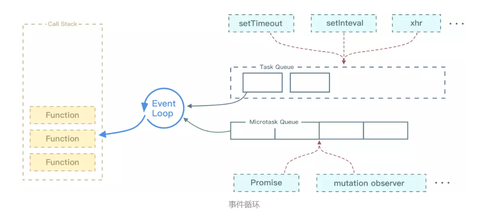

## JavaScript面试题集

&emsp;&emsp;JavaScript是一种动态的编程语言，广泛应用于网页开发中，主要用于增强网页的交互性和动态性。

[查看JavaScript文档地址](https://developer.mozilla.org/zh-CN/docs/Web/JavaScript)。
### 1、原生JS如何添加、删除、移动、复制、创建和查找节点？√
**（1）添加创建**：`document.createElement()`

**（2）删除**：`document.parentNode.removeChild()`

**（3）移动**：`targetNode.appendChild(nodeToMove)`

**（3）复制**：`nodeToCopy.cloneNode(true)`

**（3）查找**：`document.getElementById()`、`getElementsByClassName()`、`querySelector()`、`querySelectorAll()`、`getElementsByTagName()`

### 2、数组对象的操作方法有哪些？√
**（1）插入和删除**：  
&emsp;&emsp;`push()`、`pop()`：尾部插入和删除数组中一个或多个元素，会修改数组；  
&emsp;&emsp;`unshift()` 、`shift()`：首部插入和删除数组中一个或多个元素，会修改数组；

**（2）转换方法**：    
&emsp;&emsp;`slice(start, end)`：start可选参数表示开始截取的位置，end表示结束截取的位置，该方法不会改变原数组，会返回一个新的数组；

&emsp;&emsp;`splice(start, num, value)`:start可选参数表示开始替换的位置，num表示替换删除的元素个数，value表示替换的新元素，该方法改变原数组；

&emsp;&emsp;`join(string)`：用于将数组元素连接成一个字符串的方法，string为需要指定的分割符，默认指定为逗号；  

&emsp;&emsp;`toString(arr)`：用于将数组转化为字符串；  

&emsp;&emsp;`map((e)=>{})`：通过指定函数处理数组每个元素，返回新数组;  

&emsp;&emsp;`filter((e)=>{})`：返回数组中满足条件的元素组成的新数组;

**（3）其他方法**：  
&emsp;&emsp;`reverse()`反转数组、`sort()`数组排序、`concat()`连接数组、`forEach()`数组循环； 
 
### 3、Call\Apply\Bind的区别√
**（1）相同点**：都可以用于改变this的指向，传入的第一个参数都是绑定this的指向，若第一个参数是null或undefined，则会把全局对象window作为this的值；  

**（2）不同点**：   
&emsp;&emsp; ① Call传入的是参数列表，但只能一次传入；Bind传入的也是参数列表，但是可以多次传入；而Apply传入的是数组；

&emsp;&emsp; ② Call和Apply会立即调用，适用于需要立即执行函数并改变上下文的场景；而Bind返回的是一个改变this指向的函数，适用于需要创建一个新的函数时，可以预先设定部分参数以便后续调用；
```js{15,20,24,25,27,28}
// 案例
var name = "coder"
let obj = {
    name:"张三",
    say: function (param1, param2) {
        console.log(param1+param2+this.name)
    },
};
obj.say(); // 张三
setTimeout(obj.say, 10) //coder
//调用同样的的方法会因为指向问题导致数据不一致，因为setTimeout中的this指向的时window对象

//使用call优化
setTimeout(function () {
    obj.say.call(obj, "参数01", "参数02")
}, 10)

//使用apply优化后
setTimeout(function () {
    obj.say.apply(obj, ["参数01", "参数02"])
}, 10)

//使用bind优化后(会返回一个新函数)
let newFun = obj.say.bind(obj,"参数01","参数02")
newFun()
//or
let newFun = obj.say.bind(obj)
newFun("参数01","参数02")
```


### 4、什么是事件循环(EventLoop)？
‌&emsp;&emsp;由于JS是单线程的，所以为了避免阻塞，JS会将事件分为同步事件和异步事件，同步事件会在执行栈中立即执行并等待结果，而异步事件则会先放到宿主环境中，然后推送到执行队列，每次当执行栈中的同步事件执行完毕之后就回到执行队列中查找是否有异步事件需要执行，以此循环的查找过程就称为事件循环。


‌&emsp;&emsp;浏览器中事件循环和NodeJS中事件循环的主要区别就在于前者的异步任务分别为宏任务队列和微任务队列，而NodeJS中的事件循环的异步任务分成了6个任务队列:①`process.nextTick`进程队列、②`Promise等`微任务队列、③`setTimeout`计时器执行等。


### 5、什么是宏任务和微任务？
‌&emsp;&emsp;由于JS是单线程的，所以为了避免阻塞，JS会将事件分为同步任务和异步任务，而异步任务则会分为宏任务和微任务，宏任务通常由浏览器或者Node发起如script/请求事件/定时器等，而微任务则由JS引擎自身发起如`Promise`(注意`Promise`本身是同步的，但是`.then()`和`.catch()`会让其异步执行)，`Async/Await`等；



‌&emsp;&emsp;事件会按照首先在执行栈中同步任务、将微任务放入任务队列、将宏任务放入宏任务队列，待同步任务执行完毕后回去查找微任务队列中的事件执行，然后再去查找宏任务中的队列去执行。

### 6、什么是事件响应链？
&emsp;&emsp;事件响应链是指当一个事件发生在DOM元素上时，该事件会从特定的事件目标开始逐级传播到其他事件监听者；这个事件传播的过程分为三个阶段：

① `捕获阶段`(最外层开始逐级向内传播) → ② `目标阶段`(事件到达事件目标) → ③ `冒泡阶段`(目标事件开始开始逐级向内传播)；   

&emsp;&emsp;在实际开发中，可以利用事件捕获阶段来处理事件拦截或者事件的预处理，而冒泡阶段则用于执行主要的事件处理逻辑。可以通过`addEventListener`函数的第三个参数来决定监听器是在捕获阶段还是冒泡阶段触发。 

&emsp;&emsp;`addEventListener() `方法用于给元素添加监听事件，同一个元素可以重复添加，并且不会覆盖之前相同事件，用`removeEventListener() `方法来移除事件。
```js
// 使用方法：
    element.addEventListener("click",function(e)=>{
            console.log("点击事件监听");
            console.log("点击返回的参数"：e);
    })
// 传递参数（包含三个参数）：
// 1.事件名称（String类型）
 
// 例如点击事件click，鼠标按下mousedown（和元素绑定事件类似，但不需要on）
 
// 2.监听事件所需要执行的函数（void）
 
// 如function（event）{ } 或者箭头函数的形式 （event）=> {   }
 
//  3.触发类型（boolean，选填）
 
// true - 事件在捕获阶段执行
// false - 事件在冒泡阶段执行，默认是false
```
`参考资料`[JS监听器及事件](https://blog.csdn.net/qq_46344419/article/details/130320656)

### 7、什么是事件委托
&emsp;&emsp;事件委托是一种利用事件冒泡机制优化事件处理的方式，它的核心思想则是：将子元素事件监听交由父元素上统一处理，而不是绑定到每一个子元素上；

&emsp;&emsp;应用场景：

```js
//大量列表数据绑定点击事件
<ul id="parent">
  <li>Item 1</li>
  <li>Item 2</li>
  <li>Item 3</li>
</ul>

<script>
  const parent = document.getElementById('parent');

  parent.addEventListener('click', function(event) {
    // event.target 是实际被点击的 li
    if (event.target.tagName === 'LI') {
      console.log('Clicked:', event.target.textContent);
    }
  });
</script>
```


### 8、JS的垃圾回收机制(GC)
&emsp;&emsp;垃圾回收是一种自动内存管理机制，用于检测和清除不再使用的对象以释放内存空间，当一个对象不再被引用，垃圾回收器会将其进行标记，然后在适当的时候清除这些垃圾，并将内存回收给系统以供其他对象使用，其目的是减少内存泄露和提高程序的性能，而JS引擎的垃圾回收是自动执行的，无需像C和C++语言需要手动管理；  
**垃圾回收算法：**   
&emsp;&emsp;**① 引用计数**：记录每个对象被引用的次数，当对象被创建时计数器为1，引用则加1，不被引用时减1，减至0时，则可以被垃圾收集器回收；  
&emsp;&emsp;**注意**：无法处理循环引用；  
```js
let a = { x: 1 };  // 对象引用计数=1
let b = a;         // 引用计数+1 → 2
a = null;          // 引用计数-1 → 1
b = null;          // 引用计数-1 → 0 → 回收
// 无法处理循环引用
// 内存泄漏例子
function leak() {
  let obj1 = {};
  let obj2 = {};
  obj1.ref = obj2;  // obj1引用obj2
  obj2.ref = obj1;  // obj2引用obj1 → 循环引用
}
```
&emsp;&emsp;**② 标记-清除**：通过标记不再使用的对象，然后清除这些对象的内存空间以便后续内存分配使用；标记阶段：从根对象(全局变量、活动函数等)出发，标记所有可访问对象；清除阶段：同样遍历整个内存，对于未标记的对象，判定为垃圾并立即回收释放内存空间；  
&emsp;&emsp;**注意**：标记-清除算法会存在垃圾回收过程中暂停进行垃圾回收操作现象，影响用户体验；还会在回收过程中阐述大量不连续的，碎片化的内存空间，导致内存利用率低；  

&emsp;&emsp;**③ 标记-整理**：主要分为标记阶段、整理阶段、清除阶段；相当于标记-清除的增强操作，在清除阶段会先执行整理操作，移动对象位置，对内存空间进行压缩；解决了内存碎片化的问题；  
&emsp;&emsp;**注意**：标记-整理算法同样会暂停程序的执行，进行垃圾回收操作；

### 9、`map`和`forEach`的区别
&emsp;&emsp;**相同点:**

&emsp;&emsp;(1) 都可用于循环遍历数组中的每一项。

&emsp;&emsp;(2) 回调返回参数时一样的，参数分别为item(当前每一项)，index(索引值)，arr(原数组)。

&emsp;&emsp;(3) 匿名函数中的`this`都是指向`window`。

&emsp;&emsp;(4) 只能遍历数组。

&emsp;&emsp;**不同点:**

&emsp;&emsp;(1) `map()`会分配内存空间存储新数组并返回，但在引用数据类型下也会修改到原数组信息；`forEach()`不会返回数据，在引用类型数据下也会修改原数组。

&emsp;&emsp;(2) `forEach()`允许`callback`更改原始数组的元素；`map()`则是返回新的数组。
```js
let arrB = [
   { name: 'a', age: 1 },
   { name: 'b', age: 2 },
];
let arrB1=arrB.map((item) => {
   item.age = 3;
   return item;
});
console.log(arrB);//[{ name: 'a', age: 3 },{ name:'b', age: 3 },]
console.log(arrB1);//[{ name: 'a', age: 3 },{ name:'b', age: 3 },]
//原数组元素被修改，解决方法：
let arrB1=arrB.map((item) => {
     return {
         ...item,
         age:3
     };
 });

```

### 10、JS为什么是单线程
&emsp;&emsp;JavaScript 语言采用的是单线程模型，也就是说，所有任务只能在一个线程上完成，一次只能做一件事。前面的任务没做完，后面的任务只能等待。因为JS脚本语言主要是作为交互功能使用，比如操作DOM结点等，所以使用单线程，若使用多线程一边增加DOM节点，一边删除DOM节点，这样则会增加复杂性；

&emsp;&emsp;但是通过事件循环机制和异步API可以实现非阻塞执行，且还有`Web Worker`等方法补充了计算密集型任务的并行处理能力；
```js
const worker = new Worker('worker.js');
worker.postMessage(data);

self.onmessage = (e) => {
    const result = heavyCalculation(e.data);
    self.postMessage(result);
}
```

### 11、对于WebWorker的了解
&emsp;&emsp;Web Worker是一种为Web后台新增线程的一种简单方法，也就行单独运行JS的一种方法，新增线程的脚本独立于其他脚本，不会影响页面的性能，包括使用Ajax或Fetch发送请求等；WebWorker分为专用worker和共享worker；

&emsp;&emsp;创建方式：`w = new Worker("demo_workers.js");`
```js
// 主线程代码
// 1. 创建Worker
const myWorker = new Worker('worker.js');
// 2. 向Worker发送消息
myWorker.postMessage({data: '需要处理的数据'});
// 3. 接收Worker返回的结果
myWorker.onmessage = function(e) {
  console.log('从Worker收到的结果:', e.data);
};
// 4. 错误处理
myWorker.onerror = function(error) {
  console.error('Worker错误:', error.message);
};
// 5. 终止Worker
function stopWorker() {
  myWorker.terminate();
}
```

### 12、JS原生判断页面加载完成的方式
####(1) 利用Window对象中的onLoad方法判断。

&emsp;&emsp; 触发时机：页面所有资源（包括图片、脚本、CSS 等）完全加载完成后触发。
```js
    window.onload = function(){}
```

####(2) DOMContentLoaded事件。

&emsp;&emsp; 触发时机：HTML 文档完全加载和解析完成后触发，无需等待样式表、图像和子框架完成加载。
```js
    document.addEventLister('DOMContentLoaded', function() {
         console.log('DOM完全加载并解析完成');
    })
```

####(3) 使用监听器监听`load`事件，`load`事件在页面所有资源（包括样式表、图片等）加载完成后触发.
```js
window.addEventListener("load", () => {
  if (document.readyState === "complete") {
    console.log('所有资源已加载完成');
  } else if (document.readyState === "interactive") {
    console.log('DOM已准备好，但资源仍在加载');
  }
});
//并结合document.readyState属性来判断DOM是否已准备好
```

### 13、什么是纯函数？数组的纯函数API有哪些？
&emsp;&emsp;**1、定义：** 纯函数具有确定性即相同输入总返回相同输出；且没有副作用不会改变外部源数据。JavaScript数组提供了一系列纯函数方法，最常用的是`map/filter/reduce`等。

&emsp;&emsp;**2、纯函数的特点：** 

&emsp;&emsp;&emsp;**① 无副作用（No Side Effects）：** 不修改外部状态或输入参数；纯函数在执行过程中不会对外部环境产生影响，即不会改变外部状态，也不会产生外部可见的变化，如修改全局变量、修改输入参数、输出到控制台、抛出异常、进行 I/O 操作等。

&emsp;&emsp;&emsp;**② 可预测性（Predictable）：** 确定性；对于相同的输入，纯函数总是返回相同的输出。这意味着函数的行为不依赖于程序中的状态变化，每次调用时，只要输入参数相同，输出的结果也必然相同。

&emsp;&emsp;**3、数组的纯函数API：** 

&emsp;&emsp;&emsp;**① Array.toSorted()：** `Array.toSorted()`是`sort()`方法的纯函数版本，它返回一个新数组，其元素按升序排列，而原数组保持不变，这个方法接受一个可选的比较函数，允许你自定义排序逻辑；
```js
const numbers = [5, 3, 2, 8, 1];
const sortedNumbers = numbers.toSorted();
console.log(sortedNumbers); // [1, 2, 3, 5, 8]
console.log(numbers); // [5, 3, 2, 8, 1] 原数组未改变
```

&emsp;&emsp;&emsp;**② Array.toReversed()：**` Array.toReversed()`是`reverse()`方法的纯函数版本。它返回一个新数组，其元素顺序与原数组相反，原数组同样保持不变。
```js
const items = [1, 2, 3, 4];
const reversedItems = items.toReversed();
console.log(reversedItems); // [4, 3, 2, 1]
console.log(items);         // [1, 2, 3, 4] 原数组未改变
```
&emsp;&emsp;&emsp;**③ Array.toSpliced()：** `Array.toSpliced()`是`splice()`方法的纯函数版本。它返回一个新数组，根据指定的索引和删除数量，以及可选的添加元素，来生成新数组。原数组同样不会受到影响。
```js
const fruits = ["Banana", "Orange", "Apple", "Mango"];
const newFruits = fruits.toSpliced(1, 1, "Lemon");
console.log(newFruits); // ["Banana", "Lemon", "Apple", "Mango"]
console.log(fruits);     // ["Banana", "Orange", "Apple", "Mango"] 原数组未改变
```

&emsp;&emsp;&emsp;**④ Array.with()：** `Array.with()`是一个新的纯函数，用于替换数组中指定索引处的元素。它返回一个新数组，其中指定索引处的元素被替换为新值，而原数组保持不变。
```js
const arr = [1, 2, 3, 4, 5];
const newArr = arr.with(2, 6);
console.log(newArr); // [1, 2, 6, 4, 5]
console.log(arr);    // [1, 2, 3, 4, 5] 原数组未改变
```

### 14、JS是阻塞的还是非阻塞的？
&emsp;&emsp;JS是阻塞的，所有浏览器在下载JS的时候，会阻止一切其他活动，比如其他资源的下载，内容的呈现等等。直到JS下载、解析、执行完毕后才开始继续并行下载其他资源并呈现内容。

&emsp;&emsp;**JS无阻塞加载方式：**

&emsp;&emsp;(1) 将脚本放在底部: `<link>`还是放在head中，用以保证在js加载前，能加载出正常显示的页面。`<script>`标签放在`</body>`前。

&emsp;&emsp;(2) 使用`<script>`标签的`defer属性`，翻译成中文就是推迟的意思。这样该标签引入的JavaScript代码能够提前加载，但是会延迟到整个页面文档都解析完毕之后再运行。如果有多个带有defer属性的`<script>`标签，它们会按照顺序进行执行。
```js
<head>
    <title>Example HTML Page</title>
    <script defer src="exampleOne.js" ></script>
    <script defer src="exampleTwo.js" ></script>
</head>
```

### 15、对于执行上下文的了解
关键字：`全局执行上下文`，`局部(函数)执行上下文`，`eval执行上下文(不推荐使用易被攻击)`

**核心概念：** *执行上下文是JS代码执行时的`环境信息容器`，每当调用函数或执行全局代码时就会创建一个新的执行上下文；常见的三种执行上下文分别是：全局执行上下文、函数执行上下文、`eval()`内部代码执行上下文(基本不用)* 

**关键组成部分：** *环境变量、词法环境、this绑定、外部环境调用*

**生命周期：** *创建阶段、执行阶段、回收阶段*

```js
let globalVar = 'global';
function outer() {
  let outerVar = 'outer';
  
  function inner() {
    let innerVar = 'inner';
    console.log(globalVar + outerVar + innerVar);
  }
  return inner;
}
const closure = outer();
closure(); // 输出 "globalouterinner"

```

### 16、对于作用域及作用域链的理解
**关键字：** `隔离变量`，`全局作用域`，`局部作用域`

**关键概念：** 作用域是变量和函数的`可访问范围`，作用域链则是变量查找的`路径规则`。

**作用域链查找规则：** 先在当前作用域查找变量，若找不到再沿着作用域链向外层查找，直到全局作用域，找不到则报错。
```js
let globalVal = 1;

function outer() {
  let outerVal = 2;
  
  function inner() {
    let innerVal = 3;
    console.log(globalVal + outerVal + innerVal); // 6
  }
  
  inner();
}
outer();
```

### 17、高阶函数的了解
**关键字：** `函数式编程`，`高阶函数应用`

**关键概念：** 高阶函数的特点包括接受一个或多个函数作为参数、***返回一个新的函数作为结果，实现了对函数的抽象操作***，是函数式编程的重要基础，JS内置的高阶函数包括： `map()、filter()、reduce（）`等等。

```js
// 函数作为返回值
// 创建一个乘法器工厂函数
function createMultiplier(factor) {
  return function(number) {
    return number * factor;
  };
}
const double = createMultiplier(2);
console.log(double(5)); // 10
```
&emsp;&emsp;实际开发中，高阶函数常用于抽象通用逻辑、实现装饰器模式、构建函数管道等场景；

### 18、JS如何实现继承
关键字：`原型和原型链继承`，`构造函数继承`

**关键概念：** JS早期的继承基于原型链机制，而目前在ES6中以class语法提供了更友好的使用方式，建议优先使用ES6的class继承。

```js
class Parent {
    constructor(name) {
        this.name = name;
        this.colors = ['red', 'blue'];
    }
    sayName() {
        console.log(this.name)
    }
}
class Child extends Parent {
    constructor(name, age) {
        super(name);// 相当于 Parent.call(this, name)
        this.age = age;
        sayAge() {
            console.log(this.age);
        }
    }
}
const child = new Child('Tom', 10)
child.sayName();
child.sayAge();
```

## JavaScript事件

### 1、什么是事件和事件流？
&emsp;&emsp;***`事件`就是在应用程序或浏览器中执行的一些特定的交互瞬间，网页中的交互就是通过事件实现的，常用的事件有click点击事件、load加载事件、mouseover事件等；`事件流`是描述从网页中接收事件的顺序，通常包括事件捕获流、事件冒泡流；***


### 2、什么是事件冒泡和事件捕获？
&emsp;&emsp;***`事件冒泡`是指事件开始时由最具体的元素接收，然后再逐级向上传递到较为不具体的节点；`事件捕获`的思想是开始时先从不太具体的节点接收事件，而最具体的节点则在最后接收到事件，目的在于事件到达预定目标之前预先捕获它；***

注意：虽然规范要求事件应该从document开始传播，但浏览器一般都是从window开始捕获；
```html
<!DOCTYPE html>
<html>
  <head>
    <title>Example</title>
  </head>
  <body>
    <div id="myDiv">Click</div>
  </body>
</html>
<!-- 事件冒泡的执行顺序为div->body->html->document -->
<!-- 事件捕获的执行顺序为document->html->body->iv -->
```
### 3、JSDOM的事件流执行顺序是怎样的？
&emsp;&emsp;***事件流的执行通常有三个阶段：① 事件捕获阶段：为截获事件提供条件；② 目标事件阶段：实际接收到目标；③ 事件冒泡阶段：可以在该阶段对事件做出响应；***

### 4、什么是事件处理程序？
&emsp;&emsp;***`事件处理程序`指的是对事件的响应函数，也称为事件侦听器，如onclick、addEventListener()等；在编码过程中通常会将事件处理程序放在`try-catch`中来捕获异常；***

### 5、DOM2级的事件有什么特性？
&emsp;&emsp;***`DOM2级事件`定义了两种方法用来处理指定和删除事件处理程序，分别是`addEventListener()`和`removeEventListener()`，它们都接受三种参数分别是：① 要处理的事件名、② 处理事件的函数、③ 冒泡/捕获设置；而两个方法传入的事件处理程序必须相同，否则无效，因此不建议使用匿名函数作为事件处理程序；***

### 6、EventUtil对象是什么？
&emsp;&emsp;***`EventUtil`不是一个JavaScript原生提供的对象或API，而是开发者为处理浏览器跨浏览器事件兼容性问题而创建的工具对象。***

### 7、什么是事件对象？
&emsp;&emsp;***在DOM上触发事件时，会默认产生一个事件对象即`event`，这个对象包含了所有与事件相关的信息，属性和方法等，包括是否冒泡、是否可取消默认行为、事件类型、事件目标等；***
### 8、如何取消事件的捕获及冒泡？
&emsp;&emsp;***取消事件的捕获及冒泡可以使用事件默认的event对象，调用对象中的`stopPropagetion()`方法；***

### 9、JS常见的事件类型有哪些？
&emsp;&emsp;***JS中常见的事件类型包括：UI事件、焦点事件、鼠标与滚轮事件、文本事件、键盘事件、合成事件、变动事件等；***

&emsp;&emsp;***(1) UI事件：*** DOMActive、load、unload、abort、error、select、resize、scroll；

&emsp;&emsp;***(2) 焦点事件：*** blur、DOMFocusIn、DOMFoucsOut、focus、focusin、focusout；

&emsp;&emsp;***(3) 鼠标与滚轮事件：*** click、dbclick、mousedown、mouseenter、mouseleave、mousemove、mouseout、mouseover、mouseup；

## TS面试题集

### 1、对于TS的了解以及与JS的区别
&emsp;&emsp;TS是JS的超集，它在JS的基础上添加了`强类型`、`接口`、`类`、`泛型`、`元组`、`枚举`等等特性，并提供了静态类型检查等工具，可以使开发者在编写代码时更加安全、可靠；

&emsp;&emsp;与JS相比，TS具有更强的类型系统，更严格的类型检查，更好的代码可读性以及维护性等优点。TS更加适合中大型的应用开发，更注重可持续性和可维护性等。

**类型：**  
```js
let isDone: boolean = false; // 布尔值
let decLiteral: number = 6; //数字
let textString: string = '字符';//字符串
let lisrArr: number[] = [1, 2, 3] //数字的数组
let list: Array<number> = [1, 2, 3]//泛型数组
//元组：已知数量和类型的数组，类型可以不同
let x: [string, number];
x = ["字符", 6] // √
x = [6, "字符"] // ×
//枚举
enum Color {Red, Green, Blue}
enum Color2 {Red = 1, Green, Blue}
let c: Color = Color.Green;
let colorName: string = Color2[2];
console.log(colorName);  // 显示'Green'因为上面代码里它的值是2
//Any: 不确定类型时可以使用,任意类型
let notSure: any = 4;
notSure = "maybe a string instead";
notSure = false; // okay, definitely a boolean
//Void void类型像是与any类型相反，它表示没有任何类型，只能为它赋予undefined和null
let unusable: void = undefined;
//Object:除了基本类型及以上类型之外
declare function create(o: object | null): void;
create({prop: 0});
create(null)
```

### 2、TS中类型别名和接口有什么作用和区别？
&emsp;&emsp;TS中类型别名和接口的主要作用是提供类型定义，提高代码的可读性和可维护性。`接口interface`可以用于定义对象类型，以对象的形式进行描述，接口可以重复声明自动合并；

&emsp;&emsp;`别名type`则是创建一个新类型名称，也就是别名，不能重复声明，但是可以定义基本类型别名、声明联合类型、声明元组类型；

**使用场景：** 

&emsp;&emsp;① 需要被 extends 或者 implements, 则尽量使用接口。

&emsp;&emsp;② 需要使用联合类型或者元组类型，类型别名会更合适。

&emsp;&emsp;③ 定义对象或函数，则都可以，尽量选择使用interface。

**类型别名：**  
```js
//通过交叉扩展接口，类型创建后无法更改
type Point = {
    x: number;
    x: number;
}
function printCoord(pt: Point){
    console.log(pt.x, pt.y)
}
printCoord(x:100, y:200)
type StringType = string; //基本类型
type paramType = number | string; //联合类型
type arrType = [string, string, number]; //元组
```
**接口：**  
```js
//直接扩展接口，可以向现有接口添加新字段
interface Point {
    x: number;
    y: number;
}
function printCoord(pt: Ponit){
    consle.log(pt.x,pt.y)
}
printCoord(x:100, y:200)
```

### 3、TS的重载函数是什么
&emsp;&emsp;TypeScript中的函数重载是指***定义多个具有相同名称的函数，但可以有不同的参数类型或参数数量***。通过函数重载，可以为不同的参数类型或参数数量提供不同的函数实现；

&emsp;&emsp;总结：当我们在声明函数的时候直截了当的告诉函数使用者有哪些参数组合；
```js
//声明一个函数
function message(options: object): void;
function message(text: string, onCLose?: Function): void;
function message(Text: string, mode: string, duration?: number): void;
function message(
    param1: string | object,
    param2?: number | Function | string,
    param3?: Function | number
): void {}
//函数调用
message({
    mode: "mode",
    text: "text",
    onClose: () => {},
    duration: 3000,
});
message("text");
message("text",() => {});
message("text", "mode", 3000);
```

### 4、TS中的类型断言有什么作用？
&emsp;&emsp;类型断言好比其它语言里的类型转换，但是不进行特殊的数据检查和解构。 它没有运行时的影响，只是在编译阶段起作用。TS会假设程序员进行了必须的检查。
```js
//写法一
let someValue: any = "this string"
let strLength: number = (`<string>`someValue).length;
//写法二 推荐as写法
let strLength: number = (someValue as string).length
```

