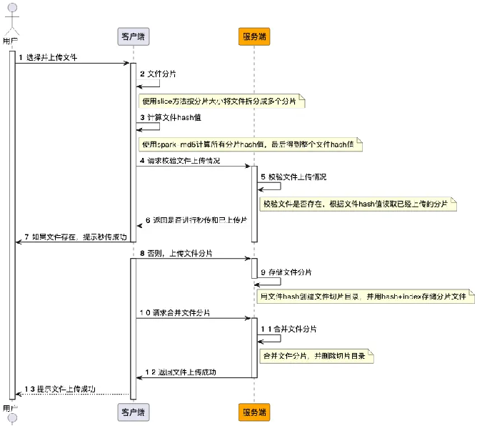
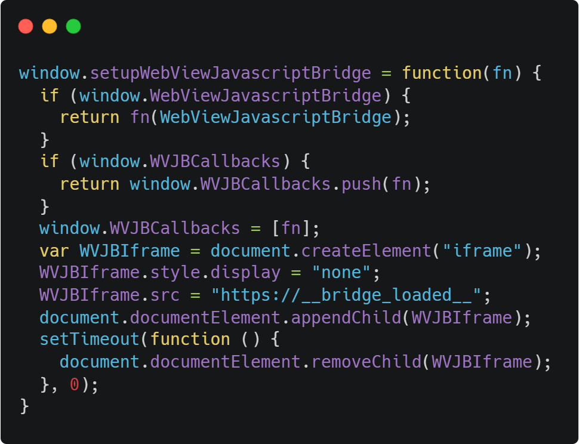
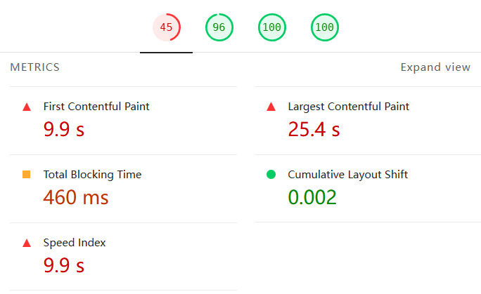

# 实践知识汇总

&emsp;&emsp;实践知识汇总重要包括工作中经常需要使用的功能模块代码以及解决或优化问题的方案等等，包括防抖节流、懒加载处理等等。

### 1、前端如何一次性处理十万条数据？✔️

**(1) 分页加载**：可以使用`requestAnimationFrame` 或者`setTimeout`时实现动态分页加载数据；  

**(2) 懒加载**：懒加载也称为延时加载，即在需要时再进行加载，可以有效提高页面渲染性能以及用户体验，常用于图片、列表数据等内容进行动态加载渲染；Vue中组件懒加载实现方案则可以使用`defienAsyncComponent()`方法异步加载实现；  
```js
// Vue结合Vite代码分割按需加载
const Modal = defineAsyncComponent(() => import('./Modal.vue'));

// React
const Modal = lazy(() => import('./Modal'));
```

**(3) 虚拟列表加载**：虚拟列表是一种在容器可见区域的动态渲染数据的技术，其优点是根据容器可视区域固定渲染的DOM节点数量，从而减少DOM操作，提高页面性能；

&emsp;&emsp;**主要实现步骤：** *初始化容器结构(滚动容器/高度占位元素/渲染列表等) → 关键数据计算(容器总高度/可视区渲染子项数/起始索引等) → 滚动逻辑处理(`ResizeObserver`监听动态高度变化)*

还可以使用`vue-virtual-scroller`插件实现虚拟滚动方案，或自定义列表子项高度固定实现；  

**注意**：需要解决的关键问题就是如何有效减少DOM节点的渲染；

[vue-virtual-scroller官方地址](https://www.npmjs.com/package/vue-virtual-scrolle)

### 2、如何实现懒加载/虚拟列表加载?  ✔️
① 若是图片元素则可以使用`img`标签中的`lazy`属性进行懒加载控制；若是其他元素则可以通过计算`offsetTop`和`srcollTop`的差值来判断是否小于等于元素高度，从而实现懒加载；

&emsp;&emsp;若想要性能更好则可以使用`IntersectionObserver`来实现懒加载/`无限加载，IntersectionObserver（交叉观察器）` 是一个浏览器 API，用于异步监听目标元素与祖先元素或视口（Viewport）的交叉状态变化,不依赖主线程，避免频繁触发 scroll 事件导致的性能问题。。
```js
// 初始化IntersectionObserver
    onMounted(() => {
      nextTick(() => {
        const observerOptions = {
          root: null,
          rootMargin: '50px',
          threshold: 0.1
        };
        
        const observer = new IntersectionObserver((entries) => {
          entries.forEach((entry) => {
            if (!entry.isIntersecting) return;
            
            // 找到对应的数据索引
            const index = listItemRefs.value.findIndex(el => el === entry.target);
            if (index !== -1) {
              // 显示列表项
              setTimeout(() => {
                listItems[index].style.opacity = 1;
                listItems[index].style.transform = 'translateY(0)';
              }, 100);
              
              // 加载图片
              listItems[index].isLoaded = true;
              
              // 停止观察该元素
              observer.unobserve(entry.target);
            }
          });
        }, observerOptions);
        
        // 开始观察所有列表项
        listItemRefs.value.forEach((item) => {
          observer.observe(item);
        });
      });
    });
```
[懒加载实现参考](https://juejin.cn/post/7080544007834730510?searchId=2025030322343958EB49F78AD14A758A20)

② 虚拟列表的核心原理是只渲染当前可视区域内的列表元素，从而提高性能，主要步骤大致可以分为：1、根据容器高度计算当前可是区域内可以渲染的元素范围；2、根据计算出的范围从数据中加载相应的数据索引并渲染；3、通过使用一个占位元素来保持滚动过程中视觉上的连续性；
```js
export default {
  data() {
    return {
      data: [], //总数居
      itemHeight: 50, //单项列表高度
      containerHeight: 500, //容器高度
      startIndex: 0, //开始索引
      offset: 0 //Y轴偏移量
    },
    computed: {
      // 总高度计算
      totalHeight() {
        return this.data.length * this.itemHeight;
      },
      // 可视区域显示项数计算
      visibleCount() {
        return Math.ceil(this.containerHeight / this.itemHeight);
      },
      // 可视区域数据截取
      visibleData() {
        return this.data.slice(this.startIndex, this.startInde + this.visible);
      }
    },
    methods: {
      // 偏移量动态计算索引 @scroll="handleScroll"
      handleScroll(e) {
        const scrollTop = e.target.srollTop;
        // 动态计算起始索引
        this.startIndex = Math.floor(scrollTop / this.item.height)
        // 计算偏移量（让内容看起来连续滚动）
        this.offset = this.startIndex * this.itemHeight;
      }
    }
  }
}

```
[虚拟列表实现参考](https://juejin.cn/post/7389064690125832244)

### 3、`requestAnimationFrame`是什么？如何使用 ✔️
&emsp;&emsp;`requestAnimationFrame`是浏览器提供的一个用于优化动画性能的API，他会在浏览器下一次重绘之前调用指定的回调函数，因为它会根据浏览器的刷新频率自行调整调用的频率，更加高效，通常用于实现平滑的动画效果；

**使用**：
```js
let animationId;
function animate() {
  // 在这里更新动画状态
  console.log("Animating...");
  // 继续调用 requestAnimationFrame 以保持动画循环
  animationId = requestAnimationFrame(animate);
}
// 启动动画
animationId = requestAnimationFrame(animate);
// 停止动画
function stopAnimation() {
  cancelAnimationFrame(animationId);
}
// 例如，5秒后停止动画
setTimeout(stopAnimation, 5000);
```

### 4、懒加载的原理是什么 ✔️
&emsp;&emsp;懒加载是一种优化技术，它允许在需要时才加载页面的一部分或全部资源，以减少初始加载时间和网络流量。懒加载的原理主要包括按需加载、异步加载、动态加载和延迟渲染等方面，其主要原理如下：

&emsp;&emsp;**(1)按需加载：** 按需加载是懒加载的核心原理之一，它是指根据用户的需求来加载相应的资源，按需加载的优点在于，可以减少初始页面加载时间，提高页面响应速度和用户体验。由于只加载用户需要的资源，因此可以减少不必要的网络流量和带宽成本；

&emsp;&emsp;**(2)异步加载：**  指将资源的加载推迟到用户需要使用时再进行。异步加载可以通过使用AJAX、Fetch等技术实现，它允许在不阻塞用户界面的情况下加载数据和其他资源；异步加载的优点在于，可以避免用户在等待资源加载时出现长时间的空白或延迟，提高用户体验。同时，异步加载还可以减轻服务器的负担，因为只需要在需要时加载数据或资源；

&emsp;&emsp;**(3)动态加载：** 指根据用户的行为和需求，动态地生成和加载页面内容。在懒加载模式下，页面内容通常会被分解成多个小块，每个小块在需要时才被加载和呈现给用户。动态加载的优点在于，可以根据用户的需求动态地生成和加载页面内容，提高页面的灵活性和响应速度。同时，动态加载还可以减少初始页面加载时间，因为只需要加载必要的结构和资源；

&emsp;&emsp;**(4)延迟加载：**  懒加载常常与延迟渲染技术结合使用，延迟渲染是指将页面的渲染过程推迟到用户需要查看时再进行。在懒加载模式下，页面的初始渲染只包含必要的结构和资源，而将其他非必要的资源通过延迟渲染的方式加载和呈现给用户；

### 5、什么是防抖和节流？✔️
**（1）防抖**：既在指定的时间间隔内，无论连续触发了多少次事件，只有最后一次事件会在该间隔结束后执行；适用于搜索框输入、表单验证等场景，用户完成输入后，才执行相关操作；  
```js{24}
/**
 * 防抖函数
 * @param {Function} func - 要防抖的函数
 * @param {number} delay - 延迟时间（毫秒）
 * @returns {Function} - 返回一个新的防抖函数
 */
function debounce(func, delay) {
    let timer; // 定义一个定时器
    return function(...args) {  // 收集所有参数到 args 数组
        const context = this; // 保存上下文
        // 清除之前的定时器
        clearTimeout(timer);
        // 设置新的定时器
        timer = setTimeout(() => {
            func.apply(context, args); // 使用 apply 将 args 数组展开传递给原函数
        }, delay);
    };
}
// 使用方式
// 示例函数
function handleResize() {
    console.log('窗口大小改变:', window.innerWidth, window.innerHeight);
}
// 使用防抖函数
const debouncedResize = debounce(handleResize, 300);
// 监听窗口调整大小事件
window.addEventListener('resize', debouncedResize);
```
**（2）节流**：既在指定的时间间隔内，无论连续触发了多少次事件，只有第一次事件执行，后续操作在该时间内都不会执行；适用于滚动事件、按钮点击等需要在连续事件中合理控制执行频率的场景；
```js{4}
function throttle(func, limit) {
    let inThrottle = false;
    return function(...args) {
        const context = this; // 保存当前的 this 上下文
        if (!inThrottle) {
            // 执行传入的函数
            func.apply(context, args);
            inThrottle = true; // 标记为正在节流
            // 使用闭包和 setTimeout 来在指定的延迟后重置 inThrottle
            setTimeout(() => {
                inThrottle = false; // 重置节流状态
            }, limit);
        }
    };
}
```
### 6、客户端中缓存数据的方式有哪些？✔️
**Cookies**：  
&emsp;&emsp;**(1) 特点**：① 可以设置过期时间，客户端和服务端都可以修改；② 存储大小在4K以内，	不能超过50个cookie；③ 只能存储字符串类型；④容易受CSRF攻击；  
&emsp;&emsp;**(2) 特点**：主要用于跟踪客户会话，存储用户偏好设置以及实现永久登录等功能；  

**sessionStorage**：  
&emsp;&emsp;**(1) 特点**：① 临时性存储关闭网站页面标签或关闭浏览器数据删除；② 存储大小一般	为5M，采用键值对存储；③ 安全性较高，不容易受CSRF攻击；  
&emsp;&emsp;**(2) 特点**：适合用于临时会话数据，临时保存表单数据等； 

**localStorage**：  
&emsp;&emsp;**(1) 特点**：① 持久化存储机制，数据在浏览器关闭后仍然保留；② 数据在同源的所有	窗口、标签页中均可共享；③ 存储大小一般为5M，采用键值对存储；④ 不容	易受CSRF攻击，但容易受到XXS影响；  
&emsp;&emsp;**(2) 特点**：主要用于跟踪客户会话，存储用户偏好设置以及实现永久登录等功能；   

**IndexedDB**：  
&emsp;&emsp;**(1) 定义**：是一种在浏览器中使用的客户端数据库，提供了一种存储和检索大量结构化数据的方式，具有更强大的功能和更高的性能；  
&emsp;&emsp;**(2) 特点**：① 具备离线访问和数据持久化的能力，② 采用键值对存储数据，可以存储任意类型，③ 可以存储几个GB的数据，④ 可以通过索引进行高效的数据	查询，⑤ 支持事务操作，可以在一个原子操作中执行多个数据库操作，保证数据的一致性；  
&emsp;&emsp;**(3) 特点**：主要用于大量数据存储、复杂查询的场景；   

**cacheStorage**：  
&emsp;&emsp;**(1) 定义**：是浏览器中的一种 API，它用于缓存网络资源，使得网页在离线状态下也能		够访问已缓存的资源，提高网页加载速度和离线访问体验。cacheStorageAPI 		属于 ServiceWorker 的一部分，因此在使用 Cache Storage 前，需要先注		册一个 ServiceWorker；  
&emsp;&emsp;**(2) 特点**：① 缓存网络资源以提高加载速度，减少网络请求；② 可以离线访问；③ 可	以通过设置缓存优先级提高缓存效率；④使用的是Promise，所以绝大部分操	作是异步的；

### 7、POST请求为何会发送两次？✔️
**（1）浏览器的重试机制**：浏览器为保证请求的可靠性，在出现网络不稳定请求	的情况下，会重新发送一次请求；    
**（2）跨域请求与预检机制**：在进行跨域请求(CORS)时，浏览器会在正式发送	POST请求之前，发送一个OPTIONS预检请求，以确保服务器是否允许跨域请求；  
**（3）前端事件多次触发**：前端是事件被多次绑定或监听，从而导致多次重复请求，如冒泡事件等；  

### 8、WebSocket的实现和应用？✔️
**定义**：WebSocket一种浏览器与服务器进行全双工通讯的网络技术，属于应用层	协议。它基于TCP传输协议，并复用HTTP的握手通道；    
**① 服务端**：在引入`ws`模块并声明`WebSocket`实例；  

**② 客户端**：向8080端口发起WebSocket连接。连接建立后，打印日志，同时向服务端发送消息。接收到来自服务端的消息后，同样打印日志； 


### 9、如何解决开发中精度计算问题？✔️
**（1）取整计算**：将浮点数转换为整数进行计算，然后再将结果转换回浮点数。这样可以避免浮点数计算中的精度问题。例如，将浮点数乘以 10^n（n 为要保留的小数位数），进行整数计算，然后再除以 10^n，得到正确的结果。这种方法简单易行，但可能会导致结果溢出，需要根据具体情况进行适当的调整；  
```js{4}
const a = 0.1;
const b = 0.2;
const result = ((a*10)+(b*10)) / 10
```   
**（2）四舍五入计算**：通过四舍五入来解决精度问题。可以使用 JavaScript 中的内置函数 `Math.round()、toFixed、Math.floor()` 或` Math.ceil()`来对浮点数进行四舍五入、向下取整或向上取整操作，从而得到较为准确的结果；  
```js
// Math.round() - 四舍五入到最近的整数
const num1 = 4.7;
const num2 = 4.4;
const num3 = 4.5;
console.log(Math.round(num1)); // 5
console.log(Math.round(num2)); // 4

// toFixed() - 四舍五入到指定的小数位数，返回字符串
const price = 19.996;
console.log(price.toFixed(2)); // "20.00"
console.log(price.toFixed(1)); // "20.0"
console.log(price.toFixed(0)); // "20"

// Math.floor() - 向下取整（向负无穷方向取整）
const num4 = 4.9;
const num5 = -4.1;
console.log(Math.floor(num4)); // 4
console.log(Math.floor(num5)); // -5

// Math.ceil() - 向上取整（向正无穷方向取整）
const num6 = 4.1;
const num7 = -4.9;
console.log(Math.ceil(num6)); // 5
console.log(Math.ceil(num7)); // -4

// 精度计算示例
const a = 0.1;
const b = 0.2;
const result = a + b; // 0.30000000000000004

// 使用不同方法处理精度问题
console.log(Math.round(result * 100) / 100); // 0.3 (四舍五入到2位小数)
console.log(parseFloat(result.toFixed(2))); // 0.3 (先转字符串再转数字)
console.log(Math.floor(result * 100) / 100); // 0.3 (向下取整)
console.log(Math.ceil(result * 100) / 100); // 0.31 (向上取整)
```
### 10、深拷贝和浅拷贝有何区别？如何对数组进行深拷贝？  ✔️
**（1）浅拷贝**：  
&emsp;&emsp;**① 定义**：新对象只复制原始对象的基本数据类型的字段或引用地址，若复制的对象发生修改可能会影响原始对象的数据；  
&emsp;&emsp;**② 方式**：扩展运算符、`Object.assign()`方法、数组可以使用`Array.slice()`和`Array.concat()`方法； 

**（2）深拷贝**：  
&emsp;&emsp;**① 定义**：指新对象会递归的复制原始对象中所有字段以及引用指向的对象，以确保新对象和原始对象之间的关系都是独立的；  
&emsp;&emsp;**② 方式**：使用`JSON.stringify()`将对象转换为 `JSON` 字符串，再使用`JSON.parse()` 将字符串解析回对象； 
下载； 
```js{4}
export default {
  data () {
    return {
      msg: 'Highlighted!'
    }
  }
}
```
### 11、移动端如何适配不同屏幕尺寸 ✔️
**(1) 使用Flex弹性布局**：使用 CSS Flexbox 和 Grid 布局可以更容易地创建响应式设计。

**(2) 使用响应式布局**：使用CSS媒体查询设置或者Flex弹性布局根据屏幕尺寸调整页面元素的布局和大小；通过设置百分比、em或rem单位比例来实现元素的相对大小；  

**(3) 新过使用viewport标记**：使用viewport标记设置来控制显示屏幕的参数尺寸；  

**(4) 使用flexible.js框架**：是一个终端设备适配的解决方案，可以更具不同的显示屏幕动态计算出元素单位比例；
```css
dispaly:grid;
grid-template-column:20% 20% 20% 20% 20%;
grid-template-row:20% 20% 20% 20% 20%;
grid-column-start: 1; /*2/3/4 占位顺序*
justify-items:start/end/center/stratch; /*子项单元格内水平对齐*/
align-items:start/end/center/stratch; /*子项单元格内垂直居中*/
place-items:center center;/*水平垂直居中*/
justify-content：space-between/space-around /*整个网格的水平对齐*/
align-content：space-between/space-around /*整个网格的垂直对齐*/
grid-column: 1 / 3;    /* 跨越第1~2列 */
grid-row: span 2;      /* 跨2行 */
justify-self: center;  /* 单个子项水平对齐 */
align-self: end;       /* 单个子项垂直对齐 *
```
[资源地址](https://github.com/amfe/lib-flexible)

[Grid练习](https://cssgridgarden.com/)

### 12、数组去重的方法有那些 ✔️
&emsp;&emsp;使用Set数据结构去重、使用Map数据结构去重、使用reduce()方法去重、使用sort()方法去重；

&emsp;&emsp;**(1) 使用 Set：性能最好O(n)** 

```js
const array = [1, 2, 2, 3, 4, 4, 5];
const uniqueArray = [...new Set(array)];
console.log(uniqueArray); // [1, 2, 3, 4, 5]
```
&emsp;&emsp;**(2) 使用 filter() + indexOf()：** 

```js
const array = [1, 2, 2, 3, 4, 4, 5];
// 使用fliter遍历后再利用indexOf方法判断是否重复
const uniqueArray = array.fliter((item) => array.indexOf(item) === index);
console.log(uniqueArray); // [1, 2, 3, 4, 5]
```
&emsp;&emsp;**(3) 使用 reduce()+find()：数组对象灵活性高** 
*总结：使用redece遍历数据获取累加器以及当前元素，再使用find方法对比具体的属性值是否重复，对于不重复的元素则加入到累加其中重新返回*
```js
// 对象数组去重示例
const objectArray = [
    {id: 1, name: '张三', age: 25},
    {id: 2, name: '李四', age: 30},
    {id: 1, name: '张三', age: 25}, // 重复对象
    {id: 3, name: '王五', age: 28},
    {id: 2, name: '李四', age: 30}, // 重复对象
    {id: 4, name: '赵六', age: 32}
];

// 方式1：根据id属性去重
// acc 累加器上一次调用回调函数的返回值
// cur 当前值当前被处理的数组元素
const uniqueById = objectArray.reduce((accumulator, current) => {
    // 步骤1：使用find方法检查是否已存在相同id的对象
    const exists = accumulator.find(item => item.id === current.id);
    if (!exists) {
        // 步骤2：如果不存在相同id，则添加该对象
        accumulator.push(current);
    }
    // 步骤3：返回更新后的累加器数组
    return accumulator;
}, []);
  // 
console.log('按id去重:', uniqueById);
```
### 13、如何实现登录拦截 ✔️
&emsp;&emsp;Vue中实现登录拦截，通常可以通过`VueRouter`中的`路由守卫`和`状态管理`来完成，首先可以使用路由守卫来拦截导航，在全局状态管理中保存用户的登陆状态，然后在`router.beforeEach()`全局前守卫进行相关操作的设定；
```js
router.beforeEach((to, from, next) => {
  const isLoggedIn = checkAuth(); //检查登录状态

  // 路由跳转判断
  if(to.matched.some(record => record.meta.requiresAuth) && !isLoggedIn) {
    next('/login') //未登录跳转登录页面
  } else {
    next() //放行；
  }
})
```
### 14、大文件上传如何分片 ✔️
*&emsp;&emsp;大文件分片上传的步骤主要分为：*

&emsp;&emsp;&emsp;① 首先使用`file.slice()`方法在前端将文件进行分片并使用哈希算法如`Spark-MD5`计算每个分片的`Hash值`；

&emsp;&emsp;&emsp;② 再将每个文件片段发送至服务端，服务端通过一个唯一标识符来记录每个分片，

&emsp;&emsp;&emsp;③ 当所有分片上传完成后将其合并为原始文件并返回响应信息；

&emsp;&emsp;注意：注意计算`Hash值`时为节省时间资源通常采用增量模式进行计算，计算完成后即可向服务端进行上传请求及校验上传情况，可以在上传过程中跟踪每个切片的上传进度

&emsp;&emsp;断点续传功能：在前端上传每个分片时就记录已成功上传的分片编号，然后在请求上传之前向服务端获取已上传分片信息确定从那个分片开始上传，最后根据服务器返回的已上传分片信息跳过已上传部分继续上传；



```js{4}
{/* <template>
  <div>
    <input type="file" @change="onFileChange" />
    <button @click="uploadFile" :disabled="!file">上传</button>
    <div v-if="uploadProgress !== null">上传进度: {{ uploadProgress }}%</div>
  </div>
</template> */}
{/* <script> */}
import axios from 'axios';

export default {
  data() {
    return {
      file: null,
      chunkSize: 1024 * 1024, // 每个切片的大小（1MB）
      uploadProgress: null,
    };
  },
  methods: {
    onFileChange(event) {
      this.file = event.target.files[0];
      this.uploadProgress = null; // 重置进度
    },
    async uploadFile() {
      if (!this.file) return;

      const totalChunks = Math.ceil(this.file.size / this.chunkSize);
      for (let i = 0; i < totalChunks; i++) {
        const start = i * this.chunkSize;
        const end = Math.min(start + this.chunkSize, this.file.size);
        const chunk = this.file.slice(start, end);

        await this.uploadChunk(chunk, i, totalChunks);
      }
      alert('文件上传完成！');
    },
    async uploadChunk(chunk, index, totalChunks) {
      const formData = new FormData();
      formData.append('file', chunk, this.file.name);
      formData.append('chunkIndex', index);
      formData.append('totalChunks', totalChunks);

      try {
        const response = await axios.post('/upload', formData, {
          onUploadProgress: (progressEvent) => {
            if (progressEvent.lengthComputable) {
              const progress = Math.round((progressEvent.loaded / progressEvent.total) * 100);
              this.uploadProgress = ((index + progress / 100) / totalChunks) * 100;
            }
          },
        });
        console.log('Chunk uploaded:', response.data);
      } catch (error) {
        console.error('上传失败:', error);
        throw new Error('上传失败');
      }
    },
  },
};
{/* </script> */}
```

### 15、WebWorker的理解和应用 ✔️
&emsp;&emsp;Web Worker 是一种在后台线程中运行 JavaScript 的机制，它独立于其他脚本，不会影响页面的性能。Web Worker 的核心原理是利用浏览器提供的多线程能力，将部分任务分配到单独创建的线程中执行。Web Workers可以处理大量计算、数据处理、文件读写等任务，并通过`postMessage()`方法和`onmessage`事件与主线程进行通信。  
&emsp;&emsp;应用：
```js
const wk = new Worker(worker.js)
```
### 16、H5通过webview内嵌如何实现原生通信 ✔️
&emsp;&emsp;H5与原生APP交互，需要使用`WebViewJavascriptBridge`桥接函数，这是一个用于在 `WebView（H5页面）`与`原生应用（iOS/Android）`之间建立双向通信的桥接库。并根据系统类型IOS或Android分别构建，然后利用callback回调函数返回；还可以在Window对象中调用原生APP创建的属性或方法；  


### 17、`Npm\Pnpm\Yarn`有何区别？✔️
&emsp;&emsp;**(1) Npm**：npm即NodeJS包管理和分发工具，是默认的JavaScript应用包管理与NodeJS一同安装，npm拥有一个集中式的注册中心并托管了数万个包，这些包可以是库、框架、工具等等；  

&emsp;&emsp;**(2) Pnpm**：即*高性能的npm*，其主要解决了npm、yarn*重复文件过多*，*复用率低*等问题，其主要特点还包括包安装速度快，磁盘利用率高等;  

&emsp;&emsp;**(3) Yarn**：yarn是FaceBook贡献的JavaScript包管理工具，相比于npm，yarn通过并行下载和缓存等优化策略，提供更快的安装速度，npm则是串行下载；在安全性方面，yarn通过检测包的完整性和使用锁定文件来确保安装的包没有被篡改；(关键词：并行下载)

### 18、通常使用那些工具及指标来量化前端性能？✔️
&emsp;&emsp;页面性能监测指标可以在浏览器的开发者工具中的`Performance`属性进行查看，主要参数有：  
&emsp;&emsp;**(1) FCP(首次内容绘制)**：即首屏加载，反映了用户开始与页面进行视觉交互的速度，FCP的理想时间应控制在1.8秒之内；可以通过降低服务器响应时间、延迟加载非关键资源、移除不必要的资源、内联关键样式等方法优化FCP时间；可以在Chrome DevTools的Lighthouse面板量；  (关键词：首屏加载、1.8s)

&emsp;&emsp;**(2) LCP(最大内容绘制)**：即最大内容绘制，用于记录视窗内最大的元素绘制的时间，该时间会随着页面渲染变化而变化，该指标会在用户第一次交互后停止；LCP考虑的元素类型包括：``元素、`<svg>`元素内嵌的`<image>`元素、`<video>`元素、使用url()函数加载背景图片的元素、包含文本节点或其他内嵌文本元素子元素的块级元素；理想LCP时间应控制在2.5秒以内；  (关键词：最大内容绘制、2.5s)

&emsp;&emsp;**(3) TTFB(首字节时间)**：表示从点击网页到接收到第一个字节的时间，测量的是`startTime`和`responseStart`之间的时间总和，这个时间段包括：重定向时间、ServiceWorker启动时间、DNS查找时间、连接和TLS协商时间、请求直到响应第一个字节到达时间；理想的TTFB时间应控制在800毫秒以内；(关键词：首字节时间、请求响应、800ms)

&emsp;&emsp;**(4) TBT(总阻塞时间)**：表用于衡量长任务对主线程的阻塞时间总和，即从首次内容绘制(FCP)到页面可交互(TTI)期间，主线程因运行长任务而被阻塞的总时间，长任务指执行时间超过50毫秒的JS任务，它会阻塞页面渲染和响应，影响用户体验；减少TBT时间的方式包括：减轻第三方代码的影响、缩短JS执行时间、减少主线程工作量、控制请求数量和传输大小；理想情况下，TBT在移动设备应低于300毫秒，在桌面Web上应低于100毫秒；(关键词：TBT总阻塞时间、主线程阻塞、300ms)

&emsp;&emsp;**(5) SI(速度指数)**：表用于衡量页面渲染用户可见内容的迅速成都，其并不是一个具体时间点，而是属于综合性指标；它表示从加载开始到页面内容基本可见的过程中，用户感受到的加载速度，该指标是基于视频捕获的可是进度或从绘制时间的可是进度来计算；理想情况下，SI在移动设备应低于3.4秒，在桌面Web上应低于1.3秒，才能使Lighthouse获得90以上评分；  

附：常用性能测试工具：`Lighthouse 选项卡`、`Gooogle 开源的 web-vitals 库`、`PageSpeed Insights` 、`(PSI) 工具`;


### 19、前端性能优化方式有那些? ✔️
&emsp;&emsp;**(1) 减少请求数量**：图片使用精灵图、字体图标代替图片、减少重定向、使用缓存、css不使用@import； 

&emsp;&emsp;**(2) 减少资源大小**：html压缩、css压缩、gzip图片压缩、js压缩；  

&emsp;&emsp;**(3) 优化网络链接**：使用CDN、使用DNS预解析；  

&emsp;&emsp;**(4) 其他方式**：减少重绘/回流、异步组件加载、懒加载路由、使用Web Worker创建多线程环境；

关键点：第一原则减少网络请求以及请求响应时长/缓存策略等、第二原则渲染优化懒加载/虚拟列表加载/异步加载等；


### 20、在日常工作中遇到的最大挑战是什么?你是如何克服的？ ✔️
<!-- **性能优化挑战：**
&emsp;&emsp;在前端开发工作中页面的渲染以及处理性能优化问题是比较大的挑战，面对不同的业务场景，需要确保数据加载的时机和顺序，以及避免对用户体验造成负面影响；

&emsp;&emsp;为了解决这个问题，我首先会分析页面的加载流程，确定那些部分是用户最关心的，然后通过动态加载，懒加载，按需加载等优化策列，确保在需要时再回加载相关数据；

&emsp;&emsp;在实施过程中，我还会注意到一些潜在的性能瓶颈，例如不必要的网络请求等等，为了解决这些问题我会优化数据请求的频率，采用缓存策略等方式来减少不必要的请求，从而提高页面的加载渲染速度和响应时间；

**技术栈的学习挑战：** -->
*作为一名前端开发者来说，工作中常见的条件集中在兼容性处理、性能优化、新技术学习等方面，总结来说，前端开发的核心挑战在于平衡用户体验与技术实现，我的解决方案是建立系统化的工程实践和持续学习机制。*

### 21、如何实现数组扁平化? ✔️
&emsp;&emsp;数组扁平化就是将多维数组转换为一维数组的过程：常用的实现方式是使用数组的`flat(int)`方法；
```js
const nestedArray = [1, [2, [3, 4], 5], 6];
// 传统递归方法
const flatten = (arr) => {
  return arr.reduce((acc,val) => {
    acc.concat(Arraay.isArray(val)? flatten(val):val),[]
  })
}
// 新方法
const flattenedArray = nestedArray.flat(2); // 2 表示扁平化的深度
console.log(flattenedArray); // [1, 2, 3, 4, 5, 6]
```

### 22、如何减少项目中过多的if-else ✔️
<!-- &emsp;&emsp;去除不必要的else、使用三目运算符、使用Optional优化判空、使用枚举做多条件判断； -->

&emsp;&emsp;**(1) 使用对象字面量替代条件语句:** 
```js
// 使用 if-else
function getAnimalSound(animal) {
    if (animal === 'dog') {
        return 'Woof';
    } else if (animal === 'cat') {
        return 'Meow';
    } else if (animal === 'cow') {
        return 'Moo';
    } else {
        return 'Unknown animal';
    }
}
// 使用对象字面量
function getAnimalSound(animal) {
    const sounds = {
        dog: 'Woof',
        cat: 'Meow',
        cow: 'Moo'
    };
    return sounds[animal] || 'Unknown animal';
}
```
&emsp;&emsp;**(2) 使用策略模式:** 策略模式允许将不同的行为封装在不同的函数中，从而避免使用 `if-else`
```js
// 策略模式示例
function dogSound() {
    return 'Woof';
}
function catSound() {
    return 'Meow';
}
function cowSound() {
    return 'Moo';
}
const animalSounds = {
    dog: dogSound,
    cat: catSound,
    cow: cowSound
};
function getAnimalSound(animal) {
    const soundFunction = animalSounds[animal];
    return soundFunction ? soundFunction() : 'Unknown animal';
}
```
&emsp;&emsp;**(3) 使用条件运算符：**
```js
function getAnimalSound(animal) {
    return animal === 'dog' ? 'Woof' :
           animal === 'cat' ? 'Meow' :
           animal === 'cow' ? 'Moo' :
           'Unknown animal';
}
```
### 23、设计登录模块可以考虑那些方式 ✔️
&emsp;&emsp;**(1) 账号+密码：** 自定义账号+密码、手机号+密码、邮箱+密码

&emsp;&emsp;**(2) 手机号+验证码**

&emsp;&emsp;**(3)本机号码一键登录：** 本机号码一键登录是基于运营商独有网关认证能力推出的账号认证产品，需要接入运营商SDK或者使用整合SDK，用户只需一键授权，即可实现以本机号码注册/登录，相比先前的短信验证码流程体验更优；主要步骤有：SDK初始化、唤起授权页、同意授权登录、获取显示号码；

&emsp;&emsp;**(4)第三方授权登录：** 借助第三方应用的接口实现用户登录，常见的有：微信、QQ、微博，借助第三方应用的接口时需到相应的开发者平台申请接入，获取appid和apikey作为应用的唯一标识；

&emsp;&emsp;**(5)其他方式登录：** 刷脸登录、扫码登录、指纹登录、手势登录等；

<!-- ### 24、Webpack的打包流程有哪些
&emsp;&emsp;**初始化参数：** 从配置文件和 Shell 语句中读取与合并参数,得出最终的参数。

&emsp;&emsp;**开始编译：** 用上一步得到的参数初始化 Compiler 对象,加载所有配置的插件,执行对象的 run 方法开始执行编译。

&emsp;&emsp;**确定入口：** 根据配置中的 entry 找出所有的入口文件。

&emsp;&emsp;**编译模块：** 从入口文件出发,调用所有配置的 Loader 对模块进行翻译,再找出该模块依赖的模块,再递归本步骤直到所有入口依赖的文件都经过了本步骤的处理。

&emsp;&emsp;**完成模块编译：** 在经过第 4 步使用 Loader 翻译完所有模块后,得到了每个模块被翻译后的最终内容以及它们之间的依赖关系。

&emsp;&emsp;**输出资源：** 根据入口和模块之间的依赖关系,组装成一个个包含多个模块的 Chunk,再把每个 Chunk 转换成一个单独的文件加入到输出列表,这步是可以修改输出内容的最后机会。

&emsp;&emsp;**输出完成：** 在确定好输出内容后,根据配置确定输出的路径和文件名,把文件内容写入到文件系统 -->

**完整Webpack配置文件示例：**
```js
const path = require('path');
const HtmlWebpackPlugin = require('html-webpack-plugin');
const MiniCssExtractPlugin = require('mini-css-extract-plugin');
const { CleanWebpackPlugin } = require('clean-webpack-plugin');

module.exports = {
  // 步骤3：确定入口 - 根据配置中的entry找出所有的入口文件
  entry: {
    main: './src/index.js',        // 主入口文件
    vendor: './src/vendor.js'      // 第三方库入口
  },

  // 步骤7：输出完成 - 确定输出的路径和文件名
  output: {
    path: path.resolve(__dirname, 'dist'),           // 输出目录
    filename: '[name].[contenthash].js',             // 输出文件名（带hash）
    chunkFilename: '[name].[contenthash].chunk.js',  // 代码分割后的文件名
    publicPath: '/',                                 // 公共路径
    clean: true                                      // 清理输出目录
  },

  // 步骤4：编译模块 - 配置Loader对模块进行翻译
  module: {
    rules: [
      {
        test: /\.js$/,                    // 匹配JS文件
        exclude: /node_modules/,          // 排除node_modules
        use: {
          loader: 'babel-loader',         // 使用babel-loader翻译ES6+代码
          options: {
            presets: ['@babel/preset-env']
          }
        }
      },
      {
        test: /\.css$/,                   // 匹配CSS文件
        use: [
          MiniCssExtractPlugin.loader,    // 提取CSS到单独文件
          'css-loader',                   // 解析CSS文件
          'postcss-loader'                // 添加浏览器前缀
        ]
      },
      {
        test: /\.(png|jpg|gif|svg)$/,     // 匹配图片文件
        type: 'asset/resource',           // 作为资源文件处理
        generator: {
          filename: 'images/[name][ext]'  // 图片输出路径
        }
      }
    ]
  },

  // 步骤2：开始编译 - 加载所有配置的插件
  plugins: [
    new CleanWebpackPlugin(),             // 清理输出目录
    new HtmlWebpackPlugin({               // 生成HTML文件
      template: './src/index.html',
      filename: 'index.html',
      chunks: ['main', 'vendor']
    }),
    new MiniCssExtractPlugin({            // 提取CSS到单独文件
      filename: '[name].[contenthash].css'
    })
  ],

  // 步骤5：完成模块编译 - 优化配置
  optimization: {
    splitChunks: {                        // 代码分割
      chunks: 'all',
      cacheGroups: {
        vendor: {                         // 第三方库单独打包
          test: /[\\/]node_modules[\\/]/,
          name: 'vendors',
          chunks: 'all'
        }
      }
    },
    usedExports: true,                    // Tree Shaking
    sideEffects: false                    // 标记无副作用
  },

  // 模块解析配置
  resolve: {
    extensions: ['.js', '.jsx', '.json'], // 文件扩展名
    alias: {                              // 路径别名
      '@': path.resolve(__dirname, 'src'),
      '@components': path.resolve(__dirname, 'src/components')
    }
  },

  // 开发环境配置
  devServer: {
    static: './dist',                     // 静态文件目录
    hot: true,                           // 热模块替换
    port: 3000,                          // 开发服务器端口
    open: true                           // 自动打开浏览器
  },

  // 模式配置
  mode: process.env.NODE_ENV === 'production' ? 'production' : 'development',
  
  // 性能配置
  performance: {
    hints: false,                         // 关闭性能提示
    maxEntrypointSize: 512000,           // 入口文件最大体积
    maxAssetSize: 512000                 // 资源文件最大体积
  }
};
```

**配置文件执行流程对应：**
(1). **初始化参数** → `module.exports`导出配置对象
(2). **加载配置插件** → `plugins`数组中的插件被加载执行
(3). **确定入口** → `entry`配置确定打包入口文件
(4). **编译模块** → `module.rules`中的Loader处理各种文件类型
(5). **完成模块编译** → `optimization`配置优化打包结果
(6). **输出资源** → `output`配置确定输出文件的路径和名称
(7). **输出完成** → 文件写入到`path`指定的目录中

### 25、Webpack打包构建的工作流程 ✔️
&emsp;&emsp;**(1) 输出完成：**  
&emsp;&emsp;Webpack 从配置文件（通常是 `webpack.config.js`）开始，读取配置项；根据配置项，Webpack初始化一些参数，如入口文件、输出文件、模块解析规则等。

&emsp;&emsp;**(2) 构建依赖图：**  
&emsp;&emsp;Webpack 从入口文件开始，递归地解析所有依赖的模块（包括 JavaScript、CSS、图片等）;每个模块都被视为一个依赖，Webpack 会分析模块之间的依赖关系，构建出一个完整的依赖图。

&emsp;&emsp;**(3) 加载模块：**  
&emsp;&emsp;Webpack 使用加载器（Loader）来处理不同类型的文件。加载器可以将文件转换为有效的模块;例如，使用 babel-loader 将 ES6+ 代码转换为 ES5，使用 css-loader 和 style-loader 处理 CSS 文件

&emsp;&emsp;**(4) 生成模块：**  
&emsp;&emsp;Webpack 将所有模块转换为 JavaScript 代码，并将它们合并成一个或多个打包文件;这个过程包括将模块的代码和依赖关系转换为一个可以在浏览器中运行的格式。

&emsp;&emsp;**(5) 输出文件：**  
&emsp;&emsp;Webpack 将生成的文件输出到指定的目录（通常是 dist 目录）；输出的文件可以是一个或多个 JavaScript 文件、CSS 文件等。

&emsp;&emsp;**(6) 监视和热更新-可选：**  
&emsp;&emsp;Webpack 可以在开发模式下监视文件的变化，并在文件变化时自动重新打包；通过热模块替换（HMR），Webpack 可以在不刷新页面的情况下更新模块，提高开发效率。

&emsp;&emsp;总结：解析入库文件构建依赖图、应用`Loader`转换解析代码文件、生成输出文件如`bundle.js`

### 26、Webpack打包需要做那些优化? ✔️

**🚀 性能优化六大策略：**

&emsp;&emsp;**(1) 📦 按需加载优化**
```js
// 路由懒加载
const Home = () => import('./views/Home.vue');
const About = () => import('./views/About.vue');

// 组件按需引入
import { Button, Input } from 'element-plus';
```

&emsp;&emsp;**(2) ⚡ Loader配置优化**
```js
module: {
  rules: [{
    test: /\.js$/,
    exclude: /node_modules/,           // 排除不需要处理的文件
    use: {
      loader: 'babel-loader',
      options: {
        cacheDirectory: true,          // 开启缓存，提升二次构建速度
        cacheCompression: false        // 缓存不压缩，提升速度
      }
    }
  }]
}
```

&emsp;&emsp;**(3) 🎯 文件路径优化**
```js
resolve: {
  extensions: ['.js', '.jsx'],        // 减少文件扩展名匹配
  alias: {                            // 路径别名，减少相对路径
    '@': path.resolve(__dirname, 'src'),
    '@components': path.resolve(__dirname, 'src/components')
  }
}
```

&emsp;&emsp;**(4) 🗜️ 代码压缩优化**
```js
optimization: {
  minimize: true,                     // 生产环境启用压缩
  minimizer: [
    new TerserPlugin({                // JS压缩
      parallel: true,                 // 并行压缩
      extractComments: false          // 不提取注释文件
    }),
    new CssMinimizerPlugin()          // CSS压缩
  ]
}
```

&emsp;&emsp;**(5) 🔄 公共代码提取**
```js
optimization: {
  splitChunks: {
    chunks: 'all',
    cacheGroups: {
      vendor: {                       // 第三方库单独打包
        test: /[\\/]node_modules[\\/]/,
        name: 'vendors',
        chunks: 'all'
      },
      common: {                       // 公共模块单独打包
        name: 'common',
        minChunks: 2,
        chunks: 'all'
      }
    }
  }
}
```

&emsp;&emsp;**(6) 🌐 CDN优化配置**
```js
externals: {                          // 外部依赖不打包
  'vue': 'Vue',
  'element-plus': 'ElementPlus'
},
output: {
  publicPath: 'https://cdn.example.com/'  // CDN地址
}
```

### 27、Webpack中`Loder`和`Plugin`的区别 ✔️
&emsp;&emsp;*(1) Loader加载器：* 

&emsp;&emsp;*① 作用：*  Loader用于对模块的源代码进行转换。

&emsp;&emsp;*② 用法：*  Loader通过在Webpack配置文件中的module.rules字段中进行	配置。它们作用于匹配特定文件类型的模块；Loader适合用于：将	TypeScript转换成JavaScript，将Sass编译成CSS，加载图片和字体等；

&emsp;&emsp;*③ 处理方式：*  Loader是函数，在加载资源时，Webpack会按照配置的顺序	调用这些函数，对文件进行转换。

&emsp;&emsp;*(2)Plugin插件：*  

&emsp;&emsp;*① 作用：*  Plugin用于执行范围更广的任务，从打包优化和压缩，到重新定义	环境中的变量等，可以扩展Webpack的功能；

&emsp;&emsp;*② 用法：*  Plugin通过在`Webpack`配置文件中的`plugins字`段中进行配置，	作用于整个构建过程；Plugin适合用于：`自动生成HTML文件`，`压缩代码`，`	分离CSS文件`，`定义环境变量`等；

&emsp;&emsp;*③ 处理方式：*  Plugin可以访问`Webpack`的生命周期钩子，在构建过程的不同阶段执行操作；

**🔌 常用Plugin插件示例：**

```js
const path = require('path');
const HtmlWebpackPlugin = require('html-webpack-plugin');
const MiniCssExtractPlugin = require('mini-css-extract-plugin');
const { CleanWebpackPlugin } = require('clean-webpack-plugin');
const CopyWebpackPlugin = require('copy-webpack-plugin');
const DefinePlugin = require('webpack').DefinePlugin;
const HotModuleReplacementPlugin = require('webpack').HotModuleReplacementPlugin;
```

**📋 插件分类总结：**

| 插件类型 | 插件名称 | 主要作用 | 使用场景 |
|----------|----------|----------|----------|
| **文件处理** | HtmlWebpackPlugin | 生成HTML文件 | 自动注入JS/CSS资源 |
| | MiniCssExtractPlugin | 提取CSS到文件 | 生产环境CSS分离 |
| | CopyWebpackPlugin | 复制静态文件 | 复制favicon、图片等 |
| **构建优化** | CleanWebpackPlugin | 清理输出目录 | 每次构建前清理旧文件 |
| | TerserPlugin | JS代码压缩 | 生产环境代码压缩 |
| | CssMinimizerPlugin | CSS代码压缩 | 生产环境CSS压缩 |
| **开发体验** | HotModuleReplacementPlugin | 热模块替换 | 开发环境热更新 |
| | FriendlyErrorsWebpackPlugin | 友好错误提示 | 美化错误信息显示 |
| **环境配置** | DefinePlugin | 定义全局变量 | 设置环境变量、版本号等 |
| | EnvironmentPlugin | 环境变量注入 | 自动注入process.env变量 |

### 28、Webpack的配置有哪些？✔️
主要的配置包括以下几个部分：

&emsp;&emsp;**entry入口：**  入口文件地址，可以是单个也可以是多个；

&emsp;&emsp;**output输出：**  输出的内容，path、filname、publicPath等；

&emsp;&emsp;**moudle：**  loaders，不同的文件使用不同的loader解析，如css-loader等

&emsp;&emsp;**plugin插件：**  对打包流程的干预和增加

&emsp;&emsp;**resolve：**  别名，扩展名等

&emsp;&emsp;**externals：**  外部扩展

```js
//口喷一个配置
const path = require('path');

module.export = {
  entry: path.resolve(__dirname, '../src/index.js'),
  output:{
    path: path.resolve(__dirname, "../dist"),
    filename: "main.[chunkhash:B].js",
    publicPath: './',
    clean: true
  },
  resolve: {
    extensions: ['.jsx', 'js']
  },
  module: {
    rules: {
      {
        test: /\.{js|jsx}$/,
        use: {
          loader: 'babel-loader',
          options: {
            persets: ['@babel/preset-env', "@bebel/preset-react"]
          }
        }
      }
    }
  }
}
```
### 29、轮播图的实现思路 ✔️
&emsp;&emsp;轮播图通常由三个部分组成，图片容器、左右切换按钮、小圆点

**（1） 功能需求**：

  - 自动播放：轮播图在一定时间间隔内自动切换。

  - 手动控制：用户可以通过点击左右箭头或小圆点进行手动切换。
  
  - 响应式设计：轮播图在不同屏幕尺寸下都能良好显示。
  
  - 可选的过渡效果：如淡入淡出、滑动等。

**（2） 结构设计** 
  - 使用HTML结构来定义轮播图的基本元素。通常包括：

  - 一个容器（`<div>`）来包裹整个轮播图。

  - 一个用于显示图片的区域。

  - 左右箭头按钮。

  - 小圆点指示器。
```js
// 功能模块代码
let currentIndex = 0;
const items = document.querySelectorAll('.carousel-item');
const dots = document.querySelectorAll('.dot');
function showSlide(index) {
    if (index >= items.length) {
        currentIndex = 0;
    } else if (index < 0) {
        currentIndex = items.length - 1;
    } else {
        currentIndex = index;
    }
    // 更新显示的图片
    const offset = -currentIndex * 100; // 计算偏移量
    document.querySelector('.carousel-inner').style.transform = `translateX(${offset}%)`;
    // 更新指示器
    dots.forEach((dot, i) => {
        dot.classList.toggle('active', i === currentIndex);
    });
}
// 下一张
function nextSlide() {
    showSlide(currentIndex + 1);
}
// 上一张
function prevSlide() {
    showSlide(currentIndex - 1);
}
// 当前幻灯片
function currentSlide(index) {
    showSlide(index - 1);
}
// 自动播放
setInterval(nextSlide, 3000); // 每3秒切换
```

### 30、前端接口防止重复请求实现方案 ✔️
&emsp;&emsp;**方案一：** 使用节流（Throttle）和防抖（Debounce）：节流和防抖是两种常用的控制函数执行频率的技术

&emsp;&emsp;**方案二：** 使用状态管理：使用状态管理库（如 Redux、Vuex），可以在状态中维护请求的状态，避免重复请求。
```js
// Vuex store
const store = new Vuex.Store({
    state: {
        isFetching: false,
    },
    mutations: {
        setFetching(state, fetching) {
            state.isFetching = fetching;
        },
    },
    actions: {
        async fetchData({ commit }) {
            if (this.state.isFetching) {
                console.log("请求正在进行中，已阻止重复请求");
                return;
            }
            commit('setFetching', true);
            console.log("Fetching data...");

            // 模拟请求
            await new Promise(resolve => setTimeout(resolve, 2000));
            console.log("请求完成");
            commit('setFetching', false);
        },
    },
});

// 使用示例
document.getElementById("fetchButton").addEventListener("click", () => {
    store.dispatch('fetchData');
});
```

&emsp;&emsp;**方案三：** 通过使用axios拦截器，在请求拦截器中开启全屏Loading，然后在响应拦截器中将Loading关闭。但是需要局部loading和全局loading会冲突的问题；
```js
import axios from "axios"
import { ElLoading } from 'element-puls'

let instance = axios.create({
  baseURL:"/api/"
})

let loadingInstance = null
//添加请求拦截器
instance.interceptors.request.use(function (config) {
  loadingInstance = ElLoading.service({ fullscreen: true, background: 'rgba(0, 0, 0, 0.7'})
  return config;
}, function (error) {
  return Promise.reject(error);
})

//添加响应拦截器
instance.interceptors.response.use(function (response) {
  loadingInstance.close()
  return response;
}, function (error) {
  return Promise.reject(error)
})

export default instance;
```

### 31、`fetchAPI`是什么？如何进行封装
&emsp;&emsp;fetch()函数可以直接用于在JS脚本中进行请求：

&emsp;&emsp;&emsp;① 它与`XMLHttpRequset`不同的是，`fecth()`使用的是`Promise`，而不是回调函数，这样更加简洁且避免了回调地狱；

&emsp;&emsp;&emsp;② `fecth()`还采用了模块化设计，API分散在`Response对象`、`Request对象`、`Headers对象上`，更加合理；

&emsp;&emsp;&emsp;③ `fetch()`还可以通过`数据流Stream对象`处理数据，分块读取，有利于提高性能；
```js
// src/utils/fetch.ts
import { Response, RequsetInit } from 'node-fetch'
const BASE_URL = 'https://api.example.com'

async function fetchApi<T>(url: string, options?: RequestInit): Promise<T> {
  try {
    const response = await fetch(BASE_URL + url, options);
    if (!response.ok) {
      const error = new Error(`Fetch error! status: ${response.status}`);
      throw error;
    }
    return response.json() as Promise<T>;
  } catch (error) {
    console.error('Fetch failed:', error);
    throw error;
  }
}

export async function get<T>(url: string): Promise<T> {
  return fetchApi<T>(url, {method: 'GET'});
}

export async function post<T>(url: string, body: any, options?: RequestInit) {
  return fetchApi<T>(url, {method: 'POST', headers: {'Content-Type': 'application/json' },body: JSON.stringify(body), ...options})
}
// src/utils/fetch.ts (继续上面的代码)
async function setAuthToken(requestInit: RequestInit): Promise<RequestInit> {
  const token = localStorage.getItem('authToken');
  if (token) {
    requestInit.headers = {
      ...requestInit.headers,
      Authorization: `Bearer ${token}`
    };
  }
  return requestInit;
}

export async function fetchWithAuth<T>(url: string, options?: RequestInit): Promise<T> {
  const modifiedOptions = await setAuthToken(options);
  return fetchApi<T>(url, modifiedOptions);
}

```

### 32、前端常用的设计模式
**（1）适配器模式：**  

&emsp;&emsp;**定义：** 每个系统的数据模型或多或少均存在差别，若想在不修改原有代码结构（类的结构）的情况下完成友好对接，就需要用到适配器模式；

&emsp;&emsp;**场景：** H5需要嵌入原生应用中并使用原生应用的请求方法，在指定环境下进行判断引入所需要的方法；

**（2）单例模式：** 

&emsp;&emsp;**定义：** 保证一个类仅有一个实例，并提供了个访问它的全局访问点；

&emsp;&emsp;**场景：** 声明一个统一管理类型的变量，首次请求进行环境判断，并确订统一状态管理变量类型；当类只能有一个实例而且客户可以从一个众所周知的访问点访问它时；

### 33、如何遍历一个数组对象？
&emsp;&emsp;**1、for...in 循环：** 遍历对象的所有可枚举属性（包括继承来的属性），并将属性名赋值给变量；不适用于遍历数组，因为遍历数组时也会遍历数组的非数字属性；
```js
//对象遍历
const myObj = {a: 1, b: 2, c: 3};
for (let key in myObj) {
console.log(key + " = " + myObj[key]);
}
//数组对象遍历
const myArray = [myObj,myObj,myObj];
for (let key in myArray) {
    console.log(key,myArray[key]);
}
```
&emsp;&emsp;**2、for...of循环:** 用于遍历可迭代对象，如Array、Map、Set等，返回元素的值。适用于遍历数组、字符串等可迭代对象。‌
```js
const myObj = {a: 1, b: 2, c: 3};
for (let [key, value] of Object.entries(myObj)) {
console.log(key + " = " + value);
}
// 输出 "a = 1"、"b = 2"、"c = 3"
```
&emsp;&emsp;**3、Object.keys() 和 Object.values()：** 返回对象所有自身可枚举属性的属性名、属性值组成的数组。
```js
const myObj = {a: 1, b: 2, c: 3};
const keys = Object.keys(myObj);
console.log(keys); // 输出key值 ["a", "b", "c"]

const values = Object.values(myObj);
console.log(values); // 输出value值 [1, 2, 3]
```

### 34、Promise中的`then()`方法可以连用吗？会返回什么
&emsp;&emsp;可以连用，‌第一个`.then()`函数‌：当`Promise`状态为`resolved`时，返回`Promise`对象执行第一个`.then()`中的函数，在第一个中也可以声明一个`Promise`并将执行结果传递给下一个`.then()`中。

**📝 Promise链式调用示例：**
```js
const promise1 = new Promise((resolve) => {
    setTimeout(() => resolve('第一个操作完成'), 1000);
});
const promise2 = new Promise((resolve) => {
    setTimeout(() => resolve('第二个操作完成'), 500);
});
promise1.then(result => {
     console.log(result);
     return promise2; // 返回下一个 Promise
 })
 .then(result => {
     console.log(result);
 });
```

**🔧 Promise其他常用方法：**

&emsp;&emsp;**(1) Promise.all() - 并行执行多个Promise**
```js
const promise1 = fetch('/api/user');
const promise2 = fetch('/api/posts');
const promise3 = fetch('/api/comments');

Promise.all([promise1, promise2, promise3])
  .then(responses => {
    // 所有请求都成功
    console.log('所有数据加载完成');
    return Promise.all(responses.map(res => res.json()));
  })
  .then(data => {
    const [user, posts, comments] = data;
    console.log('用户:', user);
    console.log('文章:', posts);
    console.log('评论:', comments);
  })
  .catch(error => {
    console.error('任一请求失败:', error);
  });
```

&emsp;&emsp;**(2) Promise.allSettled() - 等待所有Promise完成**
```js
const promises = [
  fetch('/api/data1').catch(err => ({ error: err })),
  fetch('/api/data2').catch(err => ({ error: err })),
  fetch('/api/data3').catch(err => ({ error: err }))
];

Promise.allSettled(promises)
  .then(results => {
    results.forEach((result, index) => {
      if (result.status === 'fulfilled') {
        console.log(`请求${index + 1}成功:`, result.value);
      } else {
        console.log(`请求${index + 1}失败:`, result.reason);
      }
    });
  });
```

&emsp;&emsp;**(3) Promise.race() - 竞争执行，返回最快完成的**
```js
const timeout = new Promise((_, reject) => 
  setTimeout(() => reject(new Error('请求超时')), 5000)
);
const dataPromise = fetch('/api/slow-data');

Promise.race([dataPromise, timeout])
  .then(response => response.json())
  .then(data => console.log('数据:', data))
  .catch(error => console.error('错误:', error));
```

&emsp;&emsp;**(4) Promise.resolve() / Promise.reject() - 创建已确定状态的Promise**
```js
// 创建已成功的Promise
const resolvedPromise = Promise.resolve('立即成功');
resolvedPromise.then(value => console.log(value)); // "立即成功"

// 创建已失败的Promise
const rejectedPromise = Promise.reject(new Error('立即失败'));
rejectedPromise.catch(error => console.error(error)); // Error: 立即失败
```

**📊 Promise方法对比总结：**
| 方法 | 执行方式 | 失败处理 | 适用场景 |
|------|----------|----------|----------|
| `then()` | 链式调用 | 需要catch | 单步异步操作 |
| `catch()` | 错误捕获 | 专门处理 | 错误处理 |
| `finally()` | 最终执行 | 不处理错误 | 清理资源 |
| `Promise.all()` | 并行执行 | 任一失败即失败 | 多个依赖请求 |
| `Promise.allSettled()` | 并行执行 | 等待所有完成 | 多个独立请求 |
| `Promise.race()` | 竞争执行 | 最快完成决定结果 | 超时控制 |
| `Promise.resolve()` | 立即成功 | - | 包装同步值 |
| `Promise.reject()` | 立即失败 | - | 包装错误 |

### 35、前端如何实现截图功能
&emsp;&emsp;**方案一 html2canvas：** 使用html2canvas可以将 HTML 元素渲染为 Canvas，并生成图像；

&emsp;&emsp;**方案二 dom-to-image：** 使用dom-to-image可以将 DOM 元素转换为图像；

&emsp;&emsp;**方案三 html2pdf.js：** 使用html2pdf.js可以将截图保存为 PDF 文件；

&emsp;&emsp;**方案四 使用canvas：** 在不使用第三方库的前提下，可以使用`canvas`元素的`drawImage`属性来绘制要截取的区域，然后再使用`getBoundingClientRect`获取截取区域的位置信息，最后使用`toDataURL`将`canvas`转化为图像；
```js
    document.getElementById('screenshot').addEventListener('click', function() {
        const element = document.getElementById('capture');
        const rect = element.getBoundingClientRect();
        const canvas = document.createElement('canvas');
        const ctx = canvas.getContext('2d');
        // 设置 canvas 尺寸
        canvas.width = rect.width;
        canvas.height = rect.height;
        // 将元素绘制到 canvas 上
        ctx.fillStyle = '#f0f0f0'; // 背景色
        ctx.fillRect(0, 0, canvas.width, canvas.height);
        ctx.font = '20px Arial';
        ctx.fillStyle = '#000'; // 文字颜色
        ctx.fillText('截图内容', 10, 30);
        ctx.fillText('这是要截图的内容。', 10, 60);
        // 将 canvas 转换为图像
        const imgData = canvas.toDataURL('image/png');
    });
```
### 36、Git常用的命令有哪些
&emsp;&emsp;`git init` 初始化本地仓库

&emsp;&emsp;`git clone` 克隆仓库

&emsp;&emsp;`git status` 查看工作目录和暂存区状态

&emsp;&emsp;`git add .` 修改提交暂存区

&emsp;&emsp;`git pull [origin] [branch]` 拉去远程仓库代码合并到本地

&emsp;&emsp;`git push` 将本地分支推送到远程仓库

&emsp;&emsp;`git commit -m”text”` 将暂存区代码提交远程仓库

&emsp;&emsp;`git reset` 将暂存区文件取消或切换版本

&emsp;&emsp;`git reset --hard` 版本号 切换指定版本

&emsp;&emsp;`git branch` 查看分支列表

&emsp;&emsp;`git checkout branchName` 切换分支

&emsp;&emsp;`git merge branchName`合并指定分支到当前分支

&emsp;&emsp;`git rebase branchName` 将当前分支变基到指定分支

&emsp;&emsp;`git diff fileName` 修改的文件内容

[参考文档](https://mp.weixin.qq.com/s/Qq8hKjuelBd8t0byUhIP6g)
### 37、如何处理Git中的冲突问题
&emsp;&emsp;首先产生冲突的原因包括版本信息不完整导致提交冲突，所以需要使用`git pull`命令同步版本，自动解决冲突；由于修改了公共代码或者其他人维护的代码导致冲突，需要手动解决冲突，必须对比原始代码和修改都代码，然后使用`git add .`和`git commit` 将代码进行合并提交；

### 38、在Git中进行撤销操作
&emsp;&emsp;**硬盘区：** 

&emsp;&emsp;&emsp;&emsp;&emsp;&emsp;`git checkout <changed_file>  (git restore <changed_file>)`

&emsp;&emsp;**暂存区：** 

&emsp;&emsp;&emsp;&emsp;&emsp;&emsp;`git reset <changed_file> `


&emsp;&emsp;&emsp;&emsp;&emsp;&emsp;`(git restore --staged <changed_file>)`

&emsp;&emsp;**本地仓库：**

&emsp;&emsp;&emsp;&emsp;&emsp;&emsp;` git reset --soft HEAD~1(暂存区和硬盘依然存在) `

&emsp;&emsp;&emsp;&emsp;&emsp;&emsp;`git reset --mined HEAD~1 (仅硬盘文件存在)`

&emsp;&emsp;**远程仓库：** 

&emsp;&emsp;&emsp;&emsp;&emsp;&emsp;`git revert HEAD + git push(公共分支)`

&emsp;&emsp;&emsp;&emsp;&emsp;&emsp;`git reset + git push -f(私有需强制提交) `

 ### 39、IntersectionObserver的了解及使用
`IntersectionObserver` 是浏览器提供的一个 API，可以更高效地监听元素是否进入可视区域；相比于常用图片懒加载的实现，使用 `IntersectionObserver` 可以进一步提升性能，但是为了满足兼容性推荐在现代浏览器中使用。

[参考文档](https://cloud.tencent.com/developer/article/1528620)

 ### 40、Nodejs需要读取一个文件，请编写一个中断forEach循环的功能代码
 &emsp;&emsp;首先我们需要查看NodeJS读取文件的过程：
 ```js
  //异步文件读取-非阻塞
  const fs = require('fs');
  fs.readFile('example.text','utf8',(err,data) => {
    if(err) thorw err;
    console.log('读取的文件内容',data)
  })
  //同步文件-阻塞
  let fsData = fs.readFileSync('example.txt');
  console.log('读取的文件内容',fsData.toString())
 ```

  ### 41、什么是SEO?如何进行SEO优化操作
&emsp;&emsp;**SEO定义**：SEO（Search Engine Optimization）即搜索引擎优化，是通过优化网站内容、结构和技术，提高网站在搜索引擎中的排名和可见性的技术。

**主要SEO优化操作：**

&emsp;&emsp;**(1) 技术SEO优化：**
- 使用语义化HTML标签（`<header>`、`<nav>`、`<main>`、`<article>`等）
- 优化页面加载速度（压缩图片、启用Gzip、CDN加速）
- 实现响应式设计，适配移动端
- 设置合理的URL结构，避免动态参数
- 配置`robots.txt`和`sitemap.xml`

&emsp;&emsp;**(2) 内容SEO优化：**
- 合理使用标题标签（`<h1>`-`<h6>`），保持层级结构
- 优化meta标签（title、description、keywords）
- 为图片添加alt属性描述
- 创建高质量、原创内容
- 合理使用关键词密度

&emsp;&emsp;**(3) 页面结构优化：**
- 使用面包屑导航
- 实现内部链接策略
- 优化页面布局和用户体验
- 添加结构化数据标记（Schema.org）

&emsp;&emsp;**(4) 前端框架SEO处理：**
```js
// Vue/React SSR示例
// 服务端渲染确保搜索引擎能抓取到内容
const app = createSSRApp(App);
const html = await renderToString(app);
```

**常用SEO工具：**
- Google Search Console（网站管理工具）
- Google Analytics（流量分析）
- Lighthouse（性能检测）
- 站长工具（百度、搜狗等）

  ### 42、script标签中defer和async的作用
&emsp;&emsp;**定义**：`defer`和`async`都是HTML5中为`<script>`标签新增的属性，用于控制脚本的加载和执行时机，优化页面性能和用户体验。

**三种脚本加载方式对比：**

&emsp;&emsp;**(1) 默认行为（阻塞式加载）：**
```html
<!-- 默认情况：同步加载，阻塞HTML解析 -->
<script src="script1.js"></script>
<script src="script2.js"></script>
```
**特点：**
- HTML解析暂停，等待脚本下载和执行完成
- 脚本按顺序执行
- 阻塞页面渲染，影响用户体验

&emsp;&emsp;**(2) async异步加载：**
```html
<!-- async：异步下载，下载完成后立即执行 -->
<script async src="script1.js"></script>
<script async src="script2.js"></script>
```
**特点：**
- 脚本异步下载，不阻塞HTML解析
- 下载完成后立即执行，不保证执行顺序
- 可能在DOM未完全构建时执行
- 适合独立的第三方脚本（如统计代码）

**执行时序示例：**
```html
<!DOCTYPE html>
<html>
<head>
    <script async src="script1.js"></script> <!-- 可能最先执行 -->
    <script async src="script2.js"></script> <!-- 可能比script1后执行 -->
</head>
<body>
    <div>页面内容</div> <!-- HTML继续解析 -->
</body>
</html>
```

&emsp;&emsp;**(3) defer延迟执行：**
```html
<!-- defer：异步下载，HTML解析完成后按顺序执行 -->
<script defer src="script1.js"></script>
<script defer src="script2.js"></script>
```
**特点：**
- 脚本异步下载，不阻塞HTML解析
- HTML解析完成后，按脚本在文档中的顺序执行
- 保证DOM完全构建后再执行
- 适合依赖DOM的脚本

**执行时序示例：**
```html
<!DOCTYPE html>
<html>
<head>
    <script defer src="script1.js"></script> <!-- 第1个执行 -->
    <script defer src="script2.js"></script> <!-- 第2个执行 -->
</head>
<body>
    <div>页面内容</div> <!-- HTML解析完成 -->
    <!-- 然后按顺序执行defer脚本 -->
</body>
</html>
```

**实际应用场景：**

&emsp;&emsp;**使用async的场景：**
```html
<!-- 第三方统计代码 -->
<script async src="https://www.google-analytics.com/analytics.js"></script>

<!-- 广告脚本 -->
<script async src="https://ads.example.com/ad.js"></script>

<!-- 不依赖DOM的独立脚本 -->
<script async src="utils.js"></script>
```

&emsp;&emsp;**使用defer的场景：**
```html
<!-- 依赖DOM的脚本 -->
<script defer src="dom-manipulation.js"></script>

<!-- 需要按顺序执行的脚本 -->
<script defer src="library.js"></script>
<script defer src="app.js"></script> <!-- 依赖library.js -->

<!-- 模块化脚本 -->
<script defer type="module" src="main.js"></script>
```

**性能对比总结：**
| 方式 | 下载时机 | 执行时机 | 执行顺序 | DOM就绪 | 适用场景 |
|------|----------|----------|----------|---------|----------|
| 默认 | 同步 | 立即 | 按顺序 | 不一定 | 简单脚本 |
| async | 异步 | 立即 | 不保证 | 不一定 | 独立脚本 |
| defer | 异步 | DOM解析后 | 按顺序 | 保证 | 依赖DOM的脚本 |

**最佳实践建议：**
- 关键脚本使用`defer`确保DOM就绪
- 第三方统计代码使用`async`避免阻塞
- 避免在`async`脚本中操作DOM
- 模块化开发推荐使用`type="module"`

  ### 43、Java 与 Node.js后端开发对比
  **Java 后端开发的优点**
  - 高性能 & 高并发 ：JVM 优化成熟，多线程支持优秀，适合高并发场景（如微服务、电商系统）。
  - 企业级生态丰富：Spring Boot、Spring Cloud 框架成熟，集成数据库（Hibernate/MyBatis）、消息队列（Kafka）、缓存（Redis）等方便。
  - 强类型 & 代码健壮性: 编译期类型检查，减少运行时错误，适合大型项目长期维护。
  - 更好的 CPU 密集型任务处理: 计算密集任务（如大数据处理、复杂算法）比 Node.js 更高效。

  **Java 后端开发的缺点**
  - 开发效率相对较低：代码量大，编译部署流程较长。
  - 内存占用较高：JVM 需要较多内存，小型服务可能显得笨重。
  - 学习曲线较陡：需掌握 OOP、设计模式、JVM 调优等

  **Node.js 后端开发的优点**
  - 开发效率高 & 快速迭代：JavaScript省去编译过程，可快速构建 API 或实时应用；
  - 单线程 + 事件驱动（适合 I/O 密集型）：非阻塞 I/O 适合处理高并发请求（如 REST API、聊天服务）。
  - 全栈统一语言：前端（React/Vue）和后端都用 JS/TS，减少上下文切换。
  - 轻量 & 低资源消耗：适合 Serverless、边缘计算等场景，冷启动快于 JVM。
  - NPM 生态丰富：社区模块多（如 Axios、WebSocket），容易快速集成第三方服务。

  **Node.js 后端开发的缺点**
  - 单线程限制 CPU 密集型任务:计算密集操作（如视频转码）会阻塞事件循环;
  - 回调地狱 & 异步复杂度：即使有 async/await，复杂异步逻辑仍可能难以维护。

  **总结：** Java稳定性高、强类型语言、更适合高性能高并发场景；NodeJs单线程非阻塞IO，且性能消耗低适合轻量级实时应用等场景；

  **非阻塞I/O：** 非阻塞 I/O 是一种编程模式，可以让一个线程在等待 I/O 操作（如读写文件、网络请求）的同时继续处理其他任务，而不被阻塞住；